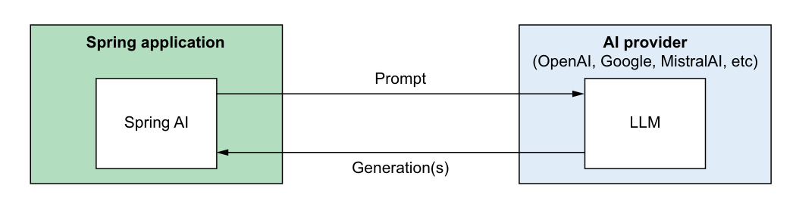
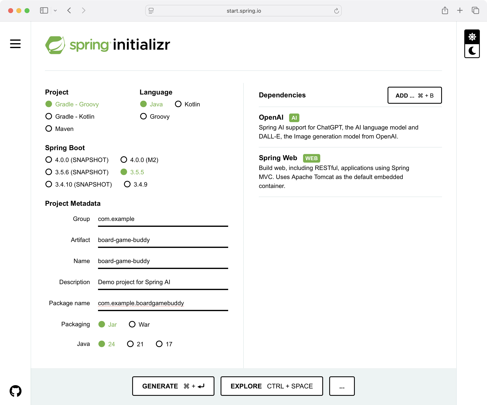

本章内容：

- Spring AI 简介
- 初始化 Spring AI 项目
- 选择 AI 服务提供商和模型

你感受到了吗？在过去一年多的时间里，人机交互领域发生了一场翻天覆地的变革，这场变革有望改变几乎每一个行业、每一种职业和每一种生活方式。ChatGPT、Midjourney 等系统已经将人工智能（Artificial Intelligence，AI）从科幻小说和学术研究中带入了公众视野。

AI 并非什么新鲜事物。但生成式 AI（Generative AI）——AI 的一个特定分支，它利用生成模型（也称为大语言模型（Large Language Models，LLMs））通过自然语言提示来生成文本、图像和其他内容——才是让"会思考的机器"这一概念走进每一个拥有智能手机、平板电脑或计算机的普通人手中的关键。借助生成式 AI，普通用户只需与模型进行对话，就能创作文学和艺术作品，或者回答各种问题。确实，许多曾经需要专业技能才能完成的任务，现在只要在生成式 AI 应用中输入请求就能完成。

软件工程也并非完全不受生成式 AI 的影响。开发者在开发应用程序时会使用 Cursor、Claude Code 等工具作为虚拟结对编程搭档。但对开发者来说，真正的机遇在于利用生成式 AI 为应用程序的用户提供丰富的功能。生成式 AI 使应用程序能够提供那些没有 AI 模型辅助就很难甚至不可能实现的信息服务。借助生成式 AI，用户可以提出任何问题，并以直观而强大的方式指示应用程序执行他们的意图，不再受传统应用程序中特定菜单和表单的束缚。

虽然目前已有不少面向 Python、Node.js 等语言的能力强劲的生成式 AI 框架和库，但 Java 的选项直到最近才开始出现。Spring AI 便是其中之一，它是 Spring 和 Spring Boot 的框架扩展，使得生成式 AI 功能可以在企业 Java 应用的事实标准框架中进行开发。这一能力让现有应用程序能够采用生成式 AI 功能，也让 Java 开发者可以在熟悉的框架和编程模型中使用生成式 AI。

## 1.1 你好，Spring AI！

OpenAI、MistralAI 等 AI 服务提供商通过 REST API 提供对其大语言模型的访问。只要你拥有访问这些 API 的密钥，就可以使用几乎任何 HTTP 客户端向模型提交提示词（Prompt）来生成响应。虽然 Spring 的 RestTemplate、RestClient 等 HTTP 客户端，甚至 curl、HTTPie 等命令行工具都能调用这些 LLM 驱动的 API，但你很快会发现，一旦需求超出简单的提示和简单的响应，使用客户端抽象层可以让与 LLM 的复杂交互变得更加简单。

简单来说，Spring AI 的核心就是一个用于对接各种 AI 服务提供商的客户端抽象层。它让与 LLM 的简单交互变得轻而易举，让复杂交互也相对容易。更重要的是，它在所有 AI 服务提供商及其模型之间提供了一致的接口，无论你的应用是基于 OpenAI、Anthropic、Meta、MistralAI 还是 Google Gemini 的模型，你编写的代码都是可移植的。

如图 1.1 所示，基于 Spring AI 构建的应用程序可以向多个支持的 AI 服务提供商之一的 LLM 提交提示词。生成的响应会返回给应用程序，由应用程序自行处理。在内部，Spring AI 处理了发送提示请求和处理响应的所有复杂细节，应用程序无需操心。

> 图 1.1 Spring AI 协调与 AI 服务提供商和模型之间的交互



提示词本身包含自然语言文本，LLM 将基于这些文本生成响应。常见的提示类型包括：

- 需要回答的问题
- 用于判断情感的消息（例如，该消息是正面的还是负面的？）
- 需要摘要的文档
- 需要审核的内容
- 需要分类的文本（例如，情感分析）
- 需要生成的图像描述

Spring AI 可以帮助你实现令人惊叹的生成式 AI 功能，你将在本书中逐步实践。但我们总要从某个地方开始。那么，让我们从编写一个非常简单的 REST 服务开始你的 Spring AI 之旅——使用 OpenAI 服务来回答问题。

### 1.1.1 初始化项目

启动一个 Spring AI 应用程序与启动其他任何 Spring Boot 应用程序基本相同。Spring AI 提供了 Spring Boot 起步依赖（Starter Dependencies）和自动配置，覆盖了其大部分组件，使你可以轻松地从零开始构建一个可运行的应用程序。

初始化 Spring Boot 项目有很多种方式，包括利用 IntelliJ IDEA、Spring Tools（适用于 Eclipse 和 VS Code）、Netbeans、Spring Boot CLI 以及 Spring CLI 中的 Spring Boot 支持。你可以选择任何喜欢的初始化方式。它们底层都使用同一个公共服务：Spring Initializr（https://start.spring.io）。如果你直接从网站使用 Initializr，只需按照图 1.2 所示填写信息并做出选择，即可开始你的第一个 Spring AI 项目。



无论你是从 httpsstart.spring.io 初始化项目，还是使用 Initializr 的其他前端，做出的选择都是一样的。对于本项目，选择以下选项：

- 基于 Groovy 的 Gradle 作为项目构建工具
- Spring Boot 版本 3.5.5
- JAR 文件打包方式
- Java 24（Java 17 或更高版本也可以）
- Spring Web（例如 Spring MVC）和 Spring AI 的 OpenAI 起步依赖（也可以选择 Spring Reactive Web 依赖替代 Spring Web）

项目元数据（Project Metadata）字段可以随意填写。在本书中，你将使用 Spring AI 创建一个能够回答各种桌面游戏问题的应用程序，因此在截图中将其命名为 Board Game Buddy（相应的 Artifact、Name 和 Package Name 字段也做了相应设置）。你也可以使用其他名称。

生成项目并加载到 IDE 后，你会得到一个包含 `build.gradle` 文件的项目。

**清单 1.1 项目的 Gradle 构建文件**

```groovy
plugins {
    id 'java'
    id 'org.springframework.boot' version '3.5.5'
    id 'io.spring.dependency-management' version '1.1.7'
}

group = 'com.example'
version = '0.0.1-SNAPSHOT'

java {
    toolchain {
        languageVersion = JavaLanguageVersion.of(24)
    }
}

repositories {
    mavenCentral()
}

ext {
    set('springAiVersion', "1.0.3") // Spring AI 版本
}

dependencies {
    implementation 'org.springframework.boot:spring-boot-starter-web'
    implementation 'org.springframework.ai:spring-ai-starter-model-openai'
    testImplementation 'org.springframework.boot:spring-boot-starter-test'
    testRuntimeOnly 'org.junit.platform:junit-platform-launcher'
}

dependencyManagement {
    imports {
        mavenBom "org.springframework.ai:spring-ai-bom:${springAiVersion}" // Spring AI 物料清单
    }
}

tasks.named('test') {
    useJUnitPlatform()
}
```

虽然在 Initializr 中没有显式指定，但我们使用的是 Spring AI 1.0.3 版本。Spring AI 旗下有许多库，因此构建文件使用了物料清单（Bill of Materials，BOM）来管理所有可能用到的 Spring AI 依赖。

项目初始化完成后，让我们编写一些使用 Spring AI 来回答问题的代码。

### 1.1.2 提交提示词

你的第一个 Spring AI 应用将是一个简单的 REST API，它接收问题并返回答案。在内部，它将使用 Spring AI 将这些问题作为提示词提交给 AI 服务的 LLM，由 LLM 生成答案。

应用程序的核心由一个服务类处理，该类实现了 `BoardGameService` 接口：

```java
package com.example.boardgamebuddy;

public interface BoardGameService {
    Answer askQuestion(Question question);
}
```

`askQuestion()` 方法接受一个 `Question` 对象作为输入，并返回一个 `Answer` 对象。`Question` 类型是一个简单的 Java 记录（Record），携带用户提交的问题：

```java
package com.example.boardgamebuddy;

public record Question(String question) {
}
```

同样，`Answer` 也是一个 Java 记录，携带 LLM 生成的答案：

```java
package com.example.boardgamebuddy;

public record Answer(String answer) {
}
```

目前每个记录都只包含一个 `String` 属性，随着项目的演进，你会为它们添加更多属性。

`SpringAiBoardGameService` 类（如清单 1.2 所示）使用 Spring AI 组件与 LLM 交互，实现了 `BoardGameService` 接口。这个类将是本书中大部分工作的核心。

**清单 1.2 BoardGameService 的 Spring AI 实现**

```java
package com.example.boardgamebuddy;

import org.springframework.ai.chat.client.ChatClient;
import org.springframework.ai.chat.prompt.ChatOptions;
import org.springframework.stereotype.Service;

@Service
public class SpringAiBoardGameService implements BoardGameService {

    private final ChatClient chatClient; // 注入 ChatClient.Builder

    public SpringAiBoardGameService(ChatClient.Builder chatClientBuilder) {
        this.chatClient = chatClientBuilder.build(); // 创建 ChatClient
    }

    @Override
    public Answer askQuestion(Question question) {
        var answerText = chatClient.prompt()
            .user(question.question()) // 提交问题
            .call()
            .content();
        return new Answer(answerText);
    }
}
```

如你所见，`SpringAiBoardGameService` 通过构造函数注入了 `ChatClient.Builder`，然后用它创建了 `ChatClient`。`ChatClient` 是 Spring AI 提供的少量客户端之一，用于与 AI 服务交互。它适用于常见的文本生成场景——你向 AI 模型提交文本并期望获得文本响应。

`askQuestion()` 方法是该服务的唯一方法。它接受一个 `Question` 对象，通过 Spring AI 的 `ChatClient` 将其提交给 LLM。使用流式风格接口（Fluent Interface）构建提示词，然后提交并获取答案。

`askQuestion()` 方法使用 `ChatClient` 的流式接口，按以下步骤构建提示词：

1. 调用 `prompt()` 方法，表示开始定义提示词。
2. 通过调用 `user()` 方法指定用户侧的问题。正如你将在第 3 章看到的，`user()` 是一个定义提示词中"用户（User）"角色消息的方法，还有一个 `system()` 方法用于定义"系统（System）"角色的消息。
3. `call()` 方法表示你已完成提示词的定义，准备将其提交给 LLM。
4. `content()` 方法提交提示词并返回响应的内容（即答案）作为字符串。

`askQuestion()` 方法最后将答案文本包装在 `Answer` 对象中返回给调用者。

现在让我们通过 REST API 暴露 `SpringAiBoardGameService` 来让它发挥作用。以下清单展示了 `AskController`，一个处理这项工作的 Spring MVC 控制器。

**清单 1.3 处理 BoardGameService 请求的控制器**

```java
package com.example.boardgamebuddy;

import org.springframework.web.bind.annotation.PostMapping;
import org.springframework.web.bind.annotation.RequestBody;
import org.springframework.web.bind.annotation.RestController;

@RestController
public class AskController {

    private final BoardGameService boardGameService;

    public AskController(BoardGameService boardGameService) { // 注入 BoardGameService
        this.boardGameService = boardGameService;
    }

    @PostMapping(path="/ask", produces="application/json")
    public Answer ask(@RequestBody Question question) {
        return boardGameService.askQuestion(question); // 提出问题
    }
}
```

`AskController` 是一个比较直接的 Spring MVC 控制器。它处理 `/ask` 的 POST 请求，请求中的 `question` 属性会绑定到 `Question` 记录的 `question` 属性。它将这个 `Question` 发送给注入的 `BoardGameService` 的 `askQuestion()` 方法，并将收到的 `Answer` 返回给请求客户端。

至此，你几乎可以启动应用程序进行测试了。但还有一个重要的前置步骤：OpenAI 要求请求包含 API 密钥（API Key），因此你需要从 https://platform.openai.com/api-keys 获取自己的密钥。如果还没有账号，你需要先注册并登录。

> **为生成式 AI 付费**
>
> 生成式 AI 是一种特殊的魔法，正如美剧《童话镇》中角色 Gold 先生（又名 Rumpelstiltskin）所说："所有的魔法都伴随着代价。"幸运的是，大多数 LLM 的定价是按使用量计费的，每 1,000 个 token（token 是单词的一个片段，大约 3/4 个单词）只需几分钱。简单的提示和答案只消耗几百个 token，所以账单不会增长得很快。即便如此，还是要留意你的使用量，以免收到意外的账单。
>
> 给你一个参考：美国《独立宣言》包含 1,695 个 token，而《Spring 实战（第六版）》则超过 20 万 token。按照我写作时 OpenAI 的报价，将《Spring 实战（第六版）》的全部文本作为提示发送给 GPT-4o-mini 模型，大约需要 3 美分。（当然，由于上下文窗口（Context Window）只允许 128K token，实际无法在单次提示中完成。）
>
> 另外，你也可以使用 Ollama 在本地运行一些模型，完全免费。稍后本章会介绍如何操作。

登录后，点击 Create a New Secret Key，给它取个名字，然后点击 Create Secret Key。记下你获得的密钥，因为之后你将无法再次获取完整形式的密钥。建议将其保存在 LastPass 或 1Password 等密钥管理工具中，既方便日后取用，又能保持密钥的安全。

有了 API 密钥后，你需要告诉 Spring AI，以便它在所有 API 请求中携带密钥。最直接的方式是在 `application.properties` 中设置 `spring.ai.openai.api-key` 属性：

```
spring.ai.openai.api-key=${OPENAI_API_KEY}
```

虽然这样做很简单，但这并不是最佳做法。当你将代码提交到版本控制时，你的私有 API 密钥也会一并暴露。我建议将 API 密钥设置为环境变量 `SPRING_AI_OPENAI_API_KEY`（Spring Boot 会将其等同于 `spring.ai.openai.api-key`）。例如，在 macOS 或 Linux 系统上：

```bash
export SPRING_AI_OPENAI_API_KEY=YOUR_OPENAI_API_KEY
```

或者在 Windows 上：

```bash
set SPRING_AI_OPENAI_API_KEY=YOUR_OPENAI_API_KEY
```

你需要在运行应用程序的环境中设置 `SPRING_AI_OPENAI_API_KEY` 环境变量。这样在将代码提交到版本控制时，API 密钥就不会被暴露。

设置好 API 密钥后，你已经准备好进行测试了。但在迫不及待地动手之前，让我们先为 `SpringAiBoardGameService` 编写一个测试。

### 1.1.3 编写测试

测试是任何软件项目的重要组成部分。但生成式 AI 在测试方面面临着与其他项目类型不同的挑战。从 LLM 发送补全请求获得的响应是非确定性的（Nondeterministic），这使得对响应编写断言变得非常困难。简而言之，在测试生成式 AI 代码时，没有所谓的 `isEqualTo()`。

在第 2 章中，你将学习评估器（Evaluator）以及如何使用它们来断言从 LLM 获得的响应与预期答案是否合理地等价。目前，我们希望编写一个测试，断言 `SpringAiBoardGameService` 对 LLM 返回的任何响应都能正确处理。既然无法让 LLM 变得确定性，我们就用确定性的东西来替代它。

为此，你可以使用 WireMock（https://wiremock.org/）来模拟 OpenAI API 的行为，让它返回已知的响应，而不是从 LLM 生成的响应。第一步是在项目的构建配置中添加以下测试依赖：

```groovy
testImplementation 'org.wiremock.integrations:wiremock-spring-boot:3.9.0'
```

WireMock 就绪后，就可以编写测试了。以下清单展示了测试 `SpringAiBoardGameService` 的 `askQuestion()` 方法的代码。

**清单 1.4 使用 WireMock 模拟 OpenAI API 行为**

```java
package com.example.boardgamebuddy;

import com.fasterxml.jackson.databind.ObjectMapper;
import com.github.tomakehurst.wiremock.client.ResponseDefinitionBuilder;
import com.github.tomakehurst.wiremock.client.WireMock;
import org.assertj.core.api.Assertions;
import org.junit.jupiter.api.BeforeEach;
import org.junit.jupiter.api.Test;
import org.springframework.ai.chat.client.ChatClient;
import org.springframework.beans.factory.annotation.Autowired;
import org.springframework.beans.factory.annotation.Value;
import org.springframework.boot.test.context.SpringBootTest;
import org.springframework.core.io.Resource;
import org.wiremock.spring.ConfigureWireMock;
import org.wiremock.spring.EnableWireMock;
import java.io.IOException;
import java.nio.charset.Charset;

@EnableWireMock( // 启用 WireMock
    @ConfigureWireMock(baseUrlProperties = "openai.base.url"))
@SpringBootTest(
    properties = "spring.ai.openai.base-url=${openai.base.url}") // 设置模拟基础 URL
public class SpringAiBoardGameServiceWireMockTests {

    @Value("classpath:/test-openai-response.json") // 注入测试响应
    Resource responseResource;

    @Autowired
    ChatClient.Builder chatClientBuilder;

    @BeforeEach
    public void setup() throws IOException {
        var cannedResponse =
            responseResource.getContentAsString(Charset.defaultCharset());
        var mapper = new ObjectMapper();
        var responseNode = mapper.readTree(cannedResponse);
        WireMock.stubFor(WireMock.post("/v1/chat/completions") // 桩接补全端点
            .willReturn(ResponseDefinitionBuilder.okForJson(responseNode)));
    }

    @Test
    public void testAskQuestion() {
        var boardGameService =
            new SpringAiBoardGameService(chatClientBuilder);
        var answer =
            boardGameService.askQuestion( // 提交提示
                new Question("What is the capital of France?"));
        Assertions.assertThat(answer).isNotNull();
        Assertions.assertThat(answer.answer()).isEqualTo("Paris"); // 断言响应
    }
}
```

类级别的 `@EnableWireMock` 注解不仅启用了 WireMock 测试，还创建了一个名为 `openai.base.url` 的属性，用于存放模拟 API 的地址。这个属性随后在 `@SpringBootTest` 注解中用于设置 `spring.ai.openai.base-url`——这是 Spring AI 中覆盖默认 OpenAI 基础 URL 的配置属性。

接下来你会注意到，一个预定义的 JSON 响应通过 `@Value` 从类路径注入。这个响应资源将在测试的 `setup()` 方法中用于模拟 API 的补全端点。桩的定义是：如果对模拟 API 的 `/v1/chat/completions` 发送 POST 请求，则在响应中返回预定义的 JSON。

预定义的 JSON 响应就是你从 OpenAI API 获取的典型响应：

```json
{
  "id": "chatcmpl-BOVzVYyegszUuxVuOwVsCtaslIxs2",
  "object": "chat.completion",
  "created": 1745182545,
  "model": "gpt-4.5-preview-2025-02-27",
  "choices": [
    {
      "index": 0,
      "message": {
        "role": "assistant",
        "content": "Paris",
        "refusal": null,
        "annotations": []
      },
      "finish_reason": "stop"
    }
  ],
  "usage": {
    "prompt_tokens": 11,
    "completion_tokens": 13,
    "total_tokens": 24,
    "prompt_tokens_details": {
      "cached_tokens": 0,
      "audio_tokens": 0
    },
    "completion_tokens_details": {
      "reasoning_tokens": 0,
      "audio_tokens": 0,
      "accepted_prediction_tokens": 0,
      "rejected_prediction_tokens": 0
    }
  },
  "service_tier": "default",
  "system_fingerprint": null
}
```

如你所见，`content` 属性被硬编码为 `Paris`。其他值对我们的测试基本无关紧要，但为了保持完整的响应结构仍然保留了。

最后，`testAskQuestion()` 方法是测试执行的地方。它首先从注入的 `ChatClientBuilder` 创建一个新的 `SpringAiBoardGameService` 实例，然后调用 `askQuestion()` 方法询问法国的首都。随后的两个断言确保返回的 `Answer` 对象非空且 `answer` 属性包含 `Paris`。

试着运行测试。如果一切顺利，它应该会通过（以绿色显示）。

终于到了你期待的时刻：启动应用程序并亲自体验。

### 1.1.4 试用

正如初始化 Spring Boot 项目有多种方式，运行 Spring Boot 应用程序也有多种方式。如果你已经有偏好的方式，请随意使用。如果没有，Spring Boot Gradle 插件使得启动变得非常简单：

```bash
$ ./gradlew bootRun
```

应用程序启动后，使用你喜欢的 HTTP 客户端向 `http://localhost:8080/ask` 发送 POST 请求，请求体中包含 JSON 格式的问题。以下是使用著名的 curl（https://curl.se/）命令提交请求的方式：

```bash
$ curl localhost:8080/ask \
  -H "Content-type: application/json" \
  -d '{"question":"Why is the sky blue?"}'
```

```json
{
  "answer": "The sky appears blue because of the way the Earth's atmosphere scatters sunlight. When sunlight travels through the atmosphere, it collides with molecules and particles in the air. These collisions cause the sunlight to scatter in all directions. Blue light has a shorter wavelength and scatters more easily than other colors, which is why we see the sky as blue during the day."
}
```

或者，如果你更喜欢 HTTPie（https://httpie.io/）命令行工具，以下命令可以达到相同的效果：

```bash
$ http :8080/ask question="Why is the sky blue?" -b
```

```json
{
  "answer": "The sky appears blue during the day because of the way the Earth's atmosphere scatters sunlight. The shorter blue wavelengths of light are scattered in all directions by the gases and particles in the atmosphere. This is known as Rayleigh scattering. This scattering causes the blue light to dominate our view of the sky, making it appear blue to our eyes."
}
```

HTTPie 假设主机名是 localhost，同时也假设请求和响应体都是 JSON 格式，并将 `question` 参数映射为请求体 JSON 文档中名为 `question` 的属性。`-b` 标志表示只打印响应体；如果省略它，请求头也会被显示出来。

除了展示两种向应用程序发送 POST 请求的方式外，这两个命令行示例还显示了收到的响应是不同的。但这种差异并非由于 HTTP 客户端的选择。事实上，你可以用相同或不同的客户端多次提交完全相同的请求，每次都会得到不同的响应。

产生差异的原因是生成式 AI 是非确定性的。响应是概率性的（Probabilistic），它提供的是在统计上与所提交提示词相匹配的响应。

现在你已经有了一个非常简单的问答应用程序，它使用 Spring AI 来生成响应。Spring AI 还有更多功能，我们将在本书中逐一探索。但目前，让我们退一步，了解一下 Spring AI 提供的 AI 服务和模型，以及如何为你的应用程序选择合适的模型。

## 1.2 选择模型

在本章创建的项目开始时，你选择了 Spring AI 的 OpenAI 起步依赖。在底层，你一直使用 OpenAI 的 REST API 来响应通过应用程序提交的问题。

> **OpenAI 兼容性**
>
> 虽然大多数 AI 服务提供商都有自己的专有 API，但许多提供商也提供与 OpenAI 兼容的 API，无论是作为自己的 API 还是作为其 API 的替代方案。Groq（https://groq.com/）和 Google Gemini 等 AI 服务提供商、vLLM（https://docs.vllm.ai/）和 LiteLLM（https://www.litellm.ai/）等工具，甚至 Ollama 都提供了与 OpenAI API 基本兼容的 API。你可以使用 Spring AI 的 OpenAI 起步依赖来集成这些 API，方式与直接使用 OpenAI 相同。

更重要的是，Spring AI 默认使用 OpenAI 的 `gpt-4o-mini` 模型，这是 OpenAI 最受欢迎的模型之一。它是一个能力很强的模型，既能理解也能用自然语言生成响应，并且在海量数据上训练过，几乎可以回答你提出的任何问题。

Spring AI 还提供了其他多种 AI 服务供选择，包括：

- **Amazon Bedrock** —— 通过 Amazon 云平台提供的 AI 服务，包含 Claude、Llama、Mistral 和 Titan 等模型。
- **Anthropic** —— 由前 OpenAI 成员创立的 AI 服务，提供 Claude 系列模型。
- **Azure OpenAI** —— 本质上与 OpenAI 相同的模型集，但通过微软 Azure 计算平台提供。
- **Google AI** —— 通过 Google 云平台提供的 AI 服务，包含 Google 的 Gemini 模型。
- **Hugging Face** —— 提供超过 30 万个模型的仓库供选择，Spring AI 的 Hugging Face 集成通过其云端 API 工作。
- **MiniMax** —— 一家中国 AI 服务提供商，提供多种模型，包括多语言模型。
- **MistralAI** —— 由前 Meta 和 Google 员工创立的 AI 公司，提供多个能力强劲的 LLM，包括流行的 Mistral 7B 模型。
- **Ollama** —— 一个可以免费在本地硬件上运行多个开源模型的选项，包括一些云端服务提供的热门模型。

这些服务都提供了适合文本生成的各种模型。其中一些还提供多模态生成能力，包括图像和语音（我们将在第 7 章中探索）。而且大多数还提供了嵌入 API（Embedding API），可以将文本转换为数学表示，用于判断两组或多组文本之间的相似度——这在我们第 4 章介绍检索增强生成（Retrieval-Augmented Generation，RAG）时会变得很重要。

如果这个列表还不够令人眼花缭乱，你应该知道生成式 AI 领域在不断变化，越来越多的服务和模型不断涌现，每一个都试图超越前一个。面对如此多的选择，如何决定使用哪个服务和模型呢？虽然没有绝对正确的方式来选择模型，但在选择服务提供商和模型时有几个标准值得考虑：

- **价格** —— 大多数选项，尤其是云端选项，都需要付费。虽然其中许多定价非常便宜，但你仍需要考虑你的选择对预算的影响。不过也有免费选项，包括 Ollama 提供的模型。
- **上下文窗口** —— 在处理提示和生成响应时，提示和响应会被分解为称为"token"的细粒度片段。token 的创建方式并不重要，重要的是提示和响应允许的 token 数量。不同模型的上下文窗口不同，从每次交互几千个 token 到几百万个 token 不等。在问简单问题时，这些限制不太值得关注，但当你向提示中添加对话历史和文档上下文时，就需要确保提示不超过模型的限制。
- **训练数据** —— 各种模型之间最显著的区别在于它们的训练数据。有些模型在比其他模型更大的数据集上训练，而有些模型则在较小但更专注的数据集上训练。此外，模型训练数据的截止日期会影响其基于更新数据提供响应的能力。
- **功能** —— 某些 AI 服务提供商和模型提供了额外的能力，如流式响应（Streaming Response）和使用应用程序提供的工具获取内容。由于这些功能并非所有 LLM 和提供商都具备，你需要考虑是否需要这些额外能力。

由于新模型经常推出，且模型的价格、上下文窗口和功能也在不断变化，本书不会深入讨论这些具体细节。你应该参考各提供商的网站了解最新的可用模型及其规格。

无论你做出什么选择，对你的应用程序来说，唯一的重要区别只是你在构建配置中添加的起步依赖不同，以及在应用程序配置中设置凭据和其他选项的方式不同。你编写的使用 `ChatClient` 或大多数其他 Spring AI 组件的代码都是一样的。

### 1.2.1 配置 OpenAI 模型

本章构建的示例使用了 Spring AI 的 OpenAI 集成。所以你已经看到了如何将其添加到 Spring Boot 项目中。不过作为提醒，以下是与 OpenAI 集成时使用的起步依赖：

```groovy
implementation 'org.springframework.ai:spring-ai-starter-model-openai'
```

如你所见，这个起步依赖带有自动配置，启用了 `ChatClient.Builder`，通过注入 builder、用它创建 `ChatClient`，然后调用 `prompt()` 方法来构建和提交请求，可以轻松上手。

默认情况下，Spring AI 的 OpenAI 模块使用 `GPT-4o mini` 模型，这是一个能力很强的模型。但它不是唯一的选择，你可能需要考虑使用其他模型。

OpenAI 会不时更新和推出新模型。要查看当前可用的模型，请访问 https://platform.openai.com/docs/models 或使用 models 端点：

```bash
$ http -A bearer -a $SPRING_AI_OPENAI_API_KEY \
  https://api.openai.com/v1/models
```

OpenAI 提供的模型包括 `GPT-4.1 mini`、`GPT-4.1 nano` 和 `GPT-4.1`。Spring AI 默认使用 `GPT-4o mini`，但你可能会考虑为更复杂的任务选择能力更强的 `GPT-4.1`，或者为了更具成本效益而尝试 `GPT-4.1 nano`。

要使用 `GPT-4.1`、`GPT-4.1 nano` 或 OpenAI 的其他模型，只需设置 `spring.ai.openai.chat.options.model` 属性。例如，以下配置将默认模型改为使用 `GPT-4.1 nano`：

```properties
spring.ai.openai.chat.options.model=gpt-4.1-nano
```

除了直接通过 OpenAI 的服务使用 OpenAI 模型外，你还可以通过 Microsoft Azure 访问 OpenAI 模型。你需要在 https://azure.microsoft.com/ 注册 Azure 访问权限，并通过 Azure 门户获取 API 密钥。

如果你使用 Azure OpenAI，Spring AI 有不同的起步依赖：

```groovy
implementation 'org.springframework.ai:spring-ai-starter-model-azure-openai'
```

同样，为 Azure OpenAI 设置 API 密钥略有不同，属性中包含"azure"字样：

```properties
spring.ai.azure.openai.api-key=${AZURE_OPENAI_API_KEY}
```

或者通过环境变量指定：

```bash
export SPRING_AI_AZURE_OPENAI_API_KEY=BSMKiIVJD0n4ldDuck2p1K3yZZOINYUiCeC
```

还需要注意的是，虽然 Azure OpenAI 提供的是 OpenAI 模型，但它是与 OpenAI 不同的服务提供商。因此，你的 OpenAI API 密钥在 Azure OpenAI 上无法使用。如果你想使用 Azure OpenAI，需要在 https://mng.bz/X7e1 注册账号并从微软获取 API 密钥。

要选择非默认模型，请设置 `spring.ai.azure.openai.chat.options.deployment-name`。在应用程序的 `application.properties` 文件中添加以下配置即可：

```properties
spring.ai.azure.openai.chat.options.deployment-name=gpt-4
```

如示例所示，`spring.ai.azure.openai.chat.options.deployment-name` 属性告诉 Spring AI 将提示发送到 `GPT-4` 模型，而不是默认的 `GPT-4o-mini` 模型。

### 1.2.2 使用 Ollama 在本地运行模型

还有一个非常有吸引力的选项，尤其适合开发阶段，那就是使用 Ollama（https://ollama.com）。Ollama 是一个出色的工具，可以让你在本地机器上免费运行多个开源 LLM。Ollama 上最受欢迎的 LLM 包括 Meta 的 Llama、Google 的 Gemma、阿里巴巴的 Qwen 以及 MistralAI 的 Mistral 7B。

下载并安装 Ollama 后，你需要拉取一个或多个想要使用的模型。使用 `ollama` 命令行工具可以轻松将模型拉取到本地。例如，要在本地安装 Gemma 2B 模型，可以使用以下命令：

```bash
$ ollama pull gemma:2b
```

同样，如果你想使用 MistralAI 的 Mistral 7B 模型，可以使用以下命令：

```bash
$ ollama pull mistral:7b
```

> **LLM 并非万能**
>
> 请注意，模型的性能取决于其大小以及运行 Ollama 的硬件。例如，我在几年前的 MacBook Pro 上运行 Gemma 2B 没有任何问题，但 Gemma 7B 模型明显更慢，生成响应时占用的内存也多得多。

参考 Ollama 官方的可用模型列表（https://ollama.com/library）了解有哪些模型可用。要查看机器上已安装的模型列表，使用 `ollama` 命令行：

```bash
$ ollama list
```

或者获取已安装模型的详细信息，向 Ollama API 的 `/api/tags` 端点发送 GET 请求：

```bash
$ http http://localhost:11434/api/tags -b
```

拉取一个或多个模型并在本地运行 Ollama 后，你可以使用 Spring AI 的 Ollama 起步依赖在项目中使用它们：

```groovy
implementation 'org.springframework.ai:spring-ai-starter-model-ollama'
```

与 Spring AI 支持的其他 AI 服务提供商不同，使用 Ollama 不需要获取或设置 API 密钥。因为 Ollama 不是像 OpenAI 那样的云端 AI 服务，它运行在你的本地机器上，不需要访问凭据。

Spring AI 在使用 Ollama 时默认使用 Mistral 7B 模型。如果你想使用其他模型，需要通过 `spring.ai.ollama.chat.model` 属性指定，如下所示：

```properties
spring.ai.ollama.chat.model=gemma:2b
```

这将配置 Spring AI 使用本地运行的 Ollama 中的 Gemma 2B 模型。

Spring AI 还为 Ollama 模型提供了特殊功能。你无需手动使用 `ollama pull` 拉取模型，可以设置 `spring.ai.ollama.init.pull-model-strategy` 属性让 Spring AI 为你拉取。例如，要让 Spring AI 在模型尚未安装时自动拉取，可以这样设置：

```properties
spring.ai.ollama.init.pull-model-strategy=when_missing
```

你也可以设置为 `always`，让它在每次应用启动时都拉取模型。默认值是 `never`，表示永远不会自动拉取模型。

虽然让 Spring AI 自动为你拉取 Ollama 模型非常方便，但这会增加应用启动时间。在生产环境中你可能希望避免使用这个功能，仅在开发和测试阶段使用。

虽然 Spring AI 支持多种 AI 服务和模型，但我们需要为大部分示例选择一个固定的组合。因此，除非另有说明，本书中的示例将使用 OpenAI（或 Azure OpenAI）的 `gpt-4o-mini` 模型，以及 Ollama 上的 Gemma、Llama 或 Mistral 模型。你完全可以也鼓励尝试其他模型，但请注意效果和成功率可能会有所不同。

## 1.3 Spring AI 能力预览

在本章中，你创建了一个非常基础的 Spring AI 应用，它向 LLM 发送一个基本的文本提示并打印文本响应。没有比这更简单的了。但如果 Spring AI 仅此而已，你就不必费心读这本书了（我也不会费心写它）。Spring AI 还有更多功能，你将在后续章节中看到。

对于更高级的场景，你发送的提示将比一句话的问题更长、更复杂。你需要提供更详细的指令来告诉 LLM 如何响应，以及 LLM 在生成响应时可以参考的数据或其他上下文。为了简化复杂提示的处理，Spring AI 提供了创建提示模板（Prompt Template）的选项，模板中包含可以用参数值和上下文填充的占位符。

很多时候，与 LLM 的交互不仅仅是单轮问答。当交互变成来回对话时，保留对话历史就很重要，这样 LLM 才能记住之前说过的内容。Spring AI 使得维护聊天历史并在发送提示时将其作为上下文提供变得简单。

所有模型的训练数据都有一个截止日期，对之后发生的事件一无所知。此外，你的项目可能需要查询 LLM 训练数据中不包含的机密文档。为了填补这些空白，可以使用一种称为检索增强生成（Retrieval-Augmented Generation，RAG）的技术。通过 RAG，你将能够对自己的文档进行提问和对话。

虽然 RAG 在处理非结构化文档时非常出色，但在某些场景下，你可能需要将生成式 AI 与应用程序提供的功能集成，例如从数据库查询数据甚至执行某些操作（例如下单）。对于这些场景，Spring AI 可以与 OpenAI、Mistral 和 Google 的某些模型提供的工具配合使用。而且，应用 Spring AI 对模型上下文协议（Model Context Protocol，MCP）的支持，让你可以将相关的工具集合作为一个模块来使用。

通常，你的用户需要提出不止一个问题并获得多个答案。虽然 LLM 本身不记得过去的交互，但通过应用 Spring AI 的聊天记忆（Chat Memory）功能，你将使应用用户能够进行多轮对话。

Spring AI 不仅仅是与 LLM 交互来回答问题。使用 Spring AI，你还可以对文本进行更多操作，如情感分析、内容审核、文档摘要和文本分类。

最后，产生文本响应的文本提示只是生成式 AI 的一个方面。Spring AI 还可以帮助你从文本生成图像、将音频转录为文本，以及通过许多其他令人兴奋的方式让你的 AI 应用大放异彩。
