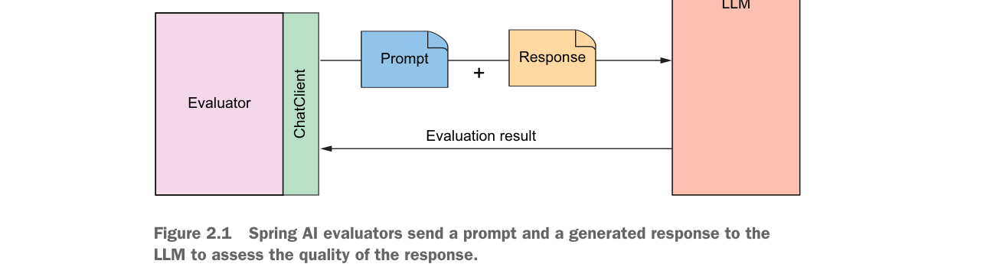

本章内容：

- Spring AI 评估器入门
- 检查回答的相关性
- 判断响应的事实准确性
- 在运行时应用评估器

针对代码编写测试是一项重要的实践。自动化测试不仅可以确保应用程序中没有功能被破坏，还能提供反馈来指导设计和实现。对应用程序中生成式 AI 组件的测试，与其他部分的测试同等重要。

但有一个问题：如果你多次向 LLM 发送相同的提示词，每次很可能会得到不同的答案。生成式 AI 的非确定性特性意味着不可能采用"断言等于"的测试方式。

在第 1 章中，你看到了如何使用 WireMock 来模拟 API 的响应，从而在测试中获得确定性的结果。这种测试方式非常适合测试围绕生成式 AI API 请求的代码，但它并不能测试提示词本身以及模型对提示词的响应。幸运的是，Spring AI 提供了另一种方式来判断生成的响应是否可以接受——评估器（Evaluator）。

评估器接收提交给 LLM 的提示词中的用户文本，以及响应的内容，然后判断响应内容是否满足某些标准。在底层，评估器可以通过适合其评估类型的任何方式来实现。但如图 2.1 所示，评估器通常依赖 LLM（通过 ChatClient）来判断响应与提交的提示词的匹配程度。

> 图 2.1 Spring AI 评估器将提示词和生成的响应发送给 LLM，以评估响应的质量。



让我们看看如何使用评估器来为 BoardGameService 编写集成测试——BoardGameService 是 Board Game Buddy 应用程序中应用生成式 AI 的核心组件。

## 2.1 确保回答的相关性

最基本的评估形式是判断 LLM 是否回答了所提出的问题。也就是说，生成的响应是否至少与提交的提示词主题相关？

例如，如果用户问"天空为什么是蓝色的？"，而 LLM 回答"因为瑞利散射"（或类似的内容），那么这个答案就是相关的。另一方面，假设 LLM 回答"月球距离地球约 239,900 英里"。虽然这个答案本身是正确的，但它与天空颜色的问题并不相关。

判断一个回答是否与给定问题相关，正是 Spring AI 的 `RelevancyEvaluator` 所做的事情。让我们看看 `RelevancyEvaluator` 是如何工作的，并用它来为 BoardGameService 编写一个测试。

```java
package com.example.boardgamebuddy;

import org.assertj.core.api.Assertions;
import org.junit.jupiter.api.BeforeEach;
import org.junit.jupiter.api.Test;
import org.springframework.ai.chat.client.ChatClient;
import org.springframework.ai.chat.evaluation.RelevancyEvaluator;
import org.springframework.ai.evaluation.EvaluationRequest;
import org.springframework.ai.evaluation.EvaluationResponse;
import org.springframework.beans.factory.annotation.Autowired;
import org.springframework.boot.test.context.SpringBootTest;

@SpringBootTest
public class SpringAiBoardGameServiceTests {

    @Autowired
    private BoardGameService boardGameService;

    @Autowired
    private ChatClient.Builder chatClientBuilder;

    private RelevancyEvaluator relevancyEvaluator;

    @BeforeEach
    public void setup() {
        this.relevancyEvaluator = new RelevancyEvaluator(chatClientBuilder);
    }

    @Test
    public void evaluateRelevancy() {
        String userText = "Why is the sky blue?";
        Question question = new Question(userText);
        Answer answer = boardGameService.askQuestion(question);

        EvaluationRequest evaluationRequest = new EvaluationRequest(
                userText, answer.answer());
        EvaluationResponse response = relevancyEvaluator
                .evaluate(evaluationRequest);

        Assertions.assertThat(response.isPass())
                .withFailMessage("""
                ========================================
                The answer "%s"
                is not considered relevant to the question
                "%s".
                ========================================
                """, answer.answer(), userText)
                .isTrue();
    }
}
```

> 清单 2.1 测试 LLM 的响应是否与问题相关

仔细看看 `SpringAiBoardGameServiceTests`，你会发现测试的前几行进行了一些运行评估所需的设置。类上标注了 `@SpringBootTest`，表明这是一个集成测试，Spring 应用上下文（包括应用程序的所有 Bean）会被创建。从该上下文中，`BoardGameService` 和 `ChatClient.Builder` 通过 `@Autowired` 注解注入到测试中。然后在 `setup()` 方法中使用 `ChatClient.Builder` 创建一个新的 `RelevancyEvaluator`，供测试方法使用。

`evaluateRelevancy()` 测试方法首先创建一个 `Question` 对象，将其发送给注入的 `BoardGameService` 的 `askQuestion()` 方法以获取 `Answer`。然后，它根据原始用户文本和答案创建一个 `EvaluationRequest`，并将其传递给 `RelevancyEvaluator` 的 `evaluate()` 方法。在内部，`evaluate()` 方法会向 LLM 发送一个提示词，要求其判断答案与问题的相关性。

`evaluate()` 方法返回一个 `EvaluationResponse`，通过调用 `isPass()` 来判断评估是否通过。如果 `isPass()` 返回 `true`，则答案被认为与问题相关；否则，`isPass()` 将返回 `false`，表示答案不相关，断言将失败。

有了这个测试，你可以快速且自动地检查通过 `SpringAiBoardGameService` 的 `askQuestion()` 方法提出的问题是否得到了合适的答案。但仅仅因为答案相关，并不意味着它是正确的。让我们进一步检查答案的正确性。

## 2.2 测试事实准确性

假设当被问到天空为什么是蓝色时，LLM 回答类似"天空是蓝色的，因为大气中漂浮着无数充满蓝莓酱的小气泡。"虽然这个答案看起来与问题相关，但它肯定不正确。它可能侥幸通过 `RelevancyEvaluator` 的审查，但这不是你应该呈现给应用程序用户的答案。

Spring AI 的 `FactCheckingEvaluator` 工作方式与 `RelevancyEvaluator` 类似，区别在于它不是要求 LLM 判断答案与问题的相关性，而是要求 LLM 判断答案是否正确地回答了问题。

在向 `SpringAiBoardGameServiceTests` 添加事实准确性测试之前，你需要调整 `setup()` 方法来创建一个 `FactCheckingEvaluator` 并赋值给实例变量：

```java
private FactCheckingEvaluator factCheckingEvaluator;

@BeforeEach
public void setup() {
    this.relevancyEvaluator = new RelevancyEvaluator(chatClientBuilder);
    this.factCheckingEvaluator = new FactCheckingEvaluator(chatClientBuilder);
}
```

现在编写事实检查测试方法：

```java
@Test
public void evaluateFactualAccuracy() {
    var userText = "Why is the sky blue?";
    var question = new Question(userText);
    var answer = boardGameService.askQuestion(question);

    var evaluationRequest =
            new EvaluationRequest(userText, answer.answer());
    var response =
            factCheckingEvaluator.evaluate(evaluationRequest);

    Assertions.assertThat(response.isPass())
            .withFailMessage("""
            ========================================
            The answer "%s"
            is not considered correct for the question
            "%s".
            ========================================
            """, answer.answer(), userText)
            .isTrue();
}
```

`evaluateFactualAccuracy()` 方法与之前创建的 `evaluateRelevancy()` 非常相似。就像测试相关性一样，`EvaluationResponse` 的 `isPass()` 用于断言，如果生成的答案被判定为不正确，测试将失败。

如果 `isPass()` 返回 `false` 且断言失败，失败消息会说明原因。例如，假设生成的答案是"大气高处充满了蓝莓酱的小气泡"，那么 `FactCheckingEvaluator` 将判定答案不正确，断言将失败。产生的失败消息可能如下所示：

```
========================================
The answer "The sky is blue because there are a gazillion tiny bubbles filled
with blueberry jam floating in the atmosphere."
is not considered correct for the question
"Why is the sky blue?".
========================================
```

在学习本书的过程中，你将对发送给 LLM 的提示词的构建方式进行许多修改。通过拥有像 `evaluateRelevancy()` 和 `evaluateFactualAccuracy()` 这样的测试，你可以确保无论做出什么更改，仍然能得到合适且正确的答案。

## 2.3 在运行时应用自我评估

即使在构建应用程序时基于评估器的测试通过了，你在运行时仍然可能收到不相关或不正确的响应。生成式 AI 的非确定性特性使得测试可能恰好获得了好的响应，但在生产环境中情况可能发生变化。在运行时应用评估器可以帮助防止将错误的答案返回给应用程序用户。

事实证明，评估器的使用并不局限于集成测试。下面的代码展示了如何将 `RelevancyEvaluator` 与 Spring Retry 结合使用，以避免返回与用户问题不相关的答案。

```java
package com.example.boardgamebuddy;

import org.springframework.ai.chat.client.ChatClient;
import org.springframework.ai.chat.evaluation.RelevancyEvaluator;
import org.springframework.ai.chat.prompt.ChatOptions;
import org.springframework.ai.evaluation.EvaluationRequest;
import org.springframework.ai.evaluation.EvaluationResponse;
import org.springframework.retry.annotation.Recover;
import org.springframework.retry.annotation.Retryable;
import java.util.List;

@Service
public class SelfEvaluatingBoardGameService implements BoardGameService {

    private final ChatClient chatClient;
    private final RelevancyEvaluator evaluator;

    public SelfEvaluatingBoardGameService(ChatClient.Builder chatClientBuilder) {
        var chatOptions = ChatOptions.builder()
                .model("gpt-4o-mini")
                .build();
        this.chatClient = chatClientBuilder
                .defaultOptions(chatOptions)
                .build();
        this.evaluator = new RelevancyEvaluator(chatClientBuilder);
    }

    @Override
    @Retryable(retryFor = AnswerNotRelevantException.class)
    public Answer askQuestion(Question question) {
        var answerText = chatClient.prompt()
                .user(question.question())
                .call()
                .content();

        evaluateRelevancy(question, answerText);
        return new Answer(answerText);
    }

    @Recover
    public Answer recover(AnswerNotRelevantException e) {
        return new Answer("I'm sorry, I wasn't able to answer the question.");
    }

    private void evaluateRelevancy(Question question, String answerText) {
        var evaluationRequest =
                new EvaluationRequest(question.question(), answerText);
        var evaluationResponse = evaluator.evaluate(evaluationRequest);
        if (!evaluationResponse.isPass()) {
            throw new AnswerNotRelevantException(question.question(), answerText);
        }
    }
}
```

> 清单 2.2 在运行时代码中验证相关性

`SelfEvaluatingBoardGameService` 与 `SpringAiBoardGameService` 类似，区别在于 `askQuestion()` 方法标注了 `@Retryable`。这个来自 Spring Retry 的注解表示，如果方法抛出 `AnswerNotRelevantException`，则应该重试该方法。

在 `askQuestion()` 内部，调用 `evaluateRelevancy()` 方法来评估相关性。`evaluateRelevancy()` 方法本身使用了在构造函数中创建的 `RelevancyEvaluator`。如果 `isPass()` 返回 `false`，`evaluateRelevancy()` 将抛出 `AnswerNotRelevantException`，该异常随后从 `askQuestion()` 中抛出，触发重试。

至于 `AnswerNotRelevantException`，它是一个简单的非受检异常：

```java
package com.example.boardgamebuddy;

public class AnswerNotRelevantException extends RuntimeException {
    public AnswerNotRelevantException(String question, String answer) {
        super("The answer '" + answer + "' is not relevant to the question '"
                + question + "'.");
    }
}
```

默认情况下，标注了 `@Retryable` 的方法最多重试三次。你可以通过指定 `maxAttempts` 属性来更改此值。例如，要最多重试五次，可以这样使用 `@Retryable`：

```java
@Retryable(retryFor = AnswerNotRelevantException.class, maxAttempts=5)
```

虽然可以通过设置 `maxAttempts` 来增加重试次数，但请注意每次重试都意味着向 LLM 发送更多提示词。这也意味着评估器会反复向 LLM 发送评估提示词。这可能会增加提交提示词的成本，因为在得到相关答案之前可能会发送更多 token。而且如果连续多次发送相同的提示词，可能会遇到速率限制。保持较低的 `maxAttempts` 值可以避免这些问题。

如果在三次尝试（或 `maxAttempts` 指定的次数）之后仍然没有生成相关答案，控制权将传递给 `recover()` 方法。`recover()` 方法标注了 `@Recover`，这是 Spring Retry 的另一个注解，作为重试持续失败时的最后手段。在 `SelfEvaluatingBoardGameService` 的情况下，`recover()` 方法简单地返回一个 `Answer`，表示无法回答该问题。

最后一点关于 Spring AI 的评估器：虽然 `RelevancyEvaluator` 和 `FactCheckingEvaluator` 是 Spring AI 开箱即用的仅有的两个评估器，但它们都基于 Spring AI 的以下 `Evaluator` 接口：

```java
package org.springframework.ai.evaluation;

import java.util.List;
import java.util.stream.Collectors;
import org.springframework.ai.document.Document;
import org.springframework.util.StringUtils;

@FunctionalInterface
public interface Evaluator {
    EvaluationResponse evaluate(EvaluationRequest evaluationRequest);

    default String doGetSupportingData(EvaluationRequest evaluationRequest) {
        List<Document> data = evaluationRequest.getDataList();
        return data.stream()
                .map(Document::getText)
                .filter(StringUtils::hasText)
                .collect(Collectors.joining(System.lineSeparator()));
    }
}
```

如果 `RelevancyEvaluator` 或 `FactCheckingEvaluator` 不能满足你的评估需求，你可以通过实现 `Evaluator` 接口来创建自定义评估器。

## 总结

- 生成式 AI 的非确定性特性使测试变得棘手。
- Spring AI 提供了评估器，可用于对生成的响应进行断言。
- 评估器通过向 LLM 提交提示词来评估响应的相关性和事实准确性。
- 评估器可以在运行时应用，以便在返回不满意的响应时重试提示词。
