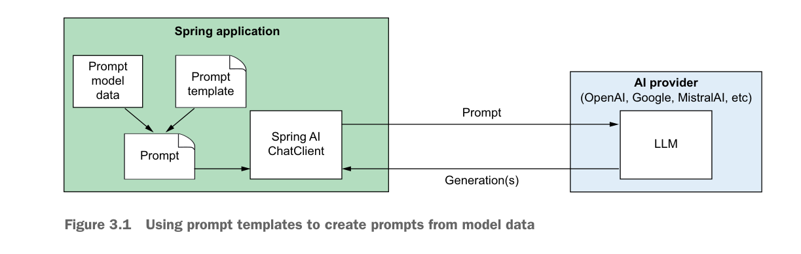
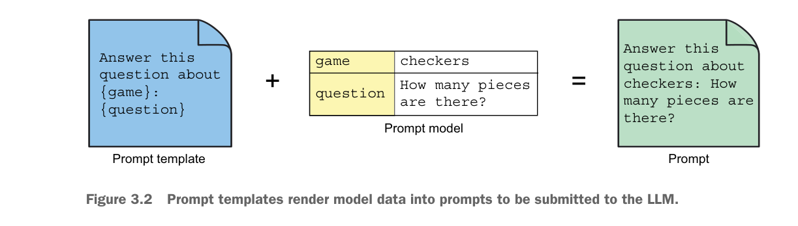
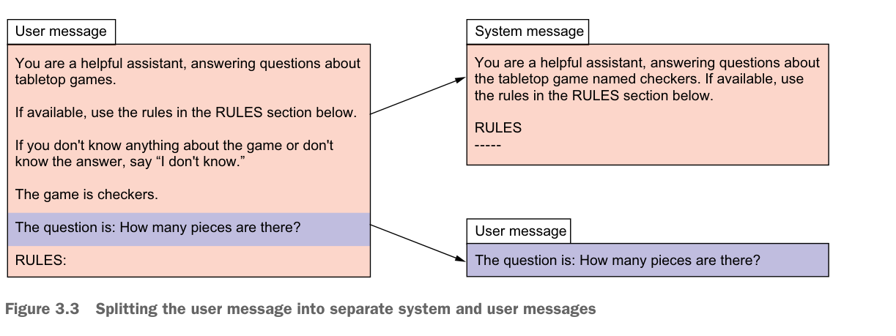

## 3.1 使用提示模板

本章将把你的提示和响应处理提升到新的高度。首先来看看如何定义提示模板（Prompt Template）。

Spring AI 提供了从模板创建提示的能力。模板中会包含一个或多个占位符（Placeholder），穿插在静态文本之间。如图 3.1 所示，这些模板的占位符可以用模型数据填充，每次调用时模型数据会有所不同，从而生成发送给 LLM 的提示。模型数据被填入占位符，周围是引导 LLM 如何响应的提示文本。



为了演示提示模板的工作原理，我们先来完善第 1 章的例子，用于回答各种桌面游戏的问题，比如国际跳棋、大富翁，或者卡坦岛、翼展等更现代的欧式桌游。

首先，需要在 Question 记录中捕获游戏标题：

```java
package com.example.boardgamebuddy;

import jakarta.validation.constraints.NotBlank;

public record Question(
    @NotBlank(message = "Game title is required") String gameTitle,
    @NotBlank(message = "Question is required") String question) {
}
```

这个新版本的 Question 增加了 `gameTitle` 属性来捕获游戏标题。这个属性确保有足够的上下文来回答关于特定游戏的问题，而不需要在游戏中提到游戏名称。

你可能还注意到两个属性都标注了 `@NotBlank`。虽然验证不是 Spring AI 的功能，但它是 Spring 本身非常重要的特性。通过 `@NotBlank` 注解，表示这两个字段都是必填的，不能为 null 或被截断为空字符串。

`@NotBlank` 注解以及 Spring 的验证支持需要在项目的构建配置中添加以下 starter 依赖：

```groovy
implementation 'org.springframework.boot:spring-boot-starter-validation'
```

还需要在控制器的 `ask()` 方法的 Question 参数上添加 `@Valid` 注解，告诉 Spring 在处理请求时进行验证：

```java
@PostMapping(path="/ask", produces="application/json")
public Answer ask(@RequestBody @Valid Question question) {
    return boardGameService.askQuestion(question);
}
```

最后，为了使验证错误能整齐地返回在 JSON 响应中，清单 3.1 中的控制器通知类使用了 Spring 对问题详情（Problem Details，RFC-7807）的支持。

**清单 3.1** 使用问题详情整齐地处理验证错误

```java
package com.example.boardgamebuddy;

import org.springframework.context.MessageSourceResolvable;
import org.springframework.http.HttpStatus;
import org.springframework.http.ProblemDetail;
import org.springframework.web.bind.MethodArgumentNotValidException;
import org.springframework.web.bind.annotation.ExceptionHandler;
import org.springframework.web.bind.annotation.RestControllerAdvice;
import java.util.List;

@RestControllerAdvice  // 适用于所有 REST 控制器
public class ExceptionHandlerAdvice {  // 处理验证异常

    @ExceptionHandler(MethodArgumentNotValidException.class)
    public ProblemDetail handleValidationExceptions(
            MethodArgumentNotValidException ex) {
        var problemDetail = ProblemDetail
                .forStatusAndDetail(HttpStatus.BAD_REQUEST, "Validation failed");
        var validationMessages = ex.getBindingResult().getAllErrors()
                .stream()
                .map(MessageSourceResolvable::getDefaultMessage)
                .toList();  // 添加验证失败信息
        problemDetail.setProperty("validationErrors", validationMessages);
        return problemDetail;
    }
}
```

简而言之，问题详情是一种以标准方式结构化 HTTP API 错误的规范。Spring 从 6.0 开始就提供了一流的问题详情支持。当问题详情应用于验证且验证失败时（例如请求中未指定游戏标题），客户端会收到类似这样的标准响应：

```json
{
  "detail": "Validation failed",
  "instance": "/ask",
  "status": 400,
  "title": "Bad Request",
  "type": "about:blank",
  "validationErrors": [
    "Game title is required"
  ]
}
```

现在把注意力转向响应。和 Question 一样，你也需要把游戏标题添加到 Answer 记录中，这样 API 的客户端就能知道答案对应的是哪个游戏：

```java
package com.example.boardgamebuddy;

public record Answer(String gameTitle, String answer) {
}
```

现在 Question 和 Answer 都包含了游戏名称，你可以修改 SpringAiBoardGameService 中的 `askQuestion()` 方法，简单地使用字符串拼接：

```java
@Override
public Answer askQuestion(Question question) {
    String prompt =
        "Answer this question about " + question.gameTitle() +
        ": " + question.question();
    String answerText = chatClient.prompt()
            .user(prompt)
            .call()
            .content();
    return new Answer(question.gameTitle(), answerText);
}
```

现在可以测试一下，发送一个关于某个游戏的问题并在请求中包含游戏名称。例如，用 HTTPie 问一个关于国际跳棋的问题：

```
$ http :8080/ask gameTitle="checkers" \
    question="How many pieces are there?" -b
{
    "answer": "In checkers, there are a total of 24 pieces-12 for each player.",
    "gameTitle": "checkers"
}
```

底层 LLM 基于自身的训练回答了关于国际跳棋的问题。这种方法对于国际跳棋、国际象棋等知名游戏没问题，但对于较新或不太知名的游戏可能答不上来。下一章将介绍如何让 LLM 回答超出其训练范围的问题。

虽然能用，但用字符串拼接来创建提示很笨拙。即使是 `askQuestion()` 方法中这样简单的提示，也让代码显得有些别扭，不容易阅读。

### 3.1.1 定义提示模板

与其使用字符串拼接，不如创建一个提示模板，在模板中定义原始的、未渲染的提示，并为变量数据预留占位符。清单 3.2 展示了修改后的 SpringAiBoardGameService，使用模板化的提示。

**清单 3.2** 使用提示模板避免笨拙的字符串拼接

```java
package com.example.boardgamebuddy;

import org.springframework.ai.chat.client.ChatClient;
import org.springframework.stereotype.Service;

@Service
public class SpringAiBoardGameService implements BoardGameService {

    private final ChatClient chatClient;

    public SpringAiBoardGameService(ChatClient.Builder chatClientBuilder) {
        this.chatClient = chatClientBuilder.build();
    }

    // 模板作为字符串
    private static final String questionPromptTemplate = """
        Answer this question about {game}: {question}
        """;

    @Override
    public Answer askQuestion(Question question) {  // 设置提示模板
        var answerText = chatClient.prompt()
            .user(userSpec -> userSpec
                .text(questionPromptTemplate)
                .param("gameTitle", question.gameTitle())
                .param("question", question.question()))  // 向模板注入数据
            .call()  // 发送提示并获取响应
            .content();
        return new Answer(question.gameTitle(), answerText);
    }
}
```

可以看到，名为 `questionPromptTemplate` 的提示模板是一个看起来很像通过拼接生成的提示的字符串。但它的价值不仅仅是文本。它是一个带有占位符 `{game}` 和 `{question}` 的字符串模板（StringTemplate，https://www.stringtemplate.org/），对应提示中的各个参数。

由于有占位符，这个提示模板不能作为简单的字符串提交。你还必须指定填充这些占位符的值。因此，在 `askQuestion()` 方法中，`user()` 方法接收一个 lambda 而不是模板本身。更具体地说，这个 lambda 实现了 `Consumer<UserSpec>` 接口，允许你自定义发送给 LLM 的请求消息。

在这个例子中，用户消息的文本（也就是提示模板）通过在用户规范上调用 `text()` 来指定。填入占位符的值通过调用 `param()` 方法来设置，每个参数调用一次。在提示发送给 LLM 之前，占位符会被这些参数值填充，生成完整的提示消息。图 3.2 展示了这个过程。



`askQuestion()` 中的其余代码和之前一样。`call()` 方法表示提示已准备好发送，`content()` 方法返回答案文本。

如果重启应用并发送请求，效果应该和之前一样，只是由于生成式 AI 的不确定性，答案的措辞可能略有不同。可以试试问其他桌游的问题看看效果。

现在提示的精髓都集中在一个地方——静态字符串常量——更容易阅读和维护，即使给 `askQuestion()` 方法增加了一些代码。既然更容易维护了，就来加一点提示工程（Prompt Engineering）让提示更好一些。看看对模板字符串的以下改进：

```java
private static final String questionPromptTemplate = """
    You are a helpful assistant, answering questions about tabletop games.
    If you don't know anything about the game or don't know the answer,
    say "I don't know".

    The game is {game}.
    The question is: {question}.
    """;
```

这个新的提示模板为 LLM 设置了更多上下文，明确了它的角色和我们的期望——告诉它是一个有用的助手，将回答关于桌游的问题。同时要求 LLM 如果训练数据中没有答案就承认不知道。

像这样的提示工程技巧可以帮助你从提示中获得更好的结果。更多提示工程技巧可以参考提示工程指南（https://www.promptingguide.ai/）。

### 3.1.2 作为资源导入模板

把提示模板字符串提取成常量帮助整理了 `askQuestion()` 方法，使代码更易阅读和调整提示。但你还可以更进一步，把模板提取到外部文件中。这样模板和 Java 源代码分离，同时仍然可以将模板纳入源代码管理。

具体做法是：先在项目的 `src/main/resources` 文件夹下创建一个名为 `promptTemplates` 的新目录。在新建的目录中创建一个名为 `questionPromptTemplate.st` 的文件，内容如下：

```
You are a helpful assistant, answering questions about tabletop games.
If you don't know anything about the game or don't know the answer,
say "I don't know".
Answer in complete sentences.

The game is {gameTitle}.
The question is: {question}.
```

> **注意** 目录和模板文件的名称可以随意取。只需要在将模板注入 SpringAiBoardGameService 时正确引用它们即可。

即使 GitHub 可能会误判，`.st` 扩展名表示这是一个 StringTemplate 文件（不是 Smalltalk 文件）。可以看到，这个 StringTemplate 文件包含的文本与之前定义的静态字符串常量相同。但现在模板定义在自己的文件中，提示模板的细节可以与提交提示的代码分开维护。

接下来需要修改 SpringAiBoardGameService 来引用模板文件。删除静态字符串常量，替换为以下代码：

```java
@Value("classpath:/promptTemplates/questionPromptTemplate.st")
Resource questionPromptTemplate;
```

`@Value` 注解使用 `classpath:` 前缀引用模板文件，本质上是将其注入到 `Resource` 属性中。注意 `Resource` 属性和之前的字符串常量同名。用户规范的 `text()` 方法是重载的，可以接受 `String` 或 `Resource`。所以把 `Resource` 命名为 `questionPromptTemplate`，就无需修改 `askQuestion()` 方法来使用新的模板资源。

重启应用再试试问游戏问题，效果和之前一样。虽然应用行为没变，但内部实现更干净了，对模板的任何调整都可以独立于 SpringAiBoardGameService 代码进行。

如果问的是国际跳棋、国际象棋等知名游戏，得到的答案很可能是正确的。但假设你问一个 LLM 没有训练过的游戏呢？比如试试问卡牌游戏"汉堡大作战（Burger Battle）"（https://www.burgerbattlegame.com/）。理想情况下，如果不知道答案它会说"我不知道"：

```
$ http :8080/ask gameTitle="Burger Battle" \
    question="What is the Grave Digger card?" -b
{
    "answer": "I don't know.",
    "gameTitle": "Burger Battle"
}
```

尽管提示模板告诉 LLM 说"我不知道"，但你同样可能得到一个编造的答案：

```
$ http :8080/ask gameTitle="Burger Battle" \
    question="What is the Destroy card?" -b
{
    "answer": "In Burger Battle, the Destroy card is a special card that allows
    players to eliminate one ingredient card from an opponent's burger.",
    "gameTitle": "Burger Battle"
}
```

如果你玩过或者读过"汉堡大作战"的规则，就会知道这个答案是错误的。这是使用 LLM 时一个不幸但有时也很搞笑的特性。当 LLM 没有足够的训练来回答某个问题时，可能会编造一个完全错误的答案。人们用一个略带调侃的术语来描述这种行为——幻觉（Hallucination）。

避免幻觉有几种方法：

- 训练自己的模型
- 对现有模型进行微调（Fine-tuning）
- 在提示中提供额外的上下文

虽然训练或微调模型可以说是避免幻觉的最佳方式（更不用说还能基于专有信息创建模型），但它们实施难度大，需要数据科学领域的技能，而不是软件开发的技能。此外，训练和微调需要大量数据才能做好，也是非常耗时的活动，可能需要几个小时、几天甚至几周。在我们一直在构建的桌游例子中，新游戏发布后无法立即添加进模型。

相比之下，在提示中添加一些上下文和添加问题本身没什么区别，都是在提交提示时即时发生的。因此，它比训练和微调模型简单得多。

下面来看看如何在提示中连同问题一起提供额外的上下文。这将为检索增强生成（Retrieval-Augmented Generation，RAG）——一种更高级的在提示中添加上下文的方式——奠定基础，我们将在下一章详细讨论。

## 3.2 用上下文填充提示

回想一下你的学生时代，你可能参加过开卷考试。在这种情况下，你不需要把所有东西都背下来才能通过考试。即使没复习，你也可以翻阅课本找到需要的答案。

在生成式 AI 中，一种通常被称为"填充提示"的技术就类似于给 LLM 一场开卷考试。除了发送给 LLM 生成的问题外，你还提供一些额外的文本供 LLM 参考。这样 LLM 就不需要在某个主题上预先训练过就能回答相关问题。

为了让 Board Game Buddy 能准确回答 LLM 没有训练过的"汉堡大作战"的问题，我们给它一场开卷考试。也就是说，把游戏规则作为上下文添加到提示中。最直接的做法是创建一个包含游戏规则的文本文件。

"汉堡大作战"的规则（https://mng.bz/yNKo）相对较短，但在本书中列出仍然太长了。但至少，为了让 LLM 能回答关于 Destroy 卡或其他战斗卡的问题，创建一个包含以下内容的文件：

```
* Burger Bomb: Blow up another player's Burger by sending their ingredients
  to the Graveyard.
* Burger Force Field: Your Burger is now protected from all Battle Cards.
* Burgerpocalypse: Obliterate all players' ingredients, including your own,
  and toss them in the Graveyard.
* Destroy!: Destroy any Battle Card of yours or another player's and toss
  it in the Graveyard.
* Gonna Eat That?: Steal another player's ingredient and add it to your
  Burger.
* Grave Digger: Dig through the Graveyard for any needed ingredient and add
  it to your Burger.
* I Got Nothin': Toss your hand in the Graveyard and draw 5 new cards.
* More Meat!: Make another player's Burger a double-decker by adding an
  extra Meat to their ingredients list.
* Pickle Plague: Rain vengeance down upon another player by adding Pickles
  to their ingredients list.
* Picky Eater: Throw another player's Lettuce, Tomato, or Onion in the
  Graveyard.
* The Old Switcheroo: Trade hands with another player.
* Yours Looks Good!: Trade your Burger and all of your ingredients with
  another player, including added Battle Cards.
```

在 `src/main/resources` 文件夹下创建一个名为 `gameRules` 的目录，把文件命名为 `burger_battle.txt`。

接下来需要修改模板，增加一个规则的占位符：

```
You are a helpful assistant, answering questions about tabletop games.
If available, use the rules in the RULES section below.
If you don't know anything about the game or don't know the answer,
say "I don't know".
Answer in complete sentences.

The game is {gameTitle}.
The question is: {question}.

RULES:
{rules}
```

注意除了添加 `{rules}` 占位符外，文本中还有一条指令告诉 LLM 在有规则可用时使用它们。

在把规则注入提示之前，需要先把它们加载到字符串中。为此，创建一个如清单 3.3 所示的服务类。

**清单 3.3** GameRulesService 将游戏规则加载到字符串中

```java
package com.example.boardgamebuddy;

import org.slf4j.Logger;
import org.slf4j.LoggerFactory;
import org.springframework.core.io.DefaultResourceLoader;
import org.springframework.stereotype.Service;
import java.io.IOException;
import java.nio.charset.Charset;

@Service
public class GameRulesService {
    private static final Logger LOG =
        LoggerFactory.getLogger(GameRulesService.class);

    public String getRulesFor(String gameName) {
        try {
            var filename = String.format(
                "classpath:/gameRules/%s.txt",  // 从游戏名称创建资源路径
                gameName.toLowerCase().replace(" ", "_"));

            return new DefaultResourceLoader()
                .getResource(filename)
                .getContentAsString(Charset.defaultCharset());  // 将资源加载为字符串
        } catch (IOException e) {
            LOG.info("No rules found for game: " + gameName);
            return "";  // 异常时返回空字符串
        }
    }
}
```

简而言之，`getRulesFor()` 方法通过 `Resource` 将指定游戏的规则加载到字符串中。由于资源路径取决于游戏名称，无法像提示模板那样用 `@Value` 定义 `Resource`，所以 `getRulesFor()` 依赖几个 Spring 工具类来定义资源。

在创建游戏规则路径时，`getRulesFor()` 会将游戏标题转为小写，并用下划线替换空格。这样可以避免游戏标题和文件名之间的大小写或空格不匹配问题。例如，如果 Question 中提交的游戏标题是 "Burger battle"，会被规范化为 `burger_battle`。

现在准备好修改 SpringAiBoardGameService，将规则添加到提示中。首先，把 `GameRulesService` 注入到 SpringAiBoardGameService：

```java
@Service
public class SpringAiBoardGameService implements BoardGameService {
    private final ChatClient chatClient;
    private final GameRulesService gameRulesService;

    public SpringAiBoardGameService(
            ChatClient.Builder chatClientBuilder,
            GameRulesService gameRulesService) {
        this.chatClient = chatClientBuilder.build();
        this.gameRulesService = gameRulesService;
    }
    // ...
}
```

然后需要修改 `askQuestion()` 方法，使用 `GameRulesService` 加载规则，并通过另一次 `param()` 调用将其作为参数添加到用户消息规范中：

```java
@Override
public Answer askQuestion(Question question) {
    var gameRules = gameRulesService.getRulesFor(question.gameTitle());
    var answerText = chatClient.prompt()
        .user(userSpec -> userSpec
            .text(questionPromptTemplate)
            .param("gameTitle", question.gameTitle())
            .param("question", question.question())
            .param("rules", gameRules))
        .call()
        .content();
    return new Answer(question.gameTitle(), answerText);
}
```

现在可以测试了。重启应用，再问一次"汉堡大作战"的 Destroy 卡：

```
$ http :8080/ask gameTitle="Burger Battle" \
    question="What is the Destroy card?" -b
{
    "answer": "The Destroy card in Burger Battle allows you to destroy any
    Battle Card, whether it belongs to you or another player, and then
    place it in the Graveyard.",
    "gameTitle": "Burger Battle"
}
```

太好了！这次答案是正确的，明显是从提示中提供的上下文里提取出来的。

为了确认它仍然能回答其他游戏的问题，再试一次。这次问一个关于国际象棋的问题：

```
$ http :8080/ask gameTitle="chess" \
    question="How are knights allowed to move?" -b
{
    "answer": "In chess, knights move in an L-shape: two squares in one
    direction, and then one square perpendicular to that. Knights are the
    only pieces that can jump over other pieces on the board.",
    "gameTitle": "chess"
}
```

虽然应用无法从加载的资源中提供国际象棋的规则，但模型的训练数据中已经包含了国际象棋的规则。

需要理解的是，提示中更多的上下文意味着更多的输入 token。问国际象棋问题时没有额外上下文，提示有 75 个 token。相比之下，虽然"汉堡大作战"的问题只包含了相对较小的规则片段，但提示的 token 数达到了 315——是无上下文时的四倍多。

至少，token 数量影响使用 LLM 的成本。提示（以及响应）中的 token 越多，费用越高。许多 LLM（如 GPT-4o）每 1000 个 token 的单价很低，但随着时间推移会累积起来。此外，如果提示中发送的 token 太多，有可能超过 token 限制。GPT-4o 的上下文窗口允许 128K token，远超我们简单示例的需要。虽然大多数桌游的规则都能轻松放入 128K token，但很容易想象其他领域中向上下文输入大量文档可能超过 token 限制。

在下一章中，你将学习如何应用检索增强生成（RAG）技术，在不超过 token 限制的前提下为提示提供相关上下文。在使用 RAG 之前，还有更多关于提示的内容需要探索，包括使用提示角色。

## 3.3 分配提示角色

许多 LLM，包括 OpenAI、MistralAI 和 Anthropic 的模型，都支持将提示拆分为多条消息，每条消息属于一个特定角色。常用的支持角色包括：

- **用户（User）**——消息包含由应用程序用户（或代表用户）提出的问题或陈述。
- **系统（System）**——消息包含应用程序本身给 LLM 的指令。
- **助手（Assistant）**——消息包含 LLM 的回复。
- **工具（Tool）**——消息包含调用工具执行某个操作或获取额外上下文信息的指令。

目前我们重点关注用户消息和系统消息。助手消息在用户和 LLM 进行多轮对话时使用，我们将在第 5 章深入讨论对话。然后在第 6 章将看到工具消息如何通过与 API 交互让你的 AI 交互变得高度动态。

> **注意** 并非所有 LLM API 都支持相同的消息角色选择。当 API 不支持系统角色时，Spring AI 会简单地将原本作为系统角色的消息文本添加到用户消息中。

到目前为止，我们一直通过 `user()` 方法指定提示，这意味着所有提示都是用户消息，代表用户提交。例如，当用目前的代码问国际跳棋有多少棋子时，Spring AI 在 POST 请求体中发送给 OpenAI 的 JSON 如下：

```json
{
  "messages": [
    {
      "content": "You are a helpful assistant, answering questions about tabletop games.\nIf available, use the rules in the RULES section below.\nIf you don't know anything about the game or don't know the answer,\nsay \"I don't know\".\n\nThe game is checkers.\n\nThe question is: How many pieces are there?.\n\nRULES:\n",
      "role": "user"
    }
  ],
  "model": "gpt-4o",
  "stream": false,
  "temperature": 0.7
}
```

注意只有一条消息，内容是完整的提示，角色设为 `user`。这种方式确实可行，但可以更好。

> **查看 Spring AI 的请求和响应**
>
> 如果你想查看使用 Spring AI 提交提示时的原始请求和响应 JSON，可以将 Logbook（https://github.com/zalando/logbook）添加到项目构建中：

```groovy
implementation 'org.zalando:logbook-spring-boot-starter:3.9.0'
```

> 这个依赖会自动配置 Spring 中的一些组件，用于监控 Spring 的 HTTP 客户端，记录通过这些组件发送的请求和返回的响应。

> 由于 Spring AI 的 `ChatClient` 底层使用了 Spring 的 `RestClient`，你需要声明一个 `RestClientCustomizer` bean 来将 Logbook 的 `LogbookClientHttpRequestInterceptor` 添加为请求拦截器：

```java
@Bean
RestClientCustomizer logbookCustomizer(
        LogbookClientHttpRequestInterceptor interceptor) {
    return restClient -> restClient.requestInterceptor(interceptor);
}
```

> Logbook 在 TRACE 级别记录请求和响应详情，所以需要在 `application.properties` 文件中设置日志级别：

```properties
logging.level.org.zalando.logbook: TRACE
```

> 默认情况下，Logbook 以 JSON 格式记录请求和响应，这可能导致难以阅读。可以将 `logbook.format.style` 属性设为 `http` 使其更易读：

```properties
logbook.format.style=http
```

> 现在当 Spring AI 向各种 AI API 发送请求和接收响应时，它们会被记录以便检查。但要注意，Spring AI 的 Gemini 模块使用 Google 自己的 HTTP 客户端库而不是 `RestClient`，所以如果你使用 Google Gemini 作为 LLM，Logbook 不会生效。

如图 3.3 所示，消息内容可以拆分为两条消息。大部分文本是给 LLM 的指令，告诉它如何回答用户的问题。因此，作为系统消息会更好。提示中唯一来自用户的部分就是问题本身。



要将这个改动应用到项目中，首先创建一个名为 `systemPromptTemplate.st` 的新模板文件，替换原来的 `questionPromptTemplate.st`（可以删除原文件，因为不再使用）。新模板定义系统消息：

```
You are a helpful assistant, answering questions about the tabletop
game named {gameTitle}. If available, use the rules in the RULES
section below.
Answer in complete sentences.

RULES
-----
{rules}
```

SpringAiBoardGameService 需要修改为使用这个新模板。将现有的 `Resource` 属性替换为：

```java
@Value("classpath:/promptTemplates/systemPromptTemplate.st")
Resource promptTemplate;
```

最后需要修改 `askQuestion()` 方法来使用这个新模板。清单 3.4 展示了新的 SpringAiBoardGameService。

**清单 3.4** 将提示拆分为独立的用户消息和系统消息

```java
@Override
public Answer askQuestion(Question question) {
    var gameRules = gameRulesService.getRulesFor(question.gameTitle());
    var answerText = chatClient.prompt()
        .system(systemSpec -> systemSpec  // 设置系统消息
            .text(promptTemplate)
            .param("gameTitle", question.gameTitle())
            .param("rules", gameRules))
        .user(question.question())  // 设置用户消息
        .call()
        .content();
    return new Answer(question.gameTitle(), answerText);
}
```

具体来说，提示模板通过系统消息规范的 `text()` 方法提供，而不是用户消息规范。用于填充占位符的参数值也是如此。至于用户消息，则再次简单地使用问题本身的文本。

指定用户消息和系统消息的顺序无关紧要，最终都会出现在发送给 LLM 的请求中。

应用这些更改后，重启应用再试一次。效果应该和之前一样，但底层发送给 OpenAI 的请求会有两条独立的消息——系统的指令和用户的问题：

```json
{
  "messages": [
    {
      "content": "How many pieces are there?",
      "role": "user"
    },
    {
      "content": "You are a helpful assistant, answering questions about the tabletop\ngame named checkers. If available, use the rules in the RULES section below.\n\nRULES\n-----\n",
      "role": "system"
    }
  ],
  "model": "gpt-4o",
  "stream": false,
  "temperature": 0.7
}
```

虽然到目前为止的例子可能太简单，角色的作用不太明显，但一般来说，角色有助于 LLM 生成更好的响应。随着提示变得更复杂，这个效果会更加显著。

到目前为止，我们一直在讨论如何创建和发送提示给 LLM 进行生成。现在把注意力转向对话的另一端——学习如何告诉 LLM 我们希望生成的响应以什么方式返回。

## 3.4 影响响应生成

Spring AI 包含几个非常有用的功能来影响响应的返回方式，包括：

- **设置生成选项**（Generation Options）——可以控制生成响应时下一个 token 的选择方式。
- **输出转换**（Output Conversion）——可以在提示中包含指令，告诉 LLM 如何格式化响应，从而将文本响应转换为 Java 对象。
- **应用流式传输**（Streaming）——结果会逐片段返回，而不是等待整个响应一次性发送。

下面来逐一了解这些有用的功能，从将响应绑定到 Java 对象开始。

### 3.4.1 指定聊天选项

在使用生成式 AI 的过程中，你可能会发现 LLM 的响应并不总是如你所愿。模型训练时投入的海量数据，加上生成的不确定性，偶尔会产生不太理想的响应。

Spring AI 提供了多个属性让你调整 LLM 处理提示的方式。你已经在第 1 章见过其中一个选项，当时在 `application.properties` 中添加了以下行来覆盖默认模型：

```properties
spring.ai.openai.chat.options.model=gpt-4.1-nano
```

Spring AI 支持的所有 API 都有类似的属性来指定使用的模型。例如，使用 Ollama 时选择 Llama 3.2 模型：

```properties
spring.ai.ollama.chat.options.model=llama3.2
```

这两行的关键区别（除了选择的模型不同）是一个用于 OpenAI 的 API，另一个用于 Ollama 的 API。通过这种方式设置聊天选项时，确保选择与你将使用的 API 对应的属性。

Spring AI 提供的大多数聊天选项都可以通过 `application.properties` 中的此类属性来设置。也可以在创建 `ChatClient` 时通过在 builder 上调用 `defaultOptions()` 来设置默认选项。例如，在创建 `ChatClient` 时指定 `gpt-4.1-nano` 作为模型：

```java
ChatOptions chatOptions = ChatOptions.builder()
    .model("gpt-4.1-nano")
    .build();

ChatClient chatClient = chatClientBuilder
    .defaultOptions(chatOptions)
    .build();
```

`defaultOptions()` 方法接受一个 `ChatOptions` 对象。你可以使用 `ChatOptions.builder()` 创建并设置多个选项。在这个例子中，`model()` 方法用于指定模型，但本节将介绍其他几个选项。

通过 `defaultOptions()` 设置的聊天选项会覆盖 `application.properties` 中的同名配置属性。但即使是通过 `defaultOptions()` 设置的选项，也可以在创建提示时通过调用 `options()` 来覆盖。例如：

```java
String answerText = chatClient.prompt()
    .user(question.question())
    .options(chatOptions)
    .call()
    .content();
如果想在创建 `ChatClient` 或创建提示时以编程方式设置，可以在 `ChatOptions` 中这样配置：

```java
ChatOptions chatOptions = ChatOptions.builder()
    .temperature(0.7)
    .build();
也可以在 `ChatOptions` 中以编程方式设置：

```java
ChatOptions chatOptions = ChatOptions.builder()
    .topP(0.8)
    .build();
```

一般建议只设置 temperature 或 Top-P 之一，而不是两个都设置。当然，同时设置也是允许的，也能取得一定的效果。

Top-K 的工作方式与 Top-P 非常相似，区别在于它使用简单的计数而不是概率之和来决定哪些 token 保留、哪些被排除。OpenAI 不支持在提交提示时指定 Top-K，所以使用 OpenAI 时无法调整 Top-K。但 Ollama 支持 Top-K，可以这样设置：

```properties
spring.ai.ollama.chat.options.top-k=4
```

以编程方式设置：

```java
ChatOptions chatOptions = ChatOptions.builder()
    .topK(4)
    .build();
```

如果在 `ChatOptions` 中设置了 Top-K 并提交提示给 OpenAI，会收到一个错误提示 OpenAI 不支持 Top-K。

在前面的集合例子中，如果 Top-K 设为 4，前四个——"books"、"coins"、"records" 和 "arts"——会保留，但 "stamps" 会被排除。和 Top-P 一样，Top-K 排除其余 token 后，概率会被归一化，然后进行随机选择。

应用 temperature、Top-P 和 Top-K 等选项有助于控制 LLM 生成响应时的选择。现在来看看如何使用输出转换以 Java 对象的形式接收生成响应。

### 3.4.2 格式化响应输出

到目前为止，我们的应用程序显式地从 LLM 返回的响应中提取文本内容，并用它创建 `Answer` 对象。鉴于 `Answer` 记录的简单性，这算不上什么大工程。但可以想象，对于更复杂的响应，这种"提取再实例化"的代码可能会比较笨拙。幸运的是，Spring AI 提供了输出转换辅助功能来处理将 LLM 响应映射到 Java 对象的任务。

为了演示输出转换的工作原理，先看看如何让 `ChatClient` 返回一个 `Answer` 对象而不是字符串响应。为此需要修改 `askQuestion()` 方法，请求一个实体对象。

**清单 3.5** 获取 Answer 对象作为 LLM 结果

```java
package com.example.boardgamebuddy;

import org.springframework.ai.chat.client.ChatClient;
import org.springframework.beans.factory.annotation.Value;
import org.springframework.core.io.Resource;
import org.springframework.stereotype.Service;

@Service
public class SpringAiBoardGameService implements BoardGameService {
    private final ChatClient chatClient;
    private final GameRulesService gameRulesService;

    public SpringAiBoardGameService(
            ChatClient.Builder chatClientBuilder,
            GameRulesService gameRulesService) {
        this.chatClient = chatClientBuilder.build();
        this.gameRulesService = gameRulesService;
    }

    @Value("classpath:/promptTemplates/systemPromptTemplate.st")
    Resource promptTemplate;

    @Override
    public Answer askQuestion(Question question) {
        var gameRules = gameRulesService.getRulesFor(question.gameTitle());
        return chatClient.prompt()
            .system(systemSpec -> systemSpec
                .text(promptTemplate)
                .param("gameTitle", question.gameTitle())
                .param("rules", gameRules))
            .user(question.question())
            .call()
            .entity(Answer.class);  // 请求 Answer 类型
    }
}
```

`askQuestion()` 方法的工作方式和之前几乎一样，只有一个几乎察觉不到的改变。不是调用 `content()` 方法，而是调用 `entity()` 方法，传入 `Answer.class` 来指定响应的类型。

这个小改动带来了提示处理方式的两个变化：

- 格式化指令会被包含在提示中发送
- 响应会被解析为对象

在提示发送给 LLM 之前，Spring AI 会给它加上格式化指令，告诉模型响应应该以什么形式呈现。格式来自 `Answer` 记录及其属性。如果你拦截请求仔细查看，会发现格式化指令大致如下：

```
Your response should be in JSON format.
Do not include any explanations, only provide a RFC8259 compliant JSON
response following this format without deviation.
Do not include markdown code blocks in your response.

Here is the JSON Schema instance your output must adhere to:
{
  "$schema" : "https://json-schema.org/draft/2020-12/schema",
  "type" : "object",
  "properties" : {
    "answer" : { "type" : "string" },
    "gameTitle" : { "type" : "string" }
  }
}
```

这里发送的格式精确地告诉 LLM 如何将响应格式化为 JSON 对象，包括一个 JSON Schema。

当响应返回时，JSON 对象会被转换为期望的类型——本例中是 `Answer`。

> **注意** 即使 Spring AI 的输出转换做好了格式化指令的工作，仍然可能不起作用。有些 LLM 会拒绝遵循格式化指令，想怎么返回就怎么返回。OpenAI 的 GPT 模型在遵循格式化指令方面表现不错，但其他 LLM（如 Mistral 7b）可能不行。不幸的是，如果你使用的 LLM 不遵守请求的格式，就无法可靠地依赖结果转换并绑定到对象。如果发生这种情况，Spring AI 在尝试将非 JSON 响应绑定到对象时会抛出 `JsonParseException`。

就这样！现在 Spring AI 的输出转换会处理创建 `Answer` 对象的工作。它之所以能做到，是因为先创建了指令告诉 LLM 如何将结果格式化为 JSON 对象。

#### 解析输出为列表

Spring AI 还可以将响应解析为 `List<String>`。当响应预期是一个列表时这很合适，比如主题公园的景点、体育联赛的球队，或者 Billboard Hot 100 的热门歌曲。

为了演示如何获取列表响应，创建一个新的控制器，如清单 3.6 所示，返回指定年份的前 10 首歌曲。

**清单 3.6** 返回年度热门歌曲的控制器

```java
package com.example.topsongs;

import java.util.List;
import org.springframework.ai.chat.client.ChatClient;
import org.springframework.beans.factory.annotation.Value;
import org.springframework.core.ParameterizedTypeReference;
import org.springframework.core.io.Resource;
import org.springframework.web.bind.annotation.GetMapping;
import org.springframework.web.bind.annotation.RequestParam;
import org.springframework.web.bind.annotation.RestController;

@RestController
public class TopSongsController {

    @Value("classpath:/top-songs-prompt.st")
    Resource topSongPromptTemplate;  // 注入提示模板

    private final ChatClient chatClient;

    public TopSongsController(ChatClient.Builder chatClientBuilder) {
        this.chatClient = chatClientBuilder.build();
    }

    @GetMapping(path = "/topSongs", produces = "application/json")
    public List<String> topSongs(@RequestParam("year") String year) {
        return chatClient.prompt()
            .user(userSpec -> userSpec
                .text(topSongPromptTemplate)
                .param("year", year))
            .call()
            .entity(new ParameterizedTypeReference<List<String>>() {});  // 请求列表结果
    }
}
```

为了简单起见，控制器直接使用了 `ChatClient`，而不是像 SpringAiBoardGameService 那样提取到单独的服务类中。提示模板定义在 `src/main/resources/top-songs-prompt.st` 中，作为 `Resource` 注入到控制器。模板内容如下：

```
What were the top 10 songs on the Billboard Hot 100 in {year}?
Each item should only include the song title.
```

这个控制器的大部分代码和 SpringAiBoardGameService 中的类似。不同之处在于调用 `entity()` 时传入了 `new ParameterizedTypeReference<List<String>>()`。期望的结果是 `List<String>`，但不能简单地传入 `List` 或 `List<String>` 给 `entity()`。`ParameterizedTypeReference` 是一种特殊的类型，它提供了一种将泛型类型带入方法（如 `entity()`）的手段，而不会因为 Java 类型擦除（Type Erasure）丢失泛型类型信息。

由于向 `entity()` 传入了 `new ParameterizedTypeReference<List<String>>()`，提示会收到以下格式化指令：

```
FORMAT: Your response should be a list of comma separated values
eg: `foo, bar, baz`
```

运行应用后，可以用 HTTPie 测试查看热门歌曲：

```
$ http :8080/topSongs?year=1981 -b
[
  "Bette Davis Eyes",
  "Endless Love",
  "Lady",
  "(Just Like) Starting Over",
  "Jessie's Girl",
  "Celebration",
  "Kiss On My List",
  "I Love A Rainy Night",
  "9 To 5",
  "Keep On Loving You"
]
```

太棒了！快速搜索一下就能确认这些确实是 1981 年的前 10 首歌曲。当然，列表的准确性取决于所选 LLM 的训练效果——上面的列表是由 OpenAI 的 gpt-4o 模型提供的。抛开准确性不谈，重要的是借助列表输出转换，响应被格式化成了一组值。

虽然将响应格式化为 Java 对象或列表很有用，但有时文本响应就够了，只是你希望它在生成过程中逐步返回。来看看如何使用另一个 Spring AI 聊天客户端将结果流式传回给调用者。

### 3.4.3 流式传输响应

如果你用过任何 AI 聊天客户端，比如 OpenAI 的 ChatGPT 或微软的 Copilot，你已经通过友好的聊天界面与 LLM 交互过了。你可能还注意到 LLM 的响应是逐词流入聊天的，就像 LLM 一个字一个字地在打字。

流式传输响应的主要好处是改善了聊天应用的用户体验。虽然简单的响应可能很快返回，但更复杂的响应可能需要 LLM 花一些时间来生成。如果响应能在生成过程中逐片段地显示在界面上，就能让用户确信应用确实在工作，而不是卡住了。

Spring AI 在使用 `ChatClient` 时支持这种流式响应。清单 3.7 展示了只需对 `askQuestion()` 方法做少量修改就能以流的方式获取结果。

**清单 3.7** 流式传输响应的桌游服务

```java
@Override
public Flux<String> askQuestion(Question question) {
    var gameRules = gameRulesService.getRulesFor(question.gameTitle());
    return chatClient.prompt()  // 返回 Flux<String>
        .system(systemSpec -> systemSpec
            .text(promptTemplate)
            .param("gameTitle", question.gameTitle())
            .param("rules", gameRules))
        .user(question.question())  // 以流的方式请求结果
        .stream()
        .content();
}
```

可以看到，与之前的 `askQuestion()` 实现的关键区别是这个方法返回 `Flux<String>`，并且不是调用 `call()` 方法，而是调用 `stream()` 方法。但等等！什么是 Flux？

`Flux` 类型来自 Project Reactor（https://projectreactor.io/），这是整个 Spring 项目组合中响应式编程能力的基础库。想了解更多关于 Project Reactor 的内容，可以看看《Spring 实战》（https://www.manning.com/books/spring-in-action-sixth-edition），从第五版开始就有专门的章节讲解 Project Reactor 以及 Flux 和 Mono（Reactor 的另一个响应式类型）的使用。

目前只需理解 Flux 是一种响应式类型，它在数据可用时逐片段地流式传输零到多个数据。对于 LLM 生成的响应，Flux 包含的是生成响应的简短片段，通常一次一个词。

还需要修改 `AskController` 来返回 `askQuestion()` 方法返回的 `Flux`。清单 3.8 展示了必要的修改。

**清单 3.8** 流式传输的 AskController

```java
package com.example.boardgamebuddy;

import org.springframework.web.bind.annotation.PostMapping;
import org.springframework.web.bind.annotation.RequestBody;
import org.springframework.web.bind.annotation.RestController;
import reactor.core.publisher.Flux;

@RestController
public class AskController {
    private final BoardGameService boardGameService;

    public AskController(BoardGameService boardGameService) {
        this.boardGameService = boardGameService;
    }

    @PostMapping(path="/ask", produces="application/json")
    public Flux<String> ask(@RequestBody Question question) {
        return boardGameService.askQuestion(question);
    }
}
```

`ask()` 方法还有一个小改动。`@PostMapping` 注解指定了它产生流式响应，MIME 类型为 `text/event-stream`。这个 MIME 类型很重要，因为如果像之前一样用 `application/json`，结果会一次性返回而不是流式传输。

可以用 HTTPie 测试这个改动。因为流式响应往往返回很快，除非答案很长，否则你可能不太容易注意到。一个能产生足够长答案的问题是关于"汉堡大作战"的战斗卡。例如：

```
$ http :8080/ask gameTitle="Burger Battle" \
    question="What battle cards are there?" -b
data:
data:Here
data: is
data: a
data: list
data: of
data: the
data: Battle
data: Cards
...
```

为了避免好几页每行只有一个词，这里展示的响应只显示了前几条。但很明显，它是逐词流式传输的，而不是一次性返回整个答案。虽然从输出中可能不太明显，但每个词之间有微小的延迟，就像 LLM 在逐字打字。

`text/event-stream` MIME 类型的一个不太理想的副作用是每个词前面都有 `data:` 前缀，这就要求 API 的客户端能够正确处理响应，从每条记录中提取出去掉前缀的实际词语。为了避免对每个词进行特殊处理，可以将 `ask()` 方法的 `@PostMapping` 注解改为生成 `application/ndjson`（换行符分隔的 JSON，newline-delimited JSON）：

```java
@PostMapping(path = "/ask", produces = "application/ndjson")
```

这种情况下，LLM 仍然会逐词流式返回，但词前面不会有 `data:` 前缀。

如果用 HTTPie 测试这个 MIME 类型的改动，可能会以为流式传输坏了。虽然 HTTPie 在响应 MIME 类型为 `text/event-stream` 时会假设是流式传输，但对 `application/ndjson` 不会做这样的假设。要启用流式传输，需要指定 `--stream` 开关：

```
$ http :8080/ask gameTitle="Burger Battle" \
    question="What battle cards are there?" -b --stream --pretty none
In Burger Battle there are several Battle Cards that players can use. Here
is a list of the standard Battle Cards:
1. **Burger Bomb**: Blow up another player's Burger by sending their
   ingredients to the Graveyard.
2. **Burger Force Field**: Your Burger is now protected from all Battle
   Cards.
3. **Burgerpocalypse**: Obliterate all players' ingredients, including your
   own, and toss them in the Graveyard.
4. **Destroy!**: Destroy any Battle Card of yours or another player's and
   toss it in the Graveyard.
5. **Gonna Eat That?**: Steal another player's ingredient and add it to your
   Burger.
...
```

这里展示的响应也是截断的以节省篇幅。虽然印刷的书页上不太明显，但使用 HTTPie 时响应是带微小延迟逐词流式返回的。不过即使响应仍然是逐词流式返回，HTTPie 会缓冲这些词直到收集完整的一行。

你可能想知道是否可以将流式响应与之前使用的输出转换结合使用。虽然流式客户端可以流式返回格式化的 JSON 文本，但它返回的 JSON 会被逐词或逐 JSON 符号拆开，在收到 LLM 的完整响应之前不会有完整且格式良好的 JSON 文档可供解析。

因此，你需要先将流式响应收集成完整的 JSON 字符串，然后再让输出转换工作，这就失去了使用流式传输的意义。简而言之，最好不要把流式传输和输出转换混在一起使用。

在本章中，你学习了如何使用 Spring AI 向 LLM 提交提示进行生成、使用提示模板进行填空式提示创建、用上下文填充提示、使用提示角色，以及影响提示的响应生成方式。在结束之前，来看看如何检查模型可能返回的响应元数据。

## 3.5 使用响应元数据

除了获取生成响应外，`ChatClient` 还能提供关于与 LLM 交互的有用元数据。其中最有用的是使用统计。每个提示和每个生成的响应最终都被分解为若干 token。这些 token 用于计算你需要支付给 AI 服务的费用。因此，了解每次请求消耗了多少 token 有助于确定与 LLM 交互的成本。

如何使用 token 使用信息取决于你。一个最基本的做法是将其记录到应用日志中。在第 9 章中，你将看到如何使用 Spring AI 的可观测性功能来暴露 token 使用量和其他指标。

**清单 3.9** 记录 token 使用量

```java
package com.example.boardgamebuddy;

import org.slf4j.Logger;
import org.slf4j.LoggerFactory;
import org.springframework.ai.chat.client.ChatClient;
import org.springframework.ai.chat.client.ResponseEntity;
import org.springframework.ai.chat.metadata.ChatResponseMetadata;
import org.springframework.ai.chat.metadata.Usage;
import org.springframework.ai.chat.model.ChatResponse;
import org.springframework.beans.factory.annotation.Value;
import org.springframework.core.io.Resource;
import org.springframework.stereotype.Service;

@Service
public class SpringAiBoardGameService implements BoardGameService {
    private static final Logger log =
        LoggerFactory.getLogger(SpringAiBoardGameService.class);  // 声明日志记录器

    private final ChatClient chatClient;
    private final GameRulesService gameRulesService;

    public SpringAiBoardGameService(
            ChatClient.Builder chatClientBuilder,
            GameRulesService gameRulesService) {
        this.chatClient = chatClientBuilder.build();
        this.gameRulesService = gameRulesService;
    }

    @Value("classpath:/promptTemplates/systemPromptTemplate.st")
    Resource promptTemplate;

    @Override
    public Answer askQuestion(Question question) {
        var gameRules = gameRulesService.getRulesFor(question.gameTitle());
        var responseEntity = chatClient.prompt()
            .system(systemSpec -> systemSpec
                .text(promptTemplate)
                .param("gameTitle", question.gameTitle())
                .param("rules", gameRules))
            .user(question.question())
            .call()
            .responseEntity(Answer.class);  // 获取 ResponseEntity
        var response = responseEntity.response();  // 获取 ChatResponse
        var metadata = response.getMetadata();
        logUsage(metadata.getUsage());  // 记录使用数据
        return responseEntity.entity();
    }

    private void logUsage(Usage usage) {
        log.info("Token usage: prompt={}, generation={}, total={}",
            usage.getPromptTokens(),
            usage.getCompletionTokens(),
            usage.getTotalTokens());
    }
}
```

`askQuestion()` 方法看起来和之前有些不同。关键区别是不再调用 `content()` 或 `entity()` 获取响应，而是调用 `responseEntity()`。这个方法类似于 `entity()`，会将响应绑定到指定类型的对象（本例中是 `Answer`）。但它不是只返回 `Answer` 对象，而是返回一个 `ResponseEntity<ChatResponse, Answer>`，其中携带一个 `ChatResponse` 对象和 `Answer`。

`ChatResponse` 对象就是查找元数据的地方。调用 `getMetadata()` 方法从 `ChatResponse` 中获取使用元数据。然后 `ask()` 方法将其发送到 `logUsage()` 方法进行记录。最后 `askQuestion()` 返回 `ResponseEntity` 中携带的 `Answer`。

应用这些更改后，启动应用并像之前一样向 `/ask` 端点发送请求。你应该会在日志中看到类似这样的条目：

```
Token usage: prompt=1618, generation=35, total=1653
```

为了聚焦于结果，这里展示的日志条目去除了所有非日志信息的内容。实际的 token 数量会根据提出的问题和给出的答案有所不同。但可以看到，日志条目提供了关于使用了多少 token 的有用信息（可用于计算提示的成本）。

请注意，并非所有 AI 服务都会报告使用指标。例如，发送给在 Ollama 中本地运行的 LLM 的提示不会提供使用数据。Mistral AI 似乎也不会返回使用数据。但你可以指望从 OpenAI、Anthropic 和 Google（可能还有其他服务）获取使用数据。

## 总结

- 提示模板使你能够定义和外化一个通用提示，在提交生成之前用具体数据填充。
- 模板还支持向提示提供额外的上下文，使生成更加聚焦和准确。
- 上下文可以包含引导响应格式化的指令，包括用于绑定到 Java 对象的 JSON。
- 输出转换可以将 LLM 生成的响应解析为 Java 对象和列表。
- 响应可以流式传输给客户端，模拟 LLM 像人类一样在聊天中打字的思考过程。
- 生成响应中可能包含有用的响应元数据，包括 token 使用指标。
