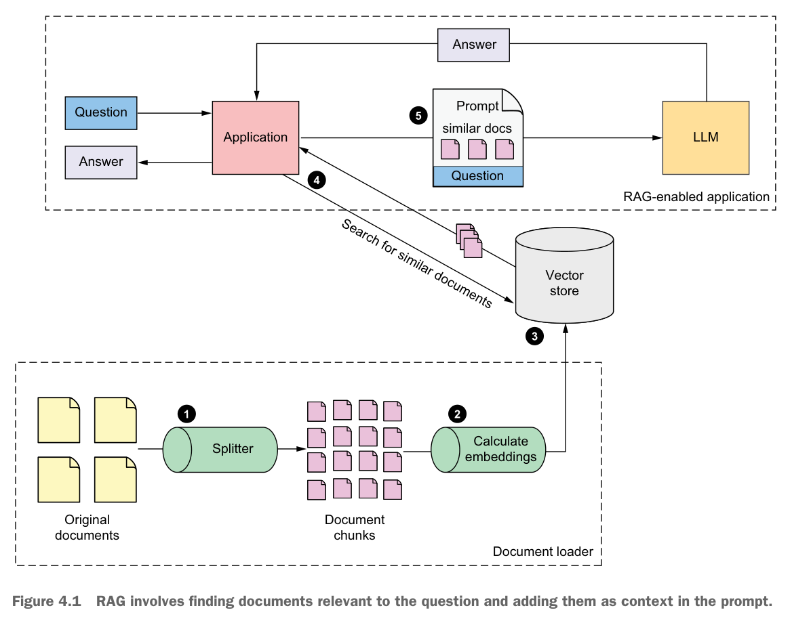
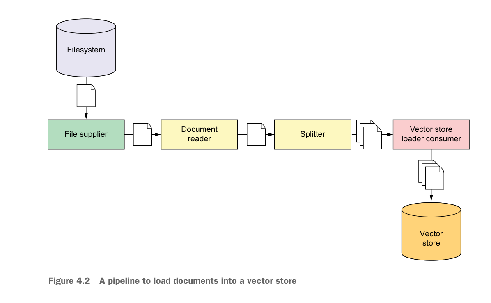
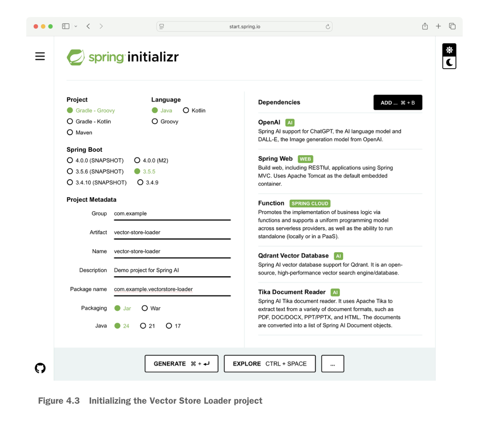

向 LLM 提供包含所需信息的文档——不仅能帮助它更准确地回答问题，还能几乎完全消除它在试图回答超出训练范围的问题时产生的幻觉（hallucination）。

本章将介绍检索增强生成（Retrieval-Augmented Generation, RAG），一种在提问时动态向 LLM 提供相关信息的技术。让我们先从了解 RAG 的工作原理开始。

## 4.1 理解 RAG

在上一章中，你通过"填充提示"的方式把《Burger Battle》的游戏规则塞进了 prompt。这样做相当于提供了一个上下文——一本开卷——让 LLM 可以在里面找到关于游戏问题的答案。

《Burger Battle》的规则书相对较小（刚超过 1000 个 token），所以放进 prompt 不会占用太多 token 窗口。但有些游戏的规则更深入，会占用更多的上下文窗口。而且你肯定想让应用能回答不止一款游戏的问题。把所有游戏的规则书都塞进 prompt 的上下文是不现实的，尤其是当任何一个问题的答案可能只占文档中很小一部分的时候。

RAG 正是为解决简单填充 prompt 的问题而生的：它将文档拆分成更小的块（chunk），确保只有与当前问题相似的文档块才会进入 prompt。图 4.1 展示了这一过程。



如图所示，一个典型的 RAG 系统有三个核心组件：

- **文档加载器（Document Loader）** 负责将文档加载到向量存储中。
- **向量存储（Vector Store）** 是存储文档的地方，后续可以从中检索。
- **RAG 应用** 向向量存储提交查询，找到与问题相似（且大概率相关）的文档。

以图 4.1 中的编号为线索，整个 RAG 系统的工作流程如下：

1. 任意大小的文档被加载并拆分成更小的文档。拆分策略由你决定，但常见做法是确保每个文档块不超过一定的 token 数。
2. 每个块的内容会根据其属性被赋予一组多维空间坐标。这些坐标被称为嵌入向量（embedding）。
3. 各文档块被写入向量存储。向量存储是一种特殊的数据库，支持基于嵌入向量检索文档块。
4. 当提出问题时，系统会计算问题本身的嵌入向量，然后将其作为查询参数发送到向量存储，定位在多维空间中与问题最接近的文档块。
5. 向量存储返回的前几个文档块将作为上下文进入 prompt。

如果这些听起来很复杂，确实如此。但好消息是，你不需要操心嵌入向量是怎么计算的，也不需要知道问题和文档在多维空间中的距离是怎么确定的。这些都由 AI 服务商的 embedding 模型和向量存储处理了。Spring AI 进一步抽象了与 embedding 模型和向量存储的交互方式，让 RAG 的使用变得非常轻松。

接下来我们要为 Board Game Buddy 应用添加 RAG 能力，让它能回答关于任何已加载规则的游戏的问题。但在开始之前，你需要一个向量存储来存放这些规则。

## 4.2 搭建向量存储

向量搜索（Vector Search）是一种通过比较查询和内容的多维向量坐标来从数据存储中查找相似内容的方法。通常使用余弦相似度（cosine similarity）来度量查询向量和文档向量之间的夹角，然后用 1 减去该值得到余弦距离（cosine distance，取值范围为 0 到 2）。简单来说，查询向量和文档向量之间的夹角越小，它们就越相似。

虽然余弦相似度从数学角度看很有趣，但使用向量存储时并不需要完全理解它。查询和文档的向量由 API 或库计算，余弦距离的数学运算在向量存储内部完成。你只需要有一个向量存储，然后用就行。

Spring AI 支持多种流行的向量存储，包括：

- Azure AI Search
- Apache Cassandra
- Chroma
- Elasticsearch
- GemFire
- SAP Hana
- Milvus
- MongoDB
- Neo4j
- Pinecone
- PostgreSQL（配合 pgvector 扩展）
- Qdrant
- Redis（配合 RediSearch 模块）
- Weaviate

最终选择哪个向量存储取决于它的功能、性能和价格。你的选择对 Spring AI 应用的开发方式几乎没有影响。

虽然很多向量存储都提供了云托管服务，但为了示例方便，我们将使用一个通过 Docker Compose 运行的向量存储。Spring AI 支持的多个向量存储都满足这个条件，我们选一个就行。那就选 Qdrant 吧。

在用 Docker Compose 运行 Qdrant 之前，确保机器上已安装 Docker。安装说明参见 Docker 官方文档：https://docs.docker.com/engine/install。

安装好 Docker 后，需要创建一个 Docker Compose 文件来启动 Qdrant。在 Board Game Buddy 项目根目录创建一个名为 `compose.yaml` 的文件，内容如下：

```yaml
services:
  qdrant:
    image: 'qdrant/qdrant:latest'
    ports:
      - '6334:6334'
      - '6333:6333'
```

这段 YAML 告诉 Docker Compose 启动一个 Qdrant 服务。最关键的信息是 ports 配置，它设置了端口转发，将服务的 6334 端口暴露到宿主机上。这很理想，因为后面在 Spring AI 中使用 Qdrant 向量存储客户端时，默认就认为 Qdrant 在 `localhost:6334` 上监听请求。

6333 端口也一并暴露了。这是可选的，但对调试非常有用——它暴露了一个 REST API，你可以用 curl 或 HTTPie 等 HTTP 客户端与 Qdrant 交互。

有两种方式启动 Qdrant：

- 手动使用 `docker compose` 命令
- 使用 Spring Boot 的 Docker Compose 支持

手动启动的话，在命令行执行：

```bash
$ docker compose --file compose.yaml up
```

但更简单的方式是让 Spring Boot 在应用启动时自动启动它。只需在项目构建配置中添加以下依赖：

```groovy
implementation 'org.springframework.boot:spring-boot-docker-compose'
implementation 'org.springframework.ai:spring-ai-spring-boot-docker-compose'
```

第一个依赖让 Spring Boot 根据 `compose.yaml` 的内容自动启动 Docker 容器，并在应用关闭时停止容器。第二个依赖启用服务连接（service connection），让 Spring AI 正确配置连接到 Qdrant 数据库。该依赖还会为以下容器（如果存在）创建服务连接：

- AWS OpenSearch
- Chroma
- MongoDB
- Ollama
- OpenSearch
- TypeSense
- Weaviate

Spring Boot 还为更多容器提供服务连接支持，完整列表参见 Spring Boot 文档：https://mng.bz/eBNG。

无论选择哪种方式启动 Qdrant，数据库现在都已就绪，可以处理文档存储和向量搜索的需求。有了运行中的向量存储，就可以开始支撑 Board Game Buddy 应用的 RAG 交互了。不过在应用能回答游戏规则问题之前，你还需要把规则文档加载到向量存储中。接下来就看看如何创建一个文档加载管道。

## 4.3 加载文档

从本质上说，把文档加入向量存储非常简单：读取文件，拆分成小块，然后保存到向量存储。这个过程涉及 Spring AI 提供的三个核心组件：文档读取器（Document Reader）、文本分割器（Text Splitter）和向量存储客户端。以下代码展示了最基本的文档加载方式：

```java
@Value("file://${HOME}/documents/my-document.txt")
private Resource documentResource;

public void loadDocument(VectorStore vectorStore) {
    DocumentReader reader = new TextReader(documentResource);
    TextSplitter splitter = TokenTextSplitter.builder().build();
    vectorStore.accept(splitter.apply(reader.get()));
}
```

在这个简单例子中，`TextReader` 将 `my-document.txt` 读取为单个 `Document` 的列表，然后传给 `TokenTextSplitter`，后者将 `Document` 拆分成一个或多个子文档，每个子文档携带原文档的一部分内容。这组子文档随后被传给 `VectorStore` 保存。

对于只需要对单个文档提问的简单 RAG 应用，这就够了。但在 Board Game Buddy 中，你可能要回答关于任意数量游戏的问题，而且随着游戏库增长还会不断添加新的规则文档。在 `Resource` 中声明单个文档在应用启动时加载的方式就不适用了。

你需要创建一个文档加载管道，能够将多个文档加载到向量存储，并支持随时添加新文档而无需重启应用。管道的流程如图 4.2 所示。



### 4.3.1 初始化加载器项目

构建这个管道需要用到一组 Spring 库的特殊组合：

- **Spring AI OpenAI** ——主要用于访问 OpenAI 的 embedding API。你也可以选择其他 AI 服务替代 OpenAI。但要注意，不同的 embedding 模型之间不兼容，所以在游戏规则应用中要确保使用相同或兼容的 embedding API。
- **Spring MVC** ——Spring AI 需要它，所以必须引入。
- **Spring AI Qdrant** ——加载器写入文档的目标向量存储的客户端库。
- **Spring AI Tika Document Reader** ——基于 Apache Tika 的文档读取器，能读取多种文件类型。
- **Spring Function Catalog** ——使用其中的 `fileSupplier` 函数（https://mng.bz/pZaR）监控目录中的新文件，并将它们发送给自定义的 consumer 写入向量存储。`fileSupplier` 就是图 4.2 中最左边的框，另一个框是本节要构建的自定义组件。
- **Spring Cloud Function** ——用于协调 `fileSupplier` 和自定义 consumer 之间的交互。

选择 Spring Cloud Function 和 Spring Function Catalog 来定义管道很方便，但这并不是唯一的方式，在使用 Spring AI 时也不是必须的选择。另一种选择是使用 Spring Batch（https://spring.io/projects/spring-batch）。

首先需要创建一个新的 Spring Boot 项目。如果你使用 Spring Boot Initializr（https://start.spring.io），按图 4.3 所示填写表单并选择依赖即可。



还有一个依赖不是 starter 依赖，无法在 Initializr 中直接选择——需要手动添加 Spring Function Catalog 的 fileSupplier 依赖。创建项目后，编辑 `build.gradle` 文件，在 `dependencies` 块中添加：

```groovy
implementation 'org.springframework.cloud.fn:spring-file-supplier'
```

fileSupplier 依赖属于更大的 Spring Functions Catalog 项目，需要在构建中添加它的 BOM（Bill of Materials，https://mng.bz/Ownj）来解析版本。在 `dependencyManagement` 块中，与 Spring AI 和 Spring Cloud BOM 并列添加：

```groovy
mavenBom "org.springframework.cloud.fn:" +
         "spring-functions-catalog-bom:" +
         "$springFunctionsCatalogVersion"
```

最后定义版本号：

```groovy
springFunctionsCatalogVersion = '5.1.0'
```

完成后，`build.gradle` 大致如下：

```groovy
plugins {
    id 'java'
    id 'org.springframework.boot' version '3.5.5'
    id 'io.spring.dependency-management' version '1.1.7'
}

group = 'com.example'
version = '0.0.1-SNAPSHOT'

java {
    sourceCompatibility = '24'
}

repositories {
    mavenCentral()
}

ext {
    springCloudVersion = '2025.0.0'
    springFunctionsCatalogVersion = '5.1.0'
    springAiVersion = "1.0.3"
}

dependencyManagement {
    imports {
        mavenBom "org.springframework.cloud:" +
                 "spring-cloud-dependencies:" +
                 "$springCloudVersion"
        mavenBom "org.springframework.cloud.fn:" +
                 "spring-functions-catalog-bom:" +
                 "$springFunctionsCatalogVersion"
        mavenBom "org.springframework.ai:" +
                 "spring-ai-bom:" +
                 "$springAiVersion"
    }
}

dependencies {
    implementation 'org.springframework.boot:spring-boot-starter-web'
    implementation 'org.springframework.cloud:spring-cloud-function-context'
    implementation 'org.springframework.cloud.fn:spring-file-supplier'
    implementation 'org.springframework.ai:spring-ai-tika-document-reader'
    implementation 'org.springframework.ai:spring-ai-starter-model-openai'
    implementation 'org.springframework.ai:spring-ai-starter-vector-store-qdrant'
    implementation 'org.springframework.ai:spring-ai-advisors-vector-store'
    testImplementation 'org.springframework.boot:spring-boot-starter-test'
}

tasks.named('test') {
    useJUnitPlatform()
}
```

接下来需要在 `src/main/resources/application.properties` 中设置几个关键属性。由于应用使用了 Spring MVC（OpenAI 客户端需要），要确保它不会在 8080 端口启动，避免与游戏规则应用冲突。因为这个应用本身不暴露 API，设置为 0 可以让它自动使用某个可用的高位端口：

```properties
server.port=0
```

默认情况下，Spring AI 期望 Qdrant 中已经创建好了集合（collection），不会自动创建。为了开发方便，将 `spring.ai.vectorstore.qdrant.initialize-schema` 设置为 `true`，会自动创建一个 Qdrant 集合来接收文档：

```properties
spring.ai.vectorstore.qdrant.initialize-schema=true
```

集合名称默认为 `SpringAiCollection`，如果想自定义，可以通过 `spring.ai.vectorstore.qdrant.collection-name` 设置：

```properties
spring.ai.vectorstore.qdrant.collection-name=GameRules
```

自定义集合名称完全可选。但如果在加载器应用中设置了自定义名称，记得在 Board Game Buddy 中也设置相同的属性，让两个应用操作同一个文档集合。

此外，加载文档时会使用 OpenAI 的 embedding API 计算嵌入向量，所以需要在 `spring.ai.openai.api-key` 中提供 API 密钥：

```properties
spring.ai.openai.api-key="${OPENAI_API_KEY}"
```

和 Board Game Buddy 应用一样，API 密钥通过环境变量 `OPENAI_API_KEY` 引用。

一切就绪，接下来可以定义高层级的管道定义。

### 4.3.2 定义加载管道

Spring Cloud Function 允许你通过设置 `spring.cloud.function.definition` 来定义由多个函数组合而成的函数，各函数之间用管道符 `|` 分隔。对于向量存储加载器，以下属性就搞定了：

```properties
spring.cloud.function.definition=\
  fileSupplier|\
  documentReader|\
  splitter|\
  titleDeterminer|\
  vectorStoreConsumer
```

组合函数以 `fileSupplier` 开头，这是 Spring Function Catalog 提供的 `java.util.function.Function` 实现。`fileSupplier` 的职责是监控一个目录，发现新文件后拾取并发送给下一个函数。它监控的目录通过 `file.supplier.directory` 指定：

```properties
file.supplier.directory="/var/dropoff"
```

它会监控 `/var/dropoff` 目录中的任何文件。如果你想让它更挑剔地选择文件，可以设置 `file.supplier.filename-regex` 来筛选：

```properties
file.supplier.filename-regex=.*\.(pdf|docx|txt)
```

这会告诉 fileSupplier 只加载 PDF、Microsoft Word 或纯文本文件，忽略其他格式。

下一个函数是 `documentReader`，它是 Spring AI `DocumentReader` 接口的实现，负责将接收到的文件读取为 `Document` 对象，然后传递给组合函数中的下一个环节。

`splitter` 函数是 Spring AI `TextSplitter` 的实现，接收 `Document` 并将其拆分为更小的块，以 `List<Document>` 的形式返回。这个列表随后被 `vectorStoreConsumer` 函数接收，通过 Spring AI 的 `VectorStore` 接口将文档块写入向量存储。

`spring.cloud.function.definition` 属性清晰简洁地定义了文档加载管道。但这些函数各自是怎么定义的呢？

函数名对应 Spring 应用上下文中的 bean。如前所述，`fileSupplier` bean 由 Spring Function Catalog 提供并自动配置。但其他 bean 需要你手动定义。下面来看具体怎么做。

### 4.3.3 创建管道组件

管道中的每个组件都是 `java.util.function` 包中的 `Function`（`vectorStoreConsumer` 除外，它是同包中的 `Consumer`）。它们都接收某种输入，所有 `Function` 组件都会产出输出并传给下一个组件。

作为函数，它们可以用 lambda 实现，并定义在 `@Bean` 方法中，方法名与组合函数定义中的组件名一致。先来定义 `documentReader` 函数。

#### 读取文档

Spring AI 内置了几个文档读取器，都基于 `DocumentReader` 接口：

- **TextReader** ——最简单的读取器，只能读取纯文本文件
- **JsonReader** ——适合读取 JSON 格式的文档

这些读取器属于 Spring AI 的 commons 模块。但我们要加载的是桌游规则，而大多数桌游规则书既不是纯文本也不是 JSON 格式，所以需要考虑 Spring AI 的其他选择。

桌游规则书通常可以从出版商网站或 Board Game Geek（https://boardgamegeek.com/）等网站以 PDF 格式获取。因此，使用 Spring AI 的 PDF 文档读取器似乎很合理：

- **PagePdfDocumentReader** ——读取 PDF 文件，按分页符拆分成多个文档
- **ParagraphPdfDocumentReader** ——读取 PDF 文件，按段落拆分（这里的"段落"大致对应文档目录中的章节）

它们都不在 commons 模块中，如果需要使用，在构建中添加：

```groovy
implementation 'org.springframework.ai:spring-ai-pdf-document-reader'
```

这两个读取器都能读取文档并拆分成更小的块。`PagePdfDocumentReader` 按分页拆分。`ParagraphPdfDocumentReader` 的工作方式则不那么直观——它依赖 PDF 中提供的目录元数据，按章节拆分（章节大小不一定等于段落）。

除了对"段落"的理解比较特别之外，`ParagraphPdfDocumentReader` 还可能不适合所有 PDF 文档。如果 PDF 不包含目录元数据（很多桌游规则书确实没有），它会抛出异常，无法加载。

你可能会觉得 `PagePdfDocumentReader` 应该是 Board Game Buddy 的首选。但在做决定之前，考虑一下：有些游戏的规则可能不是 PDF 格式，而是纯文本或 Word 文档。而且如果将 Spring AI 应用于加载企业文档，格式就更多了——PDF、纯文本、Word、Excel、PowerPoint 以及其他 `PagePdfDocumentReader` 无法读取的格式。

需要灵活处理文档类型时，Spring AI 的 `TikaDocumentReader` 是个好选择。它基于 Apache Tika（https://tika.apache.org/），能读取多种文档类型，包括前面提到的所有格式以及更多。

正因为它的灵活性，我们将在 Board Game Buddy 的规则加载器中使用 `TikaDocumentReader`。确保在构建中添加了这个依赖（替代之前的 PDF 读取器依赖）：

```groovy
implementation 'org.springframework.ai:spring-ai-tika-document-reader'
```

现在可以定义 `documentReader` 函数了：

```java
@Bean
Function<Flux<byte[]>, Flux<Document>> documentReader() {
    return resourceFlux -> resourceFlux
        .map(fileBytes ->
            new TikaDocumentReader(
                new ByteArrayResource(fileBytes))
                .get()
                .getFirst()).subscribeOn(Schedulers.boundedElastic());
}
```

这个函数接收 `Flux<byte[]>` 作为输入，产出 `Flux<Document>` 作为输出。必须接收 `Flux<byte[]>` 是因为 Spring Function Catalog 提供的 `fileSupplier` 组件输出的就是 `Flux<byte[]>`。

回顾 3.4.3 节，`Flux` 是 Project Reactor 中的响应式类型，代表一个随数据可用而逐步交付的流。在这个场景中，`fileSupplier` 产出读取到的文件字节并将其放入 Flux 流中，传给下一个函数。后续读取另一个文件时，其字节也会通过同一个 Flux 传递。

由于管道的流动代表一个长时间运行的数据流，我们用 `Flux` 接收输入并在整个管道中保持这个流。这就是为什么函数也返回 `Flux`，只不过承载的是 `List<Document>`。

在 `documentReader` 函数内部，通过对原始 Flux 调用 `map()` 方法将传入的 `Flux<byte[]>` 映射为新的 `Flux<Document>`。传给 `map()` 的 lambda 接收文件的字节节数组，用于构造 `ByteArrayResource` 并传给 `TikaDocumentReader`。然后调用读取器的 `get()` 方法返回 `List<Document>`，由于列表中应该只有一个 `Document`，所以提取第一个文档返回，并通过 `Flux<Document>` 传给下一个函数。

#### 拆分文档

由于文档可能很大，通常需要拆分成更小的块，以免把整个文档作为 prompt 上下文。Spring AI 的 PDF 文档读取器已经内置了拆分功能，但 `TikaDocumentReader` 没有，所以需要在管道中定义文档分割器。`splitter` 函数的定义如下：

```java
@Bean
Function<Flux<Document>, Flux<List<Document>>> splitter() {
    var splitter = new TokenTextSplitter();
    return documentFlux ->
        documentFlux
            .map(incoming -> splitter
                .apply(List.of(incoming)))
            .subscribeOn(Schedulers.boundedElastic());
}
```

和 `documentReader` 类似，`splitter` 也用 lambda 实现。它使用 Spring AI 的 `TokenTextSplitter` 拆分传入的 `Document`，产出包含拆分后块的 `List<Document>`。

`TokenTextSplitter` 将文本拆分为不超过指定 token 数的块（默认 800）。为避免在句子中间拆分，实际块可能小于目标值。可以通过构建器的各种属性来调整其行为，见表 4.1。

**表 4.1 TokenTextSplitter 的构建器方法**

| 方法 | 说明 | 默认值 |
|------|------|--------|
| `withChunkSize()` | 每个文本块的目标 token 数 | 800 |
| `withKeepSeparator()` | 是否在块中保留换行分隔符 | true |
| `withMaxNumChunks()` | 从文本生成的最大块数 | 10000 |
| `withMinChunkLengthToEmbed()` | 丢弃短于此值的块 | 5 |
| `withMinChunkSizeChars()` | 每个文本块的最小字符数 | 350 |

例如，如果想让分割器创建不超过 500 token 的块，丢弃少于 10 个字符的块，并去掉换行分隔符：

```java
TextSplitter splitter = TokenTextSplitter.builder()
    .withChunkSize(500)
    .withKeepSeparator(false)
    .withMinChunkLengthToEmbed(10)
    .build();
```

无论怎么配置，分割器完成后，`List<Document>` 会通过 `Flux<List<Document>>` 传给下一个函数。

#### 确定游戏标题

在文档块写入向量存储之前，需要将游戏标题作为元数据设置到每个块上。这样 Board Game Buddy 在做相似性搜索时，就能搜索特定游戏的规则。否则，搜索可能返回与问题相似但属于错误游戏的规则。

确定游戏名称的一种方式是要求文档遵循命名规范，从文件名推导游戏标题。但这过于依赖文档提供者遵守规范的意愿和能力。

有个大胆的想法：与其依赖命名规范，不如用生成式 AI 根据文档内容来判断游戏标题？这就是 `titleDeterminer` 函数要做的事。

**代码清单 4.1 使用生成式 AI 根据游戏规则确定标题**

```java
private static final Logger LOGGER =
    LoggerFactory.getLogger(GameRulesLoaderApplication.class);

@Value("classpath:/promptTemplates/nameOfTheGame.st")
Resource nameOfTheGameTemplateResource;

@Bean
Function<Flux<List<Document>>, Flux<List<Document>>>
titleDeterminer(ChatClient.Builder chatClientBuilder) {
    var chatClient = chatClientBuilder.build();
    return documentListFlux -> documentListFlux
        .map(documents -> {
            if (!documents.isEmpty()) {
                var firstDocument = documents.getFirst();
                var gameTitle = chatClient.prompt()
                    .user(userSpec -> userSpec
                        .text(nameOfTheGameTemplateResource)
                        .param("document", firstDocument.getText()))
                    .call()
                    .entity(GameTitle.class);
                if (Objects.requireNonNull(gameTitle).title().equals("UNKNOWN")) {
                    LOGGER.warn("Unable to determine the name of a game; " +
                        "not adding to vector store.");
                    documents = Collections.emptyList();
                    return documents;
                }
                LOGGER.info("Determined game title to be {}", gameTitle.title());
                documents = documents.stream().peek(document -> {
                    document.getMetadata()
                        .put("gameTitle", gameTitle.getNormalizedTitle());
                }).toList();
            }
            return documents;
        });
}
```

`titleDeterminer` 比之前的管道函数更有意思。它从 `splitter` 函数接收文档块后，将第一个块放入 prompt 中，请 LLM 判断游戏标题。判断游戏标题的 prompt 模板如下：

```
Your job is to determine the name of a game based on the rules given in the
document (in the DOCUMENT section). The document will be a short excerpt
from the rules of the game. The title of the game may or may not be explicitly
stated in the document. If the title is not explicitly stated, set the title
to "UNKNOWN".

If the title is explicitly stated in the rules, then it should be given in
title case.

DOCUMENT:
{document}
```

prompt 清楚地指示 LLM 根据传入的文档块判断游戏名称。如果无法判断，最佳实践是提供一个后备方案——这里返回 `UNKNOWN`。否则，标题会以 `GameTitle` 对象返回，并作为元数据设置到列表中所有文档块上。最后返回携带修改后列表的 `Flux` 供管道下一步处理。

`GameTitle` 是一个简单的 Java record，包含游戏标题，并提供 `getNormalizedTitle()` 方法将标题标准化为小写、用下划线替代空格：

```java
package com.example.gamerulesloader;

public record GameTitle(String title) {
    public String getNormalizedTitle() {
        return title.toLowerCase().replace(" ", "_");
    }
}
```

标准化标题会让后续从向量存储检索特定游戏的文档更加方便。

#### 将文档写入向量存储

文档读取并拆分完毕、游戏标题也设置为元数据后，管道的最终任务是将文档块写入向量存储。`vectorStoreConsumer` 组件是管道的终点，定义如下：

```java
@Bean
Consumer<Flux<List<Document>>> vectorStoreConsumer(VectorStore vectorStore) {
    return documentFlux -> documentFlux
        .doOnNext(documents -> {
            if (!documents.isEmpty()) {
                var docCount = documents.size();
                LOGGER.info("Writing {} documents to vector store.", docCount);
                vectorStore.accept(documents);
                LOGGER.info(
                    "{} documents have been written to vector store.", docCount);
            }
        })
        .subscribe();
}
```

`vectorStoreConsumer` 是 `Consumer` 的实现，没有输出，但接收 `Flux<List<Document>>` 作为输入。由于 `VectorStore` 的 `accept()` 方法不接受 `Flux`，需要先从 Flux 中提取 `List<Document>` 再传给 `accept()`。这就是 `doOnNext()` 的作用——当 `List<Document>` 到达时，记录即将写入的文档数量，然后传给 `accept()` 方法，最后记录写入完成。

最后一步是对 Flux 调用 `subscribe()`。这很关键——除非订阅了 Flux，否则数据流不会流动，什么都不会发生。可以把整个 Flux 管道想象成一根水管，`subscribe()` 就是打开水龙头。

管道定义完毕，所有组件都已实现。接下来运行看看效果。

### 4.3.4 运行管道

由 `application.properties` 中 `spring.cloud.function.definition` 定义的管道本身就是一个由各组件组合而成的函数。在数据流过管道之前，需要先启动这个组合函数。

下面的 `go()` 方法定义了一个 `ApplicationRunner` bean，通过调用组合函数的 `run()` 方法来启动管道：

```java
@Bean
ApplicationRunner go(FunctionCatalog catalog) {
    Runnable composedFunction = catalog.lookup(null);
    return args -> {
        composedFunction.run();
    };
}
```

`ApplicationRunner` bean 注入了 `FunctionCatalog`，可以从中查找函数。由于应用只有一个组合函数，向 `lookup()` 传入 `null` 就能返回管道函数。拿到函数后，调用 `run()` 启动管道。

现在可以启动应用了。在向量存储加载器项目目录下执行：

```bash
$ ./gradlew bootRun
```

应用启动后，尝试将某个桌游的 PDF 规则复制到 `/tmp/dropoff` 目录。如果没有现成的 PDF 规则书，通常可以在游戏出版商网站或 Board Game Geek 上找到。

复制一个或多个游戏规则文档到 dropoff 目录后，日志中应该能看到文档被拾取、经过管道处理、最终写入向量存储的记录。较大的文档加载时间更长，如果加载的规则书页数很多，请耐心等待。

例如，如果将《Burger Battle》的规则复制到 `/tmp/dropoff` 目录，日志中可能会看到（为适应印刷版面做了调整）：

```
TextSplitter : Splitting up document into 2 chunks.
GameRulesLoaderApplication : Determined game title to be Burger Battle
GameRulesLoaderApplication : Writing 2 documents to vector store.
GameRulesLoaderApplication : 2 documents have been written to vector store.
```

你可以用 HTTPie 验证文档块是否已写入 Qdrant。先用 Qdrant 的 `/collections` 端点获取文档集合列表：

```bash
$ http :6333/collections -b
```

```json
{
  "result": {
    "collections": [
      {
        "name": "board-game-buddy"
      }
    ]
  },
  "status": "ok",
  "time": 2.1375e-05
}
```

响应包含 Qdrant 向量存储中的集合列表。这里唯一的集合是 `board-game-buddy`，说明集合已存在。再发一个请求获取该集合中的文档块数量。

在 Qdrant 的术语中，文档块被称为"点"（point），即每个块位于多维空间中的某个点。要获取点数，发送 POST 请求：

```bash
$ http POST :6333/collections/board-game-buddy/points/count exact:=true -b
```

```json
{
  "result": {
    "count": 2
  },
  "status": "ok",
  "time": 0.000239875
}
```

该端点在路径中包含集合名称，接受 POST 请求，请求体中可以设置属性来细化和过滤结果。这里 `exact` 设为 `true` 以获取精确计数。也可以设为 `false` 获取估计值，响应可能更快。由于集合中条目很少，精确计数也很快。结果显示添加《Burger Battle》规则后，Qdrant 中有两条记录，与日志一致。

如果感兴趣，也可以用 Qdrant API 查询相似文档，但这比较繁琐——需要先计算嵌入向量再发送查询请求。Qdrant 的 API 文档见 https://api.qdrant.tech/api-reference。

不过更有趣也更实用的方式是通过 Spring AI 在 Board Game Buddy API 中实现 RAG 来做这种查询。接下来就为应用添加 RAG。

## 4.4 实现 RAG

为任何应用添加 RAG 都涉及两个步骤：先查询向量存储找到与问题相似的文档，然后将这些文档作为上下文放入 prompt。首先需要给 Board Game Buddy 应用添加向量存储 starter 依赖。由于加载器使用了 Qdrant，这里也添加相同的依赖：

```groovy
implementation 'org.springframework.ai:spring-ai-starter-vector-store-qdrant'
```

接下来需要实现 RAG 功能，搜索与问题相似的文档。

### 4.4.1 搜索相似文档

虽然 `GameRulesService` 还没有实现 RAG，但它负责将游戏规则加载到 prompt 中。目前它从固定位置加载规则。但如果 Board Game Buddy 要能回答许多不同游戏的问题（很多游戏的规则书可能很长、占用大量 token），`GameRulesService` 就需要改为从向量存储中查询与问题相似的文档块。

下面的代码展示了如何改造 `GameRulesService` 来实现 RAG 搜索。

**代码清单 4.2 在 GameRulesService 中实现 RAG**

```java
package com.example.boardgamebuddy;

import org.springframework.ai.document.Document;
import org.springframework.ai.vectorstore.SearchRequest;
import org.springframework.ai.vectorstore.VectorStore;
import org.springframework.ai.vectorstore.filter.FilterExpressionBuilder;
import org.springframework.stereotype.Service;
import java.util.List;
import java.util.stream.Collectors;

@Service
public class GameRulesService {

    private final VectorStore vectorStore;

    public GameRulesService(VectorStore vectorStore) {
        this.vectorStore = vectorStore;
    }

    public String getRulesFor(String gameName, String question) {
        var searchRequest = SearchRequest
            .builder()
            .query(question)
            .filterExpression(
                new FilterExpressionBuilder()
                    .eq("gameTitle", normalizeGameTitle(gameName)).build())
            .build();

        System.err.println("Search request: " + searchRequest);
        var similarDocs =
            vectorStore.similaritySearch(searchRequest);

        if (similarDocs.isEmpty()) {
            return "The rules for " + gameName + " are not available.";
        }

        return similarDocs.stream()
            .map(Document::getText)
            .collect(Collectors.joining(System.lineSeparator()));
    }

    private String normalizeGameTitle(String gameTitle) {
        return gameTitle.toLowerCase().replace(" ", "_");
    }
}
```

新版 `GameRulesService` 通过构造函数注入了 `VectorStore`（这里是 `QdrantVectorStore`）。它将在 `getRulesFor()` 方法中使用 `VectorStore` 搜索与问题相似的文档。

首先，`getRulesFor()` 方法创建 `SearchRequest` 来定义搜索参数。查询本身就是用户提出的问题。如果只关心文本匹配，到这里就够了：

```java
var searchRequest = SearchRequest.builder().query(question).build();
```

但向量存储中可能包含多个不同游戏的规则文档，所以 `getRulesFor()` 的 `SearchRequest` 还定义了元数据过滤条件——`gameTitle` 的值必须等于标准化后的游戏标题（snake_case 格式）。

过滤器使用 `FilterExpressionBuilder` 构建，通过流式接口可以轻松创建过滤表达式。当然也可以直接用字符串指定：

```java
.filterExpression("gameTitle == '" + normalizeGameTitle(gameName) + "'");
```

默认情况下，相似性搜索最多返回四个与问题最相似的文档。可以通过设置 Top-K 值来调整返回数量。Top-K 指定返回多少个最相似的文档。例如：

```java
var searchRequest = SearchRequest.builder()
    .query(question)
    .topK(6)
    .filterExpression(
        new FilterExpressionBuilder()
            .eq("gameTitle", normalizeGameTitle(gameName)).build())
    .build();
```

这样搜索最多返回六个相似文档。

要注意的是，加入 prompt 上下文的文档块越多，消耗的 token 就越多。这不仅增加请求成本，还可能超过 token 限制。反过来，如果把 Top-K 调得太低，可能拿不到足够的文档让 LLM 找到正确答案。

在微调搜索请求这个话题上，还可以指定相似度阈值（similarity threshold）。相似度范围是 0.0 到 1.0，默认阈值为 0.0，意味着即使相似度很低的文档也会被返回。如果发现返回的结果不够相似、不适合做上下文，可以通过 `withSimilarityThreshold()` 调整。设置为 0.5 的例子：

```java
SearchRequest searchRequest = SearchRequest.builder()
    .query(question)
    .topK(6)
    .similarityThreshold(0.5)
    .filterExpression(
        new FilterExpressionBuilder()
            .eq("gameTitle", normalizeGameTitle(gameName)).build())
    .build();
```

虽然相似度阈值能过滤掉一些不太相关的结果，但不要设得太高。阈值越高，返回的结果越少（甚至为零），LLM 就没有足够的上下文来回答问题。

`SearchRequest` 准备好后，通过调用 `VectorStore` 的 `similaritySearch` 方法查询相似文档。如果没有找到相似文档，返回一条说明该游戏规则不可用的字符串。如果找到了，将相似文档的内容提取出来，用换行符连接成一个字符串。

最终 `getRulesFor()` 返回的字符串包含所有相似文档的文本。它将被 `SpringAiBoardGameService` 用来填充系统提示模板中的 `{rules}` 占位符。但要让它生效，还需要对 `SpringAiBoardGameService` 和系统提示模板做一些小改动。

### 4.4.2 更新服务

`SpringAiBoardGameService` 大部分不需要改动就能支持 RAG 交互。因为 RAG 的核心逻辑都在 `GameRulesService` 中实现。但由于 `GameRulesService` 的 `getRulesFor()` 现在同时接受游戏名称和问题作为参数，需要修改 `SpringAiBoardGameService` 的 `askQuestion()` 方法中的调用方式：

```java
@Override
public Answer askQuestion(Question question) {
    var gameRules = gameRulesService.getRulesFor(
        question.gameTitle(), question.question());
    var answer = chatClient.prompt()
        .system(systemSpec -> systemSpec
            .text(promptTemplate)
            .param("gameTitle", question.gameTitle())
            .param("rules", gameRules))
        .user(question.question())
        .call()
        .content();
    return new Answer(question.gameTitle(), answer);
}
```

`SpringAiBoardGameService` 其他地方不需要改动，因为它已经在将 `getRulesFor()` 返回的字符串注入 prompt 的 `{rules}` 占位符。

提示模板（`systemPromptTemplate.st`）则需要做一些调整。之前的版本很宽松——如果在规则文本中找不到答案，允许 LLM 用自己的训练知识来回答。但这留下了大量产生错误答案（即幻觉）的空间。新版模板更严格：

```
You are a helpful assistant, answering questions about a tabletop
game named {gameTitle}.

Given the context in the DOCUMENTS section and no prior
knowledge, answer the user's question about the game.
If the answer is not in the DOCUMENTS section, then
reply with "I don't know".

DOCUMENTS:
----------
{rules}
----------
```

按照这个 prompt 的指示，如果 LLM 在给定规则中找不到答案，应该回复 "I don't know"。

现在来试试。确保向量存储还在运行，并已载入了一些游戏规则。然后启动应用，通过 `/ask` 端点提问。例如，如果加载了《Burger Battle》的规则，可以问 Grave Digger 卡牌：

```bash
$ http :8080/ask question="What is the Grave Digger card?" \
  gameTitle="Burger Battle" -b
```

```json
{
  "answer": "The Grave Digger card allows a player to dig through the
  Graveyard for any needed ingredient and add it to their
  Burger in the game Burger Battle.",
  "gameTitle": "Burger Battle"
}
```

反过来，假设你问了一个关于《Carcassonne》的问题，但还没有将它的规则加载到向量存储中，就会得到：

```bash
$ http :8080/ask question="How do you score a monastery?" \
  gameTitle="Carcassonne" -b
```

```json
{
  "answer": "I don't know.",
  "gameTitle": "Carcassonne"
}
```

如果后来加载了《Carcassonne》的规则再试，可能会得到：

```json
{
  "answer": "To score a monastery in Carcassonne, it must be completed
  when it is surrounded by tiles. Each of the monastery's tiles
  (including the one with the monastery itself and the 8
  surrounding tiles) is worth 1 point.",
  "gameTitle": "Carcassonne"
}
```

结果可能因使用的模型不同而有所差异。大多数模型会按 prompt 指示回复 "I don't know"。有时可能会得到一个更长的答案，但本质上还是"我不知道"。少数模型会完全无视指示，试图用自己的训练知识来回答。

在 `GameRulesService` 中实现 RAG 相当直接，也清楚地展示了相似性搜索如何融入问答流程。但 Spring AI 还提供了另一种应用 RAG 的方式，可以减少一些代码量。接下来看看如何使用顾问（advisor）来实现 RAG——这是 Spring AI 提供的一个组件，能帮你处理大部分 RAG 的通用功能。

## 4.5 使用顾问实现 RAG

如你所见，RAG 的大部分工作发生在 prompt 实际发送给 LLM 之前。事实上，上一节的实现中，RAG 的主要逻辑都在 `GameRulesService` 中，`askQuestion()` 方法首先调用的就是 `getRulesFor()`。`askQuestion()` 中唯一与 RAG 相关的其他操作就是确保在构建 prompt 时设置了 `{rules}` 参数。

不难想到，RAG 的工作也许可以提取到某种拦截器中，包裹对 LLM 的调用。这个拦截器可以先做相似性搜索找到相关文档，然后在 prompt 发送前将文档注入提示模板。

这正是 Spring AI `QuestionAnswerAdvisor` 的用途。Spring AI 的顾问（advisor）在与 `ChatClient` 交互的前后被调用，可以为 prompt 添加上下文，也可以从响应中提取信息供后续使用。`QuestionAnswerAdvisor` 的核心功能是向用户提示模板追加文本，并在向量存储中搜索文档作为上下文。

> **注意** `QuestionAnswerAdvisor` 只是 Spring AI 提供的众多顾问之一。还有其他几个顾问在处理聊天记忆时很方便，包括本章后面会介绍的 `RetrievalAugmentationAdvisor`。我们将在第 5 章添加对话记忆时学习如何使用它们。

来看一下 `QuestionAnswerAdvisor` 的工作方式，以下是 `askQuestion()` 方法的一种实现：

```java
@Override
public Answer askQuestion(Question question) {
    String gameNameMatch = String.format("gameTitle ==
        '%s'", question.gameTitle());
    return chatClient.prompt()
        .system(systemSpec -> systemSpec
            .text(promptTemplate)
            .param("gameTitle", question.gameTitle()))
        .user(question.question())
        .advisors(
            QuestionAnswerAdvisor.builder(vectorStore).build())
        .call()
        .entity(Answer.class);
}
```

在这个版本中，注意虽然系统提示仍然被指定，但它不再用于提供从向量存储检索到的文档块。因此，系统提示模板可以简化为：

```
You are a helpful assistant, answering questions about the tabletop
game named {gameTitle}.
```

不再通过模板提供游戏规则，而是调用 `advisors()` 方法让 `QuestionAnswerAdvisor` 来搜索与问题相似的文档。它甚至会向系统提示追加包含相似文档的文本，并指示 LLM 使用这些文档。本质上，上一节中你需要手动完成的几乎所有工作，`QuestionAnswerAdvisor` 都替你搞定了。

`QuestionAnswerAdvisor` 默认追加到 prompt 的文本如下：

```
Context information is below.
---------------------
{question_answer_context}
---------------------
Given the context and provided history information and no prior knowledge,
reply to the user comment. If the answer is not in the context, inform
the user that you can't answer the question.
```

`{question_answer_context}` 会被相似性搜索找到的文档替换。

在 `ChatClient` 提交请求之前，它会调用 `QuestionAnswerAdvisor` 来处理 RAG 工作。`QuestionAnswerAdvisor` 在创建时接收 `VectorStore` 的引用以执行相似性搜索，同时带有一个默认的 `SearchRequest`，会将问题作为搜索条件进行扩展。

但这些都在 `ChatClient` 和 `QuestionAnswerAdvisor` 内部完成，你不需要在代码中实现。使用 `QuestionAnswerAdvisor` 时，甚至不再需要 `GameRulesService`。

在 `askQuestion()` 方法中使用时，`QuestionAnswerAdvisor` 与特定请求无关。因此可以将它提取出来，作为 `ChatClient` 的默认顾问，对所有请求生效。你需要显式声明一个 `ChatClient` bean 并通过 `defaultAdvisors()` 设置顾问。下面的配置类展示了具体做法。

**代码清单 4.3 配置带默认顾问的 ChatClient bean**

```java
package com.example.boardgamebuddy;

import org.springframework.ai.chat.client.ChatClient;
import org.springframework.ai.chat.client.advisor.vectorstore
    .QuestionAnswerAdvisor;
import org.springframework.ai.vectorstore.VectorStore;
import org.springframework.context.annotation.Bean;
import org.springframework.context.annotation.Configuration;

@Configuration
public class AiConfig {
    @Bean
    ChatClient chatClient(
        ChatClient.Builder chatClientBuilder, VectorStore vectorStore) {
        return chatClientBuilder
            .defaultAdvisors(
                QuestionAnswerAdvisor.builder(vectorStore).build())
            .build();
    }
}
```

这是一个好的开始，现在处理请求时不需要在 `askQuestion()` 中提供 `QuestionAnswerAdvisor` 了。但还缺一点。下面的代码展示了新的 `SpringAiBoardGameService` 实现，其中创建 `QuestionAnswerAdvisor` 时附带了包含游戏标题过滤条件的 `SearchRequest`。

**代码清单 4.4 在 SearchRequest 中指定过滤条件来创建 QuestionAnswerAdvisor**

```java
import static org.springframework.ai.chat.client.advisor
    .vectorstore.QuestionAnswerAdvisor.FILTER_EXPRESSION;

@Override
public Answer askQuestion(Question question) {
    var gameNameMatch = String.format(
        "gameTitle == '%s'",
        normalizeGameTitle(question.gameTitle()));
    return chatClient.prompt()
        .system(systemSpec -> systemSpec
            .text(promptTemplate)
            .param("gameTitle", question.gameTitle()))
        .user(question.question())
        .advisors(advisorSpec ->
            advisorSpec.param(FILTER_EXPRESSION, gameNameMatch))
        .call()
        .entity(Answer.class);
}
```

`askQuestion()` 方法不再创建 `QuestionAnswerAdvisor`，因为现在在 `ChatClient` bean 创建时就指定了。但由于 bean 创建时还不知道游戏标题，`askQuestion()` 负责提供这个信息。

首先，`askQuestion()` 用游戏标题构建过滤表达式。调用 `advisors()` 时，通过 `FILTER_EXPRESSION` 常量作为键来设置该表达式。这样一来，`ChatClient` bean 创建时指定的 `QuestionAnswerAdvisor` 就有了过滤条件，能聚焦于特定游戏。

虽然使用 `QuestionAnswerAdvisor` 比自己实现 RAG 简单得多，但它的工作方式不够灵活。Spring AI 还提供了另一个顾问，既能让你更好地控制 RAG 流程，又保持了相对简单的使用方式。下面来看看 `RetrievalAugmentationAdvisor`——Spring AI 的模块化 RAG 顾问。

## 4.6 应用模块化 RAG

假设你想确保用户提出的问题与向量存储中文档的语言一致。或者想通过聚焦用户查询来提高搜索准确性。又或者想从向量存储之外的某个来源获取相关文档。

`QuestionAnswerAdvisor` 无法满足这些需求，但 Spring AI 的 `RetrievalAugmentationAdvisor` 可以。它是一个模块化 RAG 顾问，允许你通过插入支撑组件来自定义行为，处理各种任务。

来看看 `RetrievalAugmentationAdvisor` 的工作方式。先用它复现 `QuestionAnswerAdvisor` 提供的 RAG 流程，然后看看如何通过插入组件来改变其行为。

首先需要在构建中添加 Spring AI 的 RAG 依赖，让 `RetrievalAugmentationAdvisor` 可用：

```groovy
implementation 'org.springframework.ai:spring-ai-rag'
```

然后创建 `RetrievalAugmentationAdvisor` 实例并配合 `ChatClient` 使用，和上一节使用 `QuestionAnswerAdvisor` 类似。以下代码展示了更新后的 `chatClient()` bean 方法。

**代码清单 4.5 配置默认的 RetrievalAugmentationAdvisor**

```java
package com.example.boardgamebuddy;

import org.springframework.ai.chat.client.ChatClient;
import org.springframework.ai.rag.advisor.RetrievalAugmentationAdvisor;
import org.springframework.ai.rag.preretrieval.query.expansion
    .MultiQueryExpander;
import org.springframework.ai.rag.preretrieval.query.transformation
    .RewriteQueryTransformer;
import org.springframework.ai.rag.preretrieval.query.transformation
    .TranslationQueryTransformer;
import org.springframework.ai.rag.retrieval.search
    .VectorStoreDocumentRetriever;
import org.springframework.ai.vectorstore.VectorStore;
import org.springframework.context.annotation.Bean;
import org.springframework.context.annotation.Configuration;

@Configuration
public class AiConfig {
    @Bean
    ChatClient chatClient(
        ChatClient.Builder chatClientBuilder, VectorStore vectorStore) {
        var advisor = RetrievalAugmentationAdvisor.builder()
            .documentRetriever(
                VectorStoreDocumentRetriever.builder()
                    .vectorStore(vectorStore)
                    .build())
            .build();
        return chatClientBuilder
            .defaultAdvisors(advisor)
            .build();
    }
}
```

这里在创建 `ChatClient` bean 时将其设为默认顾问，但也可以在构建 prompt 时通过 `advisors()` 方法设置。

你可能注意到创建 `RetrievalAugmentationAdvisor` 比 `QuestionAnswerAdvisor` 多了几行代码。这是因为必须通过 `documentRetriever()` 指定文档检索器。`QuestionAnswerAdvisor` 默认查询向量存储，`RetrievalAugmentationAdvisor` 则没有这种假设。你可以插入任何实现了 Spring AI `DocumentRetriever` 接口的组件，比如从知识库服务获取文档的检索器。这里选择的是 `VectorStoreDocumentRetriever`，从向量存储中检索文档。

> **只有一个 DocumentRetriever？**
> `RetrievalAugmentationAdvisor` 的文档检索器是可插拔的，可以使用任何你想要的 `DocumentRetriever` 实现。但在 Spring AI 1.0.0 中，`VectorStoreDocumentRetriever` 是唯一可用的实现。

如果你想自定义实现也可以。`DocumentRetriever` 接口很简单，只需实现一个方法：

```java
public interface DocumentRetriever extends Function<Query,
    List<Document>> {
    List<Document> retrieve(Query query);
    default List<Document> apply(Query query) {
        return retrieve(query);
    }
}
```

将 `RetrievalAugmentationAdvisor` 设为默认顾问后，仍然需要在构建 prompt 时指定过滤条件，就像代码清单 4.4 中按游戏标题过滤一样。一个重要的区别是 `FILTER_EXPRESSION` 常量不再来自 `QuestionAnswerAdvisor`，而是需要从 `VectorStoreDocumentRetriever` 静态导入：

```java
import static org.springframework.ai.rag.retrieval.search
    .VectorStoreDocumentRetriever.FILTER_EXPRESSION;
```

然后在构建 prompt 时通过 `advisors()` 方法设置过滤表达式：

```java
return chatClient.prompt()
    // ...
    .advisors(advisorSpec ->
        advisorSpec.param(FILTER_EXPRESSION, gameNameMatch))
    .call()
    .entity(Answer.class);
```

除了 `FILTER_EXPRESSION` 的导入来源不同，这段代码和代码清单 4.4 中 `QuestionAnswerAdvisor` 的用法完全一样。

`RetrievalAugmentationAdvisor` 的灵活性不仅体现在文档检索来源上。接下来通过插入组件来改写用户查询，以获得更精确的结果。

### 4.6.1 改写用户查询

美版《办公室》中的角色 Kevin Malone 说过："Why waste time say lot word when few word do trick?"（为什么浪费时间说很多字，少说几个字不就行了？）虽然 Kevin 的极简用词很搞笑，但他可能说的有道理。提问时少说几个字可能让查询更聚焦，效果更好。

假设用户问："What is the Burger Force Field and how can I play it in the game Burger Battle?"（Burger Force Field 是什么，在 Burger Battle 中怎么用？）虽然这个问题不算啰嗦，但可以缩短来更直接地表达重点。更短的问题在查询向量存储时可能得到更相关的结果。

Spring AI 提供了一个名为 `RewriteQueryTransformer` 的查询转换器，能将用户查询改写得更简洁明了。它通过 `ChatClient` 使用 LLM 来实现。

使用 `RewriteQueryTransformer` 时，需要创建实例并在构建 `RetrievalAugmentationAdvisor` 时设置：

```java
var advisor = RetrievalAugmentationAdvisor.builder()
    .documentRetriever(
        VectorStoreDocumentRetriever.builder()
            .vectorStore(vectorStore)
            .build())
    .queryTransformers(
        RewriteQueryTransformer.builder()
            .chatClientBuilder(chatClientBuilder)
            .build())
    .build();
```

和许多 Spring AI 组件一样，`RewriteQueryTransformer` 使用构建器创建。必须通过 `chatClientBuilder()` 方法提供 `ChatClient.Builder`。`RewriteQueryTransformer` 会用它创建一个 `ChatClient`，让 LLM 改写用户查询。构建完成后，通过 `queryTransformers()` 方法传给 `RetrievalAugmentationAdvisor` 的构建器。

有了 `RewriteQueryTransformer`，冗长的问题会被改写得更聚焦。比如关于《Burger Battle》中 Burger Force Field 卡牌的问题，可能会被改写为 "What is the Burger Force Field in Burger Battle?" 再去查询向量存储。

接下来看看另一个查询转换器，确保查询以与向量存储中文档相同的语言提交。

### 4.6.2 翻译用户查询

到目前为止，我们一直假设 Board Game Buddy 向量存储中的规则是英文的，用户也用英文提问。但桌游爱好者遍布全球，他们很可能想用母语提问。要求用户始终使用英文既不方便也不合理。更何况把游戏规则的多种翻译版本都加载到向量存储中也不现实。

如果用户用与文档不同的语言提问，运气好的话可能得到一些合理的结果。但如果查询与文档语言相同，效果显然会更好。这就是 `TranslationQueryTransformer` 的用武之地。

顾名思义，`TranslationQueryTransformer` 是另一个查询转换器，将用户查询翻译为目标语言，理想情况下匹配文档的语言。这样即使用户语言与文档不同，向量搜索也更可能返回相关结果。

假设 Board Game Buddy 向量存储中的规则都是英文的。那么无论用户用什么语言提问，都希望查询以英文提交给向量存储。通过在创建 `RetrievalAugmentationAdvisor` 时提供 `TranslationQueryTransformer` 来实现：

```java
var advisor = RetrievalAugmentationAdvisor.builder()
    .documentRetriever(
        VectorStoreDocumentRetriever.builder()
            .vectorStore(vectorStore)
            .build())
    .queryTransformers(
        TranslationQueryTransformer.builder()
            .chatClientBuilder(chatClientBuilder)
            .targetLanguage("English")
            .build(),
        RewriteQueryTransformer.builder()
            .chatClientBuilder(chatClientBuilder)
            .build())
    .build();
```

如你所见，`queryTransformers()` 方法可以接受多个查询转换器。这里同时使用了 `RewriteQueryTransformer` 和 `TranslationQueryTransformer`。

和 `RewriteQueryTransformer` 一样，`TranslationQueryTransformer` 也依赖 `ChatClient` 让 LLM 执行翻译。所以同样需要通过 `chatClientBuilder()` 方法提供 `ChatClient.Builder`。但它还需要知道目标语言，所以在构建转换器之前将 `English` 传入 `targetLanguage()` 方法。

有了这个转换器，就能保证查询在用于向量存储搜索时是英文的。如果一个德国用户问 "Was ist das Burger Force Field und wie kann ich es im Spiel Burger Battle spielen?"，`TranslationQueryTransformer` 会先将其翻译为 "What is the Burger Force Field and how can I play it in the game Burger Battle?"，然后 `RewriteQueryTransformer` 再将其改写得更聚焦，比如 "What is the Burger Force Field in Burger Battle?"

查询转换器只是从向量搜索中获取更好结果的一种方式。将用户查询扩展为多个查询也可能产生好效果。接下来看看如何在 `RetrievalAugmentationAdvisor` 中插入查询扩展器。

### 4.6.3 扩展用户查询

`RewriteQueryTransformer` 的目标是在提交查询前让问题更聚焦，`MultiQueryExpander` 则采取了相反的策略——不是简化查询，而是通过创建多个查询来扩展它，每个查询都是原问题的不同表述。

例如，用户问 "Does Burger Force Field protect against Burgerpocalypse?"，`MultiQueryExpander` 可能会生成以下额外查询：

- "Is the Burger Force Field effective in preventing Burgerpocalypse?"
- "How does the Burger Force Field mitigate the effects of a Burgerpocalypse?"
- "What measures does the Burger Force Field implement to safeguard against a Burgerpocalypse?"

其思路是：通过多种不同的方式表达同一个问题，向量搜索可能会发现基于原始措辞无法匹配的相关文档。

使用 `MultiQueryExpander` 与使用查询转换器差别不大。创建实例时需要提供 `ChatClient.Builder` 让它请 LLM 生成扩展查询列表。但不是传给 `queryTransformers()`，而是传给 `queryExpander()`：

```java
var advisor = RetrievalAugmentationAdvisor.builder()
    .documentRetriever(
        VectorStoreDocumentRetriever.builder()
            .vectorStore(vectorStore)
            .build())
    .queryExpander(
        MultiQueryExpander.builder()
            .chatClientBuilder(chatClientBuilder)
            .build())
    .build();
```

默认情况下，`MultiQueryExpander` 生成四个查询——三个新查询加上原始查询。可以通过 `numberOfQueries()` 指定生成数量。例如：

```java
var advisor = RetrievalAugmentationAdvisor.builder()
    .documentRetriever(
        VectorStoreDocumentRetriever.builder()
            .vectorStore(vectorStore)
            .build())
    .queryExpander(
        MultiQueryExpander.builder()
            .chatClientBuilder(chatClientBuilder)
            .numberOfQueries(5)
            .build())
    .build();
```

传入 5 后，`MultiQueryExpander` 会生成六个查询（五个新查询加原始查询）。如果不希望包含原始查询，可以传 `false` 给 `includeOriginal`：

```java
var advisor = RetrievalAugmentationAdvisor.builder()
    .documentRetriever(
        VectorStoreDocumentRetriever.builder()
            .vectorStore(vectorStore)
            .build())
    .queryExpander(
        MultiQueryExpander.builder()
            .chatClientBuilder(chatClientBuilder)
            .numberOfQueries(5)
            .includeOriginal(false)
            .build())
    .build();
```

这样会得到五个查询，全部是从原始查询生成的新查询。

无论像 `GameRulesService` 那样显式实现 RAG，还是让 `QuestionAnswerAdvisor` 或 `RetrievalAugmentationAdvisor` 替你完成 RAG 的工作，本质上取决于你想保留多少控制权，还是愿意委托给框架。虽然使用顾问能简化代码，但显式实现 RAG 给了你更多自定义流程的空间。

下一章将继续介绍 Spring AI 提供的其他顾问，用于管理应用中的记忆，实现与 LLM 的对话交互。

## 本章小结

- 检索增强生成（RAG）使应用能够提交 prompt 来询问 LLM 训练数据之外的信息。
- RAG 还能大幅减少模型在未训练或过度训练的主题上产生的幻觉。
- RAG 通过将 prompt 上下文聚焦于与问题相似的少量文档来工作。
- Spring AI 集成了十余种向量存储，用于存储和查询与问题相似的文档。
- 使用 Spring AI 的 ChatClient，你可以显式实现 RAG，也可以利用 `QuestionAnswerAdvisor` 来处理 RAG 的具体逻辑。
