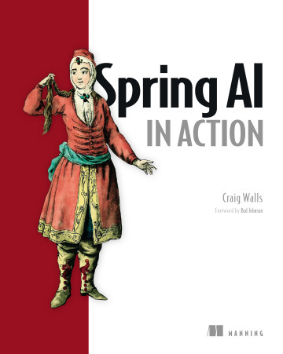

# 📚 读书记录

  

    

      
    

    

      <h3 class="book-title">Spring AI in Action</h3>
      
Craig Walls

      

        <a href="/books/spring-ai-in-action/Spring_AI_in_Action_第1章_中文翻译" class="chapter-link">第1章 - Spring AI 简介</a>
        <a href="/books/spring-ai-in-action/Spring_AI_in_Action_第2章_中文翻译" class="chapter-link">第2章 - 开始使用 Spring AI</a>
        <a href="/books/spring-ai-in-action/Spring_AI_in_Action_第3章_中文翻译" class="chapter-link">第3章 - AI 模型集成</a>
        <a href="/books/spring-ai-in-action/Spring_AI_in_Action_第4章_中文翻译" class="chapter-link">第4章 - 高级特性</a>
      

      <button class="toggle-btn" onclick="this.previousElementSibling.classList.toggle('collapsed'); this.textContent = this.textContent === '展开全部' ? '收起' : '展开全部'">展开全部</button>
    

  

