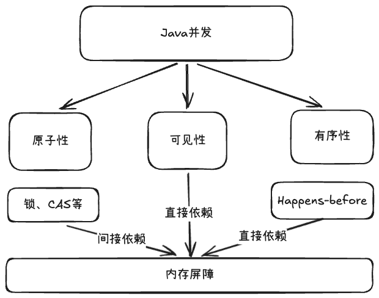
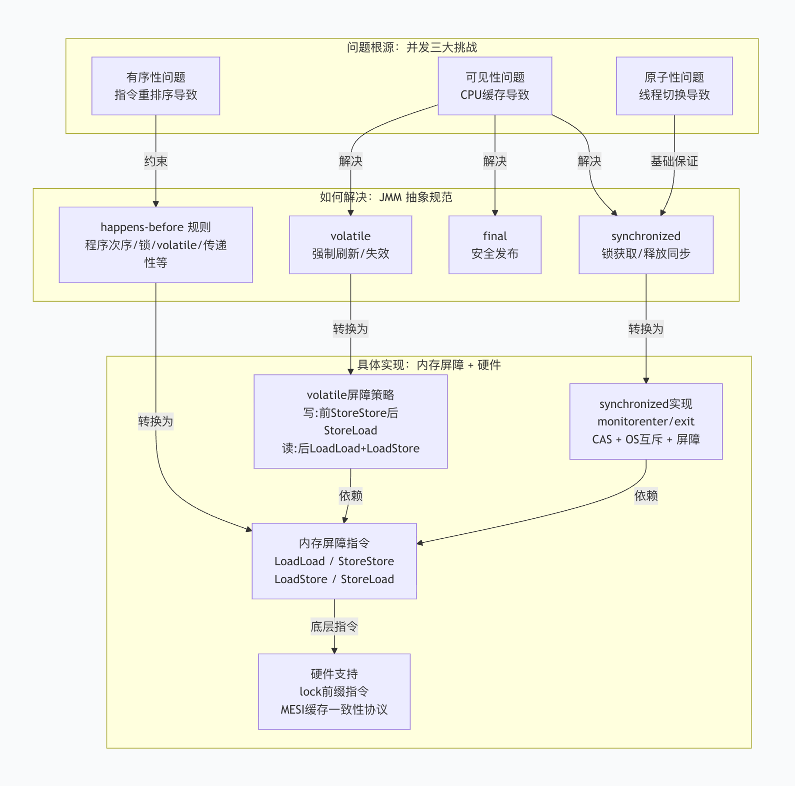
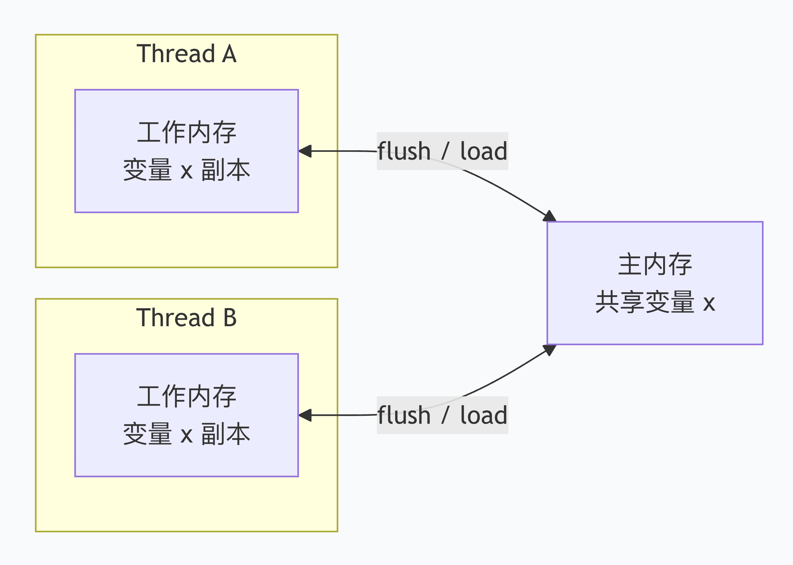

# Java并发

- 原子性：一个或多个操作，要么全部执行完且中间不被任何干扰，要么一个都不执行。
- 可见性：一个线程对共享变量的修改，其他线程能立刻看到。
- 有序性：程序执行的顺序，按照代码的书写顺序来。

# Java内存模型

> [!info] JMM
> 主要解决可见性、有序性，基本保证原子性操作。

## JMM是什么
Java内存模型（Java Memory Model），简称JMM，是一套抽象的规范。定义了多线程环境中共享变量的访问规则。
JMM将内存划分为主内存和工作内存。
- 主内存：所有线程共享，存放变量的正式值。
- 工作内存：每个线程私有，存放该线程用到的**主内存变量的副本**。

## JMM解决什么问题
JMM解决可见性、有序性两个问题：
- 可见性问题：CPU多级缓存与缓冲区。
- 有序性问题：编译器和处理器为了性能会进行指令重排序。

### 解决可见性
**建立"强制刷新/失效"协议**。JMM规定，线程对变量的操作不能一直停留在工作内存里，必须在特定时刻同步到主内存。
- volatile：
	- 写操作：新值必须立即刷新到主内存。
	- 读操作：每次读取前强制从主内存重新加载，并让其他线程的副本实效。
- synchronized：
	- 加锁后：必须清空工作内存中变量副本，强制从主内存重新加载。
	- 解锁前：工作内存的修改必须全部刷新到主内存。
- final：
	- 只要构造期间没有让this引用逸出，构造完成后final字段的值对其他线程立刻可见，无需额外同步。

### 解决有序性
**定义Happens-Before原则**。规定哪些操作不可重排序。

### 保证基本的原子性
JMM只保证基本读写操作的原子性，除了long、double外，其他变量的单次读写操作都是原子的。复合操作必须通过锁或其他方式保证原子性。

## JMM怎么实现
JMM的规范是抽象的， 需要靠**JIT编译器插入内存屏障**、**处理器提供的硬件指令**来落地。
### 内存屏障
JIT在编译字节码时，会在关键位置插入四种内存屏障指令。

| 屏障类型           | 作用                             |
| -------------- | ------------------------------ |
| **LoadLoad**   | 禁止屏障前后的读操作重排                   |
| **StoreStore** | 禁止屏障前后的写操作重排                   |
| **LoadStore**  | 禁止屏障前的读与屏障后的写重排                |
| **StoreLoad**  | 禁止屏障前的写与屏障后的读重排（最重，同时具备其他三者效果） |
- volatile：
	- 写操作：写前插入 StoreStore，写后插入 StoreLoad。
	- 读操作：读后插入 LoadLoad 和 LoadStore。
- synchronized：使用字节码指令`monitorenter` 和 `monitorexit`触发内存屏障，保证临界区内的读写在锁释放后可见。
- final：在构造方法末尾插入 StoreStore屏障，保证final字段赋值不会与对象引用赋值被重排序。
### 硬件指令
内存屏障主要通过CPU指令lock xxx实现。
- 强制将当前CPU缓存刷新到主内存。
- 通过MESI缓存一致性协议，将其他CPU缓存中对应数据失效。
- 阻止处理器对lock前后的指令进行重排序。

# volatile

> [!NOTE] volatile
> 最轻量的同步机制，通过写前StoreStore+写后StoreLoad、读后LoadLoad+LoadStore的内存屏障策略，保证多线程环境下的可见性和有序性，但不保证原子性。

- 可见性：
	- 写入：volatile写后插入 StoreLoad屏障，强制将当前线程工作内存刷新到主内存。
	- 读取：强制从主内存加载。
- 有序性：
	- 写入：写前插入 StoreStore，写后插入StoreLoad。
	- 读取：读后插入 LoadLoad、LoadStore。

# synchronized

> [!NOTE] synchronized
> 较重的同步机制，保证原子性、可见性、有序性。

synchronized用法：
- 修饰普通方法：锁当前实例对象this。
- 修饰静态方法：锁当前类对象。
- 修饰代码块：锁指定的对象。

如何保障的原子性、可见性、有序性：
- 原子性：锁互斥。同一时刻只有一个线程能进入临界区执行。
- 可见性：加锁后，工作内存被清空，强制从主内存重新加载；解锁前，强制刷新到主内存。
- 有序性：保证临界区内的代码不会与临界区外的代码发生重排序（即代码不能跨出或跨入临界区），但临界区内部的指令是允许重排序的。

底层实现原理：
- 字节码层：临界区代码由`monitorenter`和`monitorexit`包裹，方法修饰符中设置了 `ACC_SYNCHRONIZED` 标志。确保同一时刻，只有一个线程能获取对象关联的Monitor。
- 对象头与Monitor：每个对象的对象头都有一个Mark Word，记录了锁状态（无锁、偏向锁、轻量级锁、重量级锁）。重量级锁状态下，Mark Word指向一个ObjectMonitor。
- 硬件层：原子性由CAS 或 操作系统互斥量保障。可见性和有序性由内存屏障保障。

锁升级：
- 无锁：没有加锁的情况下。
- 偏向锁：消除同一线程反复获取锁的同步开销。线程第一次获取到锁时，通过CAS在对象头的Mark Word记录下自己的线程ID。之后进入同步块，只需判断线程ID是否一致来确定是否是当前线程持有锁。
- 轻量级锁：并发情况下，通过CAS自旋来获取锁，获取成功后将对象头的Mark Word修改为指向当前线程在栈中创建的Lock Record。
- 重量级锁：自旋失败或竞争激烈时，膨胀为重量级锁。JVM创建ObjectMonitor，未获取到锁的线程进入等待队列，被操作系统挂起，直到锁释放后被唤醒。

# final

> [!info] final
> 解决不可变对象的安全发布问题。

核心保证是：当一个对象的构造函数执行完毕，且 `this` 引用没有在构造期间逸出，那么其他线程即使没有同步，也能立刻看到该对象中所有 `final` 字段的正确初始化值。

实现原理：在构造函数执行完毕、即将返回时，JIT 编译器插入了 StoreStore 内存屏障。确保在构造方法返回前，final变量已安全发布。

PS：只有包含final字段的构造方法，才会插入StoreStore屏障。

# AQS

# ThreadLocal

# 线程池

# FAQ

---

<KnowledgeGraph />
