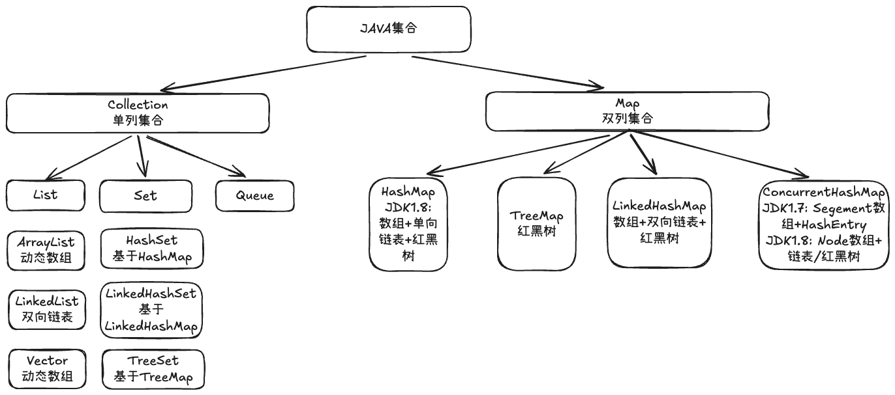

# Java集合总览



---

# Collection 单列集合

> [!info] 特点
> Collection是单值存储的根接口，继承自Iterable接口，表示一组元素的集合。

## List

> [!tip] 特点
> 有序，可重复

### ArrayList
- 数据结构：动态数组。
- 特点：
	- 查询快：数组在内存中是连续的，可以通过索引下标计算出内存地址，所以查询快，时间复杂度为：O(1)。
	- 写入慢：
		- 在数组首部添加元素：需要移动其他元素，时间复杂度为：O(n)。
		- 在数组尾部添加元素：直接加入到数组末尾，可能伴随扩容，时间复杂度均摊下来为：O(1)。
- 扩容机制：初始化时仅构造空数组，在第一次执行add操作时，将数组大小扩容为默认大小：10。当插入元素等于当前数组容量时，扩容为原有数组的1.5倍。
- 是否线程安全：否。
- 适用场景：适合查询多、写入少的场景。

### LinkedList
- 数据结构：双向链表。
- 特点：
	- 写入快：通过节点的前驱和后继指针关联节点，无需移动其他元素。时间复杂度：O(1)。
	- 查询慢：需遍历链表逐个查询。
- 是否线程安全：否。
- 适用场景：适合操作元素多、查询少的场景。

### Vector
- 数据结构：动态数组。
- 是否线程安全：是。对所有方法增加synchronized关键字，实现线程安全。

## Set

> [!tip] 特点
> 无序，不可重复。

### HashSet
- 数据结构：基于HashMap实现，使用HashMap的key作为数据存储，value为不可变的Object对象。
- 是否线程安全：否。

### LinkedHashSet
- 数据结构：继承于HashSet，使用HashSet中的特殊构造方法，基于LinkedHashMap实现。
- 是否线程安全：否。

### TreeSet
- 数据结构：基于TreeMap实现，底层实现为红黑树。
- 特点：有序，唯一。
- 是否线程安全：否。

## Queue
- 数据结构：队列。
- 特点：通常遵循FIFO（先进先出）原则，但也有支持按优先级排序或双端操作的变体。
- 是否线程安全：大部分非线程安全，但也有线程安全的队列，如：BlockingQueue。

# Map 双列集合

> [!info] 特点
> 双列集合的根接口，用于存储键值对。每个键最多映射到一个值，键不允许重复。（通过equals和hashcode判断）。

## HashMap
- 数据结构：
	- JDK1.7：数组+链表，时间复杂度：O(n)。
	- JDK1.8：数据+链表+红黑树，时间复杂度：O(logn)。
- 特点：存储键值对，允许一个null键，允许多个null值。
- 写入流程：
	- 扩容判断：判断数组是否为空，为空则进行扩容。
	- 哈希计算：通过hashcode+扰动函数： `(key == null) ? 0 : (h = key.hashCode()) ^ (h >>> 16)`，计算插入元素key的哈希值，在通过`hash&(n-1)`确定桶位置。
	- 写入数据：
		- 桶内没有元素：创建新节点，插入键值对。
		- 桶内有元素（哈希冲突）：通过equals和hashcode方法判断桶内的首个节点是否与key相同。
			- 相同：直接更新对应值。
			- 不相同：
				- 节点是树节点：在红黑树中插入键值对。
				- 节点不是树节点：在链表插入键值对。
	- 扩容判断：判断实际存储的键值对是否超过了当前容量，超过则扩容。
- 扩容机制：初始化时默认负载因子为：0.75，第一次执行put操作时，将容量扩充为默认大小：16。当插入元素超过 当前容量x负载因子 时，扩容为原有容量的2倍。
    - 树化时机：参考泊松分布，当单个桶中链表的长度大于8，且数组容量大小大于64时，链表会转换为红黑树，查询时间复杂度由O(n)降至O(logn)。当红黑树节点数少于6时，退化为链表。
    - 重新计算索引：扩容时会触发哈希重算，元素的位置为 原桶位置 或 原桶位置+原桶容量。因为HashMap容量值为2次幂，计算桶位置是通过 hash & oldCapacity。如果元素的hash值高位为1，则位置变化为原桶位置+原桶容量。如果元素的hash值高位为0，则位置不变化。
- 是否线程安全：否。

## LinkedHashMap

- 数据结构：数组+双向链表+红黑树。基于HashMap实现，增加了双向链表。
- 是否线程安全：否。

## TreeMap
- 数据结构：红黑树。
- 特点：有序。
- 是否线程安全：否。

## ConcurrentHashMap
- 数据结构：
	- JDK1.7：Segment数组 + HashEntry链表。
	- JDK1.8：Node数组+链表+红黑树。
- 特点：线程安全，高性能。
- 并发控制：
	- JDK1.7：分段锁。将桶分为多个段（Segment），每个段是一个独立的可重入锁（ReentrantLock）。每个段包含一个HashEntry数组，HashEntry为链表结构。
	- JDK1.8：CAS+synchronized。
		- 计算哈希值：对 key 进行哈希运算，以定位到数组中的相应桶（位置）。
		- 空桶处理：若桶为空，通过CAS插入新Node节点。
		- 非空桶处理：通过synchronized锁住第一个Node节点，表示有线程在操作这个桶。
		- 插入数据：
			- 存在相同key：直接更新对应值。
			- 不存在相同key：在链表或红黑树中新建Node节点插入键值对。
		- 释放第一个Node节点。
- 扩容机制：
	- 多线程并发扩容：每个线程负责一段桶区间，迁移桶时锁住头节点，迁移过的桶标记为ForwardingNode节点。其他线程遇到该节点会协助或跳过。
	- 无锁读取：遇到ForwardingNode节点则路由到新桶中。

ConcurrentHashMap数据结构 - JDK1.7：
```text
ConcurrentHashMap
│
├── Segment[] segments (默认容量 16)
│       │
│       ├── Segment[0] ────┐
│       │                  │ (持有 ReentrantLock)
│       │                  ▼
│       │          ┌─────────────────┐
│       │          │ HashEntry[]     │  (桶数组)
│       │          │  [0] → null     │
│       │          │  [1] → HashEntry(key1, val1) → HashEntry(key2, val2) → null
│       │          │  [2] → null     │
│       │          │  ...            │
│       │          └─────────────────┘
│       │
│       ├── Segment[1] ────┐
│       │                  ▼
│       │          ┌─────────────────┐
│       │          │ HashEntry[]     │
│       │          │  [0] → null     │
│       │          │  ...            │
│       │          └─────────────────┘
│       │
│       └── Segment[15] ──┐
│                          ▼
│                    ┌─────────────────┐
│                    │ HashEntry[]     │
│                    │  ...            │
│                    └─────────────────┘
│
└── 并发控制：每个 Segment 独立锁，写操作锁住整个 Segment
```

ConcurrentHashMap数据结构 - JDK1.8：
```text
ConcurrentHashMap
│
├── Node[] table (长度初始 16，2 的幂次扩容)
│       │
│       ├── [0] → null
│       │
│       ├── [1] ──→ 链表结构（头节点被 synchronized 锁）
│       │           ┌────────────┐     ┌────────────┐
│       │           │ Node(keyA) │ ──→ │ Node(keyB) │ ──→ null
│       │           │ valA       │     │ valB       │
│       │           │ next ──────┘     │ next = null│
│       │           └────────────┘     └────────────┘
│       │               ↑
│       │               └── 当对该桶写操作时，锁住这个头节点
│       │
│       ├── [2] → null
│       │
│       ├── [3] ──→ 红黑树结构（链表长度 ≥ 8 且数组长度 ≥ 64）
│       │           ┌─────────────┐
│       │           │ TreeNode    │
│       │           │ (root)      │
│       │           │   left/right│
│       │           └─────────────┘
│       │
│       ├── [4] ──→ ForwardingNode (扩容时标记，指向新 table)
│       │
│       └── ...
│
├── 辅助控制变量：sizeCtl (扩容阈值、初始化控制)
│
└── 并发机制：
    - 读操作：无锁（Node 的 value/next 为 volatile）
    - 空桶写操作：CAS 放入新 Node
    - 非空桶写操作：synchronized 锁桶的头节点（细粒度）
    - 扩容：多线程并行迁移数据（每个线程处理一段桶区间）
```


# FAQ

## 普通数据和ArrayList的区别？
- 数组容量：
	- 普通数组：创建后数组长度固定。
	- ArrayList：长度可变。
- 元素类型：
	- 普通数组：可存储基本类型或引用类型，但不能混用。
	- ArrayList：只支持存储引用类型，基本类型会自动装箱。
- 泛型支持：
	- 普通数组：不支持。
	- ArrayList：支持。

## ArrayList和LinkedList的区别？
- 数据结构：
	- ArrayList：动态数组。
	- LinkedList：双向链表。
- 访问效率：
	- ArrayList：O(1)。
	- LinkedList：O(n)。
- 增删效率：
	- ArrayList：操作尾部元素，约等于O(1)。其他情况需要移动元素，O(n)。
	- LinkedList：O(1)。
- 内存占用：LinkedList > ArrayList，LinkedList除了存储数据，还要存储前驱指针和后继指针。

## ArrayList和Vector的区别？
- 线程安全：
	- ArrayList：线程不安全。
	- Vector：线程安全。
- 性能：ArrayList > Vector，Vector中使用synchronized保证线程安全。
- 扩容：
	- ArrayList：1.5倍。
	- Vector：2倍。

## HashSet和LinkedHashSet的区别？
- 数据结构：
	- HashSet：基于HashMap实现。
	- LinkedHashSet：继承自HashSet，使用HashSet中的构造方法，基于LinkedHashMap实现。
- 元素顺序：
	- HashSet：无序。
	- LinkedHashSet：按插入顺序排序。
- 内存占用：LinkedHashSet > HashSet，LinkedHashSet需要额外维护前驱指针和后继指针。
- 是否允许null：两者都允许一个null键，一个null值（因不可重复，所以只允许一个null值）。
- 线程安全：两者都是线程不安全的。

## JDK1.7和JDK1.8 中 HashMap 的底层实现有什么区别?
- 数据结构：
	- JDK1.7：数组+链表。
	- JDK1.8：数组+链表+红黑树。
- 插入方式：
	- JDK1.7：头插法。（多线程扩容容易形成环形链表）
	- JDK1.8：尾插法。（解决了环形链表问题）
- 哈希重算：
	- JDK1.7：需要重新计算每个元素的索引，用新数组长度取模。
	- JDK1.8：利用2次幂进行位运算，决定节点是去原位还是高位，避免了重复计算。
- 初始化时机：
	- JDK1.7：构造方法时初始化。
	- JDK1.8：第一次put时初始化。

## 为什么用红黑树而不是平衡二叉树（AVL）？
AVL 树追求严格平衡，查询性能略优于红黑树，但插入和删除时旋转次数更多。HashMap 场景下插入和查找都频繁，红黑树牺牲少量查询理论性能，换来更少的旋转和更好的插入/删除效率，整体成本更低。此外红黑树的实现在大规模并发库中更通用，维护成本可控。

## HashMap和Hashtable的区别？
- 线程安全：
	- HashMap：线程不安全。
	- Hashtable：线程安全。使用synchronized保证线程安全。
- 是否允许null：
	- HashMap：允许一个null键，多个null值。
	- Hashtable：不允许null键和null值。对null会抛出空指针异常。
- 扩容：
	- HashMap：第一次put时初始化为16。每次扩容为原来的2倍。
	- Hashtable：使用构造方法初始化为11。每次扩容为原来的2n+1。
- 数据结构优化：
	- HashMap：数组+链表+红黑树。
	- Hashtable：数组+链表。不会转红黑树。

## HashMap和ConcurrentHashMap的区别？
- 线程安全：
	- HashMap：线程不安全。
	- ConcurrentHashMap：线程安全。
- 是否允许null值：
	- HashMap：允许一个null键，多个null值。
	- ConcurrentHashMap：不允许有null键、null值。（在并发情况下，无法区分是没有对应key，还是对应key值为null）。

## HashMap在JDK1.7为什么会发生死循环？
JDK1.7中，HashMap采用头插法插入元素，在扩容时会遍历每个桶中的链表，插入到新链表中，这个过程会导致链表反转。如果在并发情况下，可能会产生环形链表。
示例：
- 扩容前：A->B->null
- 线程t1开始扩容：记录A.next=B；线程暂停。
- 线程t2开始扩容：B->A->null；线程执行完毕。
- 线程t1继续扩容：A->B->A->null；形成环形链表。

---

<KnowledgeGraph />
