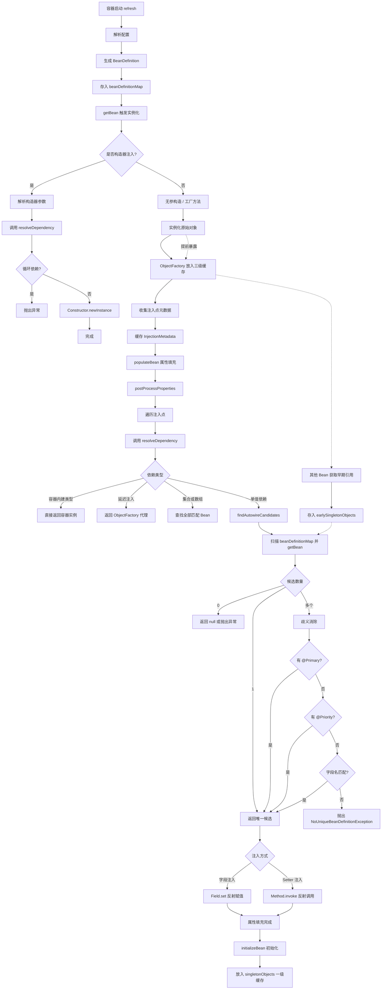

# Spring

Spring是一个轻量级的Java开发框架，目标是让Java开发者能专注于开发逻辑。底层有两个核心特性：依赖注入（IOC）、面向切面编程（AOP）。

## 依赖注入

> [!NOTE] IOC
> IOC，全称Inversion of Control，控制反转。不是Spring发明的，是一种设计原则。

常见实现IOC的方式：
- Service Locator：组件主动从容器中查找依赖，如：context.getBean("xxx"); 这种方式对业务代码侵入性较高。
- Dependency Injection（DI）：容器被动地将依赖**注入**给组件，组件完全不感知容器。这种方式对好处是：代码干净、依赖关系清晰、易于测试。

Spring选择了DI作为主要的IOC实现机制，但也保留了Service Locator的能力（ApplicationContextAware）。

### DI的三种注入方式及理解

构造器注入：
```java
@Service
public class OrderService {
    private final OrderRepository repository;
    
    public OrderService(OrderRepository repository) {
        this.repository = repository;
    }
}
```
优点：
- 依赖不可变，声明为final，保证线程安全。
- 确保依赖不为null，编译时保证注入。
- 易于单元测试，直接通过构造期传入Mock。
缺点：
- 无法解决循环依赖。
- 依赖过多时，代码显得很臃肿。

Setter注入：
```java
@Service
public class OrderService {
    private OrderRepository repository;
    
    @Autowired
    public void setRepository(OrderRepository repository) {
        this.repository = repository;
    }
}
```
优点：
- 可以解决循环依赖
- 保留有一定的封装性
缺点：
- 依赖可变，可能造成对象状态不稳定
- 不能保证注入不为null

字段注入：
```java
@Service
public class OrderService {
    @Autowired
    private OrderRepository repository;
}
```
优点：
- 代码最简洁
缺点：
- 违背了不可变性原则，依赖不能设置为final
- 难以单元测试，通常需要反射或其他框架配合mock注入

Spring官方推荐使用构造器注入必须依赖，而Setter注入可选依赖。

### DI原理

> [!NOTE] 注入过程
> BeanDefinition注册 -> 注入点元数据收集 -> 依赖查找与解析 -> 依赖写入

在Spring中，每一个被管理的对象在诞生之前，都会被解析成一个`BeanDefinition`对象，它相当于Bean的图纸，包含：
- 类的全限定名
- 作用域（单例、多例）
- 是否懒加载
- 依赖关系
- 构造器参数与属性值
- 自动装配模式（byType、byName）

BeanDefinition的三种来源：
- XML中的bean配置，被`XmlBeanDefinitionReader`解析成BeanDefinition
- @Component、@Service等，被`ClassPathBeanDefinitionScanner`扫描并解析成BeanDefinition
- @Bean注解，被`ConfigurationClassPostProcessor`解析成BeanDefinition

这些解析器最终都会调用`DefaultListableBeanFactory#registerBeanDefinition`，将BeanDefinition存入beanDefinitionMap中，成为后续DI查找依赖的唯一注册表。
`private final Map<String, BeanDefinition> beanDefinitionMap = new ConcurrentHashMap<>(256);`

后续getBean时，会获取或创建Bean。

在实例化之后，属性填充之前，`AutowiredAnnotationBeanPostProcessor`将可能存在继承关系的BeanDefinition合并为完整定义，该后处理器一次性扫描所有注入点并缓存下来，封装为`InjectionMetadata`，形成后续属性填充时直接可用的"注入地图"。

现在有了BeanDefinition蓝图、也有了Bean的所有注入点地图。下一步会进行属性填充，也就是执行真正的Bean注入。但在注入之前，还会做一件事：**将能生成该Bean早期引用的`ObjectFactory`放入三级缓存`singletonFactories`中**。这是解决循环依赖的核心。

接下来是属性填充，真正进行依赖查找，此时若发生循环依赖，就能从三级缓存中拿到Bean的早期引用。
依赖查找有以下几个路径：
- 处理特殊依赖，如BeanFactory、ApplicationContext等，直接返回容器自身，无需查找。
- 处理延迟注入，如ObjectFactory等，返回一个代理对象，真正获取Bean时调用其getObject方法才执行后续查找。
- 处理集合和数组，查找容器中类型匹配的所有Bean全部注入。
- 普通字段注入，优先按类型查找、@Qulifier指定、@Primary等，兜底用beanName查找，否则报错找不到bean。
最后是依赖注入，其中构造器注入在实例化阶段完成，Setter注入和字段注入在属性填充阶段完成。

DI注入完整流程图：



## 面向切面编程


# Spring Boot


# Spring Cloud


# FAQ

## 为什么构造器注入无法解决循环依赖，Setter注入和注解注入却可以？

---

<KnowledgeGraph />
