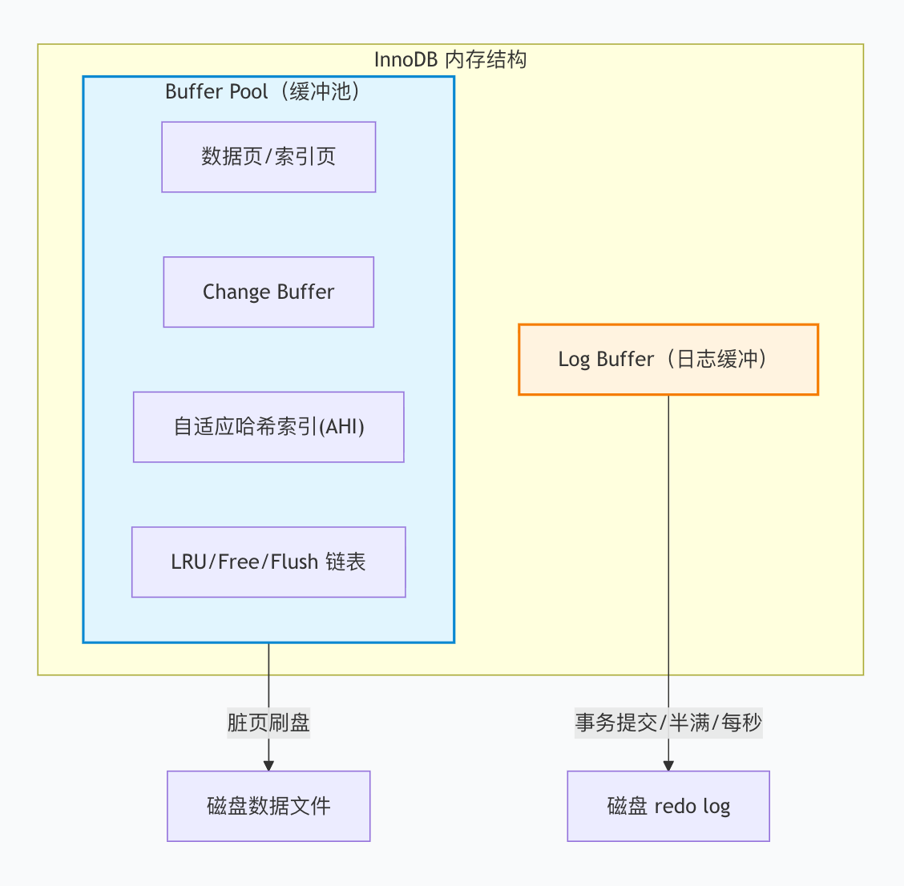
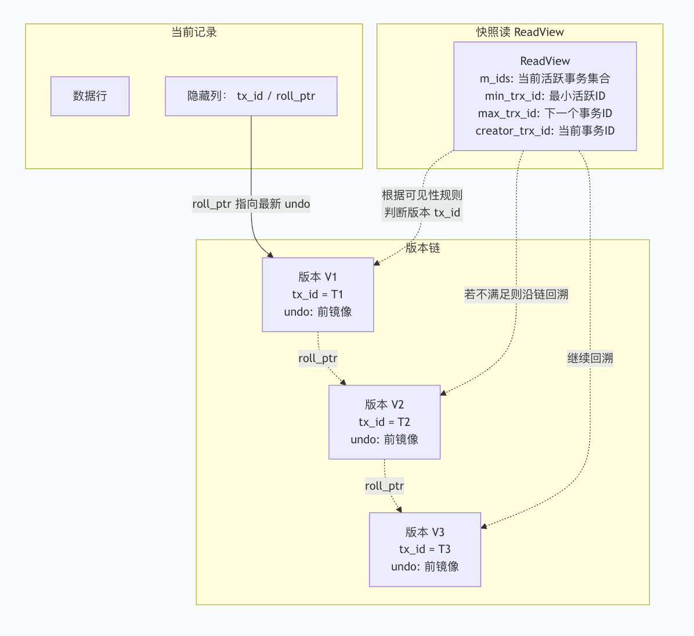
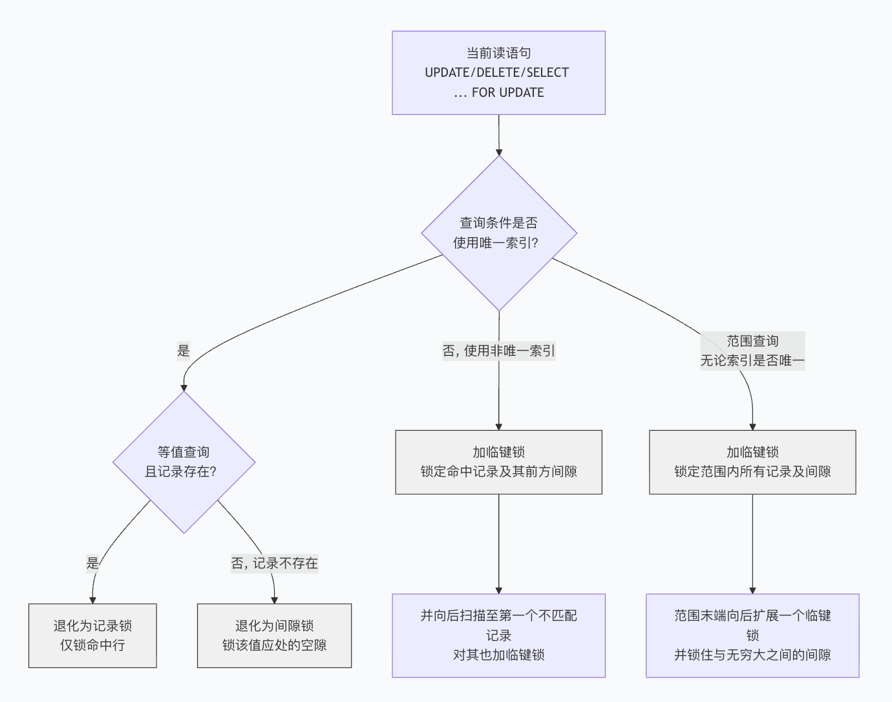
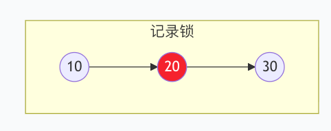
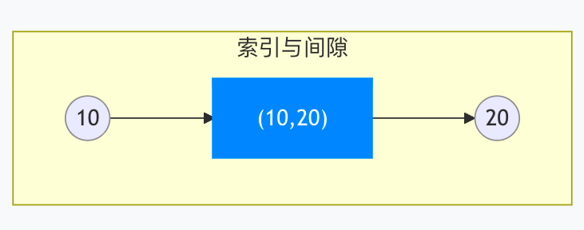
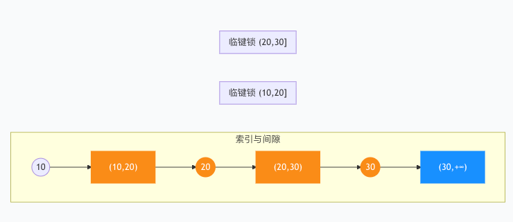
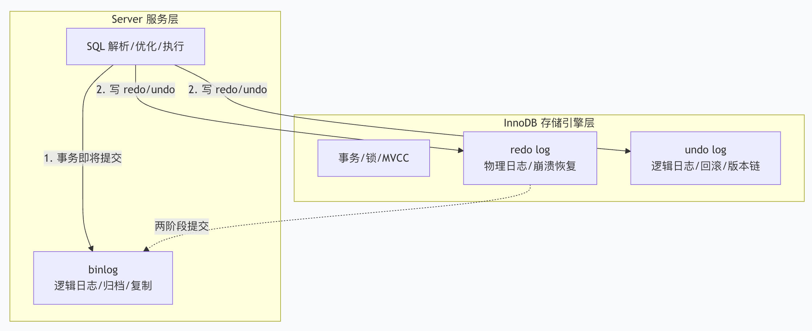

# MySQL

MySQL是开源关系型数据库管理系统，使用客户端-服务端模型，支持可插拔存储引擎。

# 整体架构

整体分为两层：Server层 和 存储引擎层。

Server层：
- 连接器：负责与客户端建立TCP连接，验证身份、权限，维持会话状态等。
- 分析器：词法分析、语法分析，验证SQL合法性。
- 优化器：优化SQL、索引选择等，选择最优执行计划。
- 执行器：调用执行引擎读写接口进行数据交互。

存储引擎层：
- InnoDB：默认引擎，支持ACID、行锁、MVCC、外键等。
- MyISAM：早期默认引擎，不支持事务、表级锁等。

# InnoDB引擎

- Buffer Pool：数据与索引的缓存池。
- Log Buffer：redo log的缓存。

### Buffer Pool

Buffer Pool 是 InnoDB 最大的内存区域，以 **页（Page，默认 16KB）** 为单位缓存数据。所有对数据的读写操作，都会优先经过它。

它缓存什么？

- **数据页与索引页**：无论是聚簇索引还是二级索引，它们的 B+Tree 节点都会被加载到这里。
- **Change Buffer**：当修改非唯一二级索引，而目标页不在 Buffer Pool 时，更改会先写到这里，等页被读入时再合并，减少随机 I/O。它物理上就占用 Buffer Pool 空间。
- **自适应哈希索引 (AHI)**：InnoDB 自动对高频访问的 B+Tree 页构建哈希索引，加速等值查询。同样存在 Buffer Pool 中。
- **锁信息**：行锁、表锁等内存数据结构也在此维护。
- **数据字典**：表的元数据信息。

三大链表管理页的生命周期

Buffer Pool 内部通过三张链表，精密管理所有缓存页的状态：
- **Free 链表**：存储"空闲页"，需要加载新页时，从这里取。
- **LRU 链表**：存储"已被使用的页"，并按最近最少使用排序。InnoDB 将 LRU 链表分为 **Young 区（热数据）** 和 **Old 区（冷数据）**。新读入的页不会直接插入 Young 区头部，而是插入 Old 区头部。只有在 Old 区存活足够时间并被再次访问时，才会晋升到 Young 区。这有效防止了全表扫描把真正的热数据冲走。
- **Flush 链表**：存储"脏页"（内存中被修改过，但还没刷入磁盘的页），按第一次变脏的时间排序。后台线程会按此链表顺序将脏页写入磁盘，并更新 LSN（日志序列号）。

## Log Buffer

Log Buffer 是一块独立于 Buffer Pool 的内存区域，专门缓存**redo log 条目**。

- **为什么要独立？** redo log 是顺序写入的环形日志，和数据页的随机访问模式完全不同。独立出来可以避免跟数据页争抢 Buffer Pool 空间，也方便实现顺序写磁盘的高吞吐。
- **写盘时机**：Log Buffer 中的数据在下面三种情况下刷到磁盘 redo 文件：
    1. **事务提交**：`innodb_flush_log_at_trx_commit = 1` 时，每次提交都刷。
    2. **Log Buffer 半满**：达到容量的 50%。
    3. **后台线程每秒刷盘**。
- **大小**：默认 16MB，对于写入密集的场景可适当调大，减少刷盘频率。

## 内存与磁盘的协同工作流

读请求：
1. 查询 Buffer Pool，命中则直接返回。
2. 未命中，从磁盘读取数据页到 Buffer Pool 的空闲页（从 Free 链表取），然后返回。

写请求（以 `UPDATE` 为例）：
1. 先写 **Log Buffer** 记录一条 redo 条目。
2. 修改 Buffer Pool 中的对应数据页，使其变成**脏页**，并加入 Flush 链表。
3. 修改对应的 undo 页，同样产生 redo 条目，undo 页也变成脏页。
4. 事务提交时，Log Buffer 中的 redo 刷盘，事务完成。脏页则留待后台线程择机刷盘，实现**WAL（Write-Ahead Log）**。

# 索引

InnoDB索引的数据结构为B+树，包含聚簇索引、非聚簇索引。

- **聚簇索引**：也叫主键索引，叶子节点存完整行数据。
- **非聚簇索引**：也叫二级索引，叶子节点存储 索引列 + 主键值，通过双向链表连接不同叶子节点。当索引列+主键无法覆盖查询字段时，需要回到聚簇索引进行二次查询，称为回表查询。

核心概念：
- 最左前缀：查询字段按照联合索引字段顺序查询。
- 覆盖索引：索引包含全部查询字段，无需回表查询。
- 索引下推：在存储引擎层提前过滤数据，减少回表查询次数。MySQL5.6+版本引入的索引下推。
- 前缀索引：对长字符串取前缀构建索引，节省空间。

为什么使用B+树，而不是B树？
- 高度低、磁盘IO少、叶子双向链表支持范围查询和排序。

# 事务

事务是保证一组数据库操作，要么全部成功、要么全部失败。在MySQL中，事务是在存储引擎层中实现的。MyISAM引擎不支持事务，InnoDB支持事务。

## 事务特性

ACID：
- 原子性：undo log保障。
- 一致性：约束、锁、undo log 共同保障。
- 隔离性：锁、MVCC保障。
- 持久性：redo log保障。

## 隔离级别

- 读未提交：事务还未提交，就可能被其他事务看到。（直接返回记录上的最新值，不创建Read View）
- 读已提交：事务必须提交后，才能被其他事务看到。（每次执行SQL时创建Read View）
- 可重复读：事务执行过程中，看到的数据与事务启动时一致。（事务启动时创建Read View）
- 串行化：写加写锁，读加读锁，当出现读写锁冲突时，需要等上一个事务执行完成。（不创建Read View）

| 隔离级别         | 脏读  | 不可重复读 | 幻读   |
| ------------ | --- | ----- | ---- |
| 读未提交         | 可能  | 可能    | 可能   |
| 读已提交(RC)     | 避免  | 可能    | 可能   |
| 可重复读(RR)(默认) | 避免  | 避免    | 部分避免 |
| 串行化          | 避免  | 避免    | 避免   |

- 脏读：一个事务读取到了另一个事务尚未提交的数据。
- 不可重复读：同一个事务内，两次读取同一行数据，值不一样。
- 幻读：同一个事务内，两次查询同一个范围的数据，行数不一样。

# MVCC

实现原理：
- **隐藏字段**：每行记录有最新修改的事务ID：`DB_TRX_ID` 和 指向undo log的版本链：`DB_ROLL_PTR`。
- **undo log 版本链**：更新时先写入undo log，记录旧版本，形成版本链。
- **Read View快照**：包含当前活跃的事务ID列表，用来判断版本可见性。RR级别在事务第一次快照读时生成，之后复用。RC级别每次快照读都生成新的。

实际事务执行时，从根据当前活跃事务ID列表 及 当前数据行的最新事务ID，来判断数据可见性。

## 当前读

`update`、`delete`、`select xxx for update`这类**更新操作**会读取最新的数据版本，称为**当前读**。
在执行更新操作时，会根据具体SQL判断是否需要加行锁、间隙锁、临键锁，防止其他事务更改当前行或在数据间隙插入数据。
在执行`insert` 操作时，会产生**插入意向锁**。插入意向锁与间隙锁互斥，需要等待间隙锁释放后再执行。

行锁：

间隙锁：

临键锁：

# 锁

| 层级               | 锁类型                    | 本质           |
| ---------------- | ---------------------- | ------------ |
| **表级锁**          | 1. **表锁** (Table Lock) | 手动强制整表串行     |
|                  | 2. **元数据锁** (MDL)      | 自动保护表结构不冲突   |
|                  | 3. **意向锁** (IS/IX)     | 行锁前的声明，表级检查  |
|                  | 4. **自增锁** (AUTO-INC)  | 保护自增主键不重复    |
| **行级锁** (InnoDB) | 5. **行锁** (S/X) + 三种算法 | 并发控制的核心      |
|                  | 6. **插入意向锁**           | INSERT 的排队信号 |

死锁：不是锁，是一种并发事务互相等待锁资源造成的循环等待现象。

# redo log & undo log & binlog

- redo log 和 undo log 是InnoDB存储引擎层独有的，物理记录数据页变更或旧数据。
- binlog是Server层产生的，与引擎无关，逻辑记录SQL或行变化。

## redo log

redo log，叫做重做日志，是物理逻辑日志，用于记录"在某页偏移量做了某修改"，它记录了所有的数据页（包括undo log）的物理变更。

WAL机制：先写日志，再修改buffer pool，脏页后台刷盘。循环写。

## undo log

undo log，叫做回滚日志，是逻辑日志，记录行的旧版本。用于事务回滚和构建MVCC版本链，保证原子性和一致性。

## binlog

binlog，叫作归档日志，是Server层逻辑日志，记录SQL或行变化，用于主从复制和基于时间点的恢复。

### 两阶段提交

两阶段提交，用于保证redo log 和binlog在事务提交时的一致性：
- prepare阶段：写入redo log，并标记prepare状态。
- 写binlog阶段：将本次变更写入binlog。
- commit阶段：redo log标记为commit，事务完成。

崩溃恢复时，若redo log处于prepare阶段，且binlog有完整数据，则提交事务，否则回滚。

---

<KnowledgeGraph />
