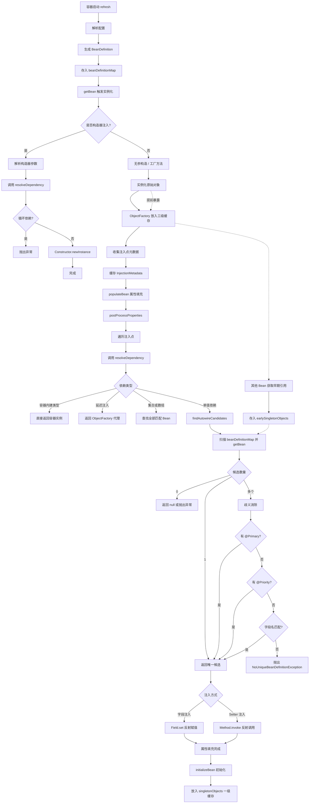

# Spring

Spring是一个轻量级的Java开发框架，目标是让Java开发者能专注于开发逻辑。底层有两个核心特性：依赖注入（IOC）、面向切面编程（AOP）。

## 依赖注入

> [!NOTE] IOC
> IOC，全称Inversion of Control，控制反转。不是Spring发明的，是一种设计原则。

常见实现IOC的方式：
- Service Locator：组件主动从容器中查找依赖，如：context.getBean("xxx"); 这种方式对业务代码侵入性较高。
- Dependency Injection（DI）：容器被动地将依赖**注入**给组件，组件完全不感知容器。这种方式对好处是：代码干净、依赖关系清晰、易于测试。

Spring选择了DI作为主要的IOC实现机制，但也保留了Service Locator的能力（ApplicationContextAware）。

### DI的三种注入方式及理解

构造器注入：
```java
@Service
public class OrderService {
    private final OrderRepository repository;
    
    public OrderService(OrderRepository repository) {
        this.repository = repository;
    }
}
```
优点：
- 依赖不可变，声明为final，保证线程安全。
- 确保依赖不为null，编译时保证注入。
- 易于单元测试，直接通过构造期传入Mock。
缺点：
- 无法解决循环依赖。
- 依赖过多时，代码显得很臃肿。

Setter注入：
```java
@Service
public class OrderService {
    private OrderRepository repository;
    
    @Autowired
    public void setRepository(OrderRepository repository) {
        this.repository = repository;
    }
}
```
优点：
- 可以解决循环依赖
- 保留有一定的封装性
缺点：
- 依赖可变，可能造成对象状态不稳定
- 不能保证注入不为null

字段注入：
```java
@Service
public class OrderService {
    @Autowired
    private OrderRepository repository;
}
```
优点：
- 代码最简洁
缺点：
- 违背了不可变性原则，依赖不能设置为final
- 难以单元测试，通常需要反射或其他框架配合mock注入

Spring官方推荐使用构造器注入必须依赖，而Setter注入可选依赖。

### DI原理

> [!NOTE] 注入过程
> BeanDefinition注册 -> 注入点元数据收集 -> 依赖查找与解析 -> 依赖写入

在Spring中，每一个被管理的对象在诞生之前，都会被解析成一个`BeanDefinition`对象，它相当于Bean的图纸，包含：
- 类的全限定名
- 作用域（单例、多例）
- 是否懒加载
- 依赖关系
- 构造器参数与属性值
- 自动装配模式（byType、byName）

BeanDefinition的三种来源：
- XML中的bean配置，被`XmlBeanDefinitionReader`解析成BeanDefinition
- @Component、@Service等，被`ClassPathBeanDefinitionScanner`扫描并解析成BeanDefinition
- @Bean注解，被`ConfigurationClassPostProcessor`解析成BeanDefinition

这些解析器最终都会调用`DefaultListableBeanFactory#registerBeanDefinition`，将BeanDefinition存入beanDefinitionMap中，成为后续DI查找依赖的唯一注册表。
`private final Map<String, BeanDefinition> beanDefinitionMap = new ConcurrentHashMap<>(256);`

后续getBean时，会获取或创建Bean。

在实例化之后，属性填充之前，`AutowiredAnnotationBeanPostProcessor`将可能存在继承关系的BeanDefinition合并为完整定义，该后处理器一次性扫描所有注入点并缓存下来，封装为`InjectionMetadata`，形成后续属性填充时直接可用的"注入地图"。

现在有了BeanDefinition蓝图、也有了Bean的所有注入点地图。下一步会进行属性填充，也就是执行真正的Bean注入。但在注入之前，还会做一件事：**将能生成该Bean早期引用的`ObjectFactory`放入三级缓存`singletonFactories`中**。这是解决循环依赖的核心。

接下来是属性填充，真正进行依赖查找，此时若发生循环依赖，就能从三级缓存中拿到Bean的早期引用。
依赖查找有以下几个路径：
- 处理特殊依赖，如BeanFactory、ApplicationContext等，直接返回容器自身，无需查找。
- 处理延迟注入，如ObjectFactory等，返回一个代理对象，真正获取Bean时调用其getObject方法才执行后续查找。
- 处理集合和数组，查找容器中类型匹配的所有Bean全部注入。
- 普通字段注入，优先按类型查找、@Qulifier指定、@Primary等，兜底用beanName查找，否则报错找不到bean。
最后是依赖注入，其中构造器注入在实例化阶段完成，Setter注入和字段注入在属性填充阶段完成。

DI注入完整流程图：



### Bean的生命周期

1. **加载BeanDefinition** —— 扫描Bean，注册为BeanDefinition
2. **实例化** —— 反射/工厂方法创建原始对象（构造器注入在这里完成）
3. **属性填充** —— 给 `@Autowired`、`@Value` 字段赋值（三级缓存解决循环依赖）
4. **Aware 回调** —— 让 Bean 感知自己的名字、容器等
5. **前置处理** —— `@PostConstruct` 在这里执行
6. **初始化** —— `InitializingBean` 和 `init-method`
7. **后置处理** —— **AOP 代理在这里生成**（事务、切面都在这时生效）
8. **放入单例池** —— Bean 可以被正常使用
9. **销毁** —— `@PreDestroy` 和 `destroy-method` 收尾


# 面向切面编程

在OOP中，通常按业务划分出不同的类，但总有一些公共逻辑散落在各个类中。比如：日志记录、事务管理等。
这些逻辑叫做**横切关注点**。横切逻辑与业务代码紧密耦合，会导致代码重复、难以维护等问题。AOP通过将这些横切逻辑模块化为独立的**切面**，在不修改业务代码的情况下，将横切逻辑**动态织入**到指定的连接点，保持业务代码的纯粹。

AOP核心术语：
- 连接点：程序执行过程中可以插入额外逻辑的点。每个类的每个方法都是一个连接点。
- 切点：匹配需要操作的连接点的条件，决定**在哪些位置**做额外逻辑。
- 通知：在匹配的连接点上要执行的额外逻辑，做什么、何时做。
	- 前置通知（Before）：方法执行**之前做**。
	- 后置通知（After）：方法执行**之后做**。无论成功还是异常都会执行。
	- 返回通知（AfterReturning）：仅在方法正常返回时执行，可以拿到返回值。
	- 异常通知（AfterThrowing）：仅在方法抛出异常时执行，可以拿到异常对象。
	- 环绕通知（Around）：包裹整个方法调用，可控制是否执行目标方法、以及修改返回值。
- 切面：通知+切点的组合，是横切逻辑的完整模块。
- 目标对象：被通知的真正业务对象。
- 织入：将切面应用到目标对象，并创建代理对象的过程。

## Spring AOP原理

> [!NOTE] 原理
> 动态代理

Spring AOP基于**动态代理**实现，常见动态代理方式：
- JDK动态代理：要求目标类至少实现一个接口，通过反射在运行时动态生成代理类的字节码，这个代理类实现了目标类的所有接口，但并非目标类的子类。所有方法调用都会被转发到一个`InvocationHandler`上。
- CGLIB代理：对目标类无要求，CGLIB使用ASM字节码框架，生成目标类的子类，重写父类中允许重写的方法，在子类中插入拦截逻辑，以实现代理目的。

激活Spring AOP的入口是注解 `@EnableAspectJAutoProxy`，该注解通过`@Import(AspectJAutoProxyRegistrar.class)`向容器注册了一个后处理器：**`AnnotationAwareAspectJAutoProxyCreator`**，是Spring AOP的核心引擎，做了两件事：
- 收集切面：找到容器中所有@AspeceJ标注的类，并解析为一组Advisor。
- 创建代理：在Bean初始化完成后，检查是否需要代理，需要时动态生成代理对象。

核心设计思路：
- 用`@AspectJ`声明切面，用`@Before`、`@After`等声明通知，用切点表达式定义拦截位置。
- Spring容器自动发现这些切面，并将它们解析为一组`Advisor`。
- 在Bean创建过程中，Spring会检查每个Bean是否需要被某个Advisor匹配，如果需要则创建代理对象。
- 代理对象在方法调用时，将根据匹配的Advisor生成拦截器链（**MethodInterceptor**），通过递归调用的**责任链模式**执行通知逻辑。
	- 正常返回：Around前部->Before->目标方法->AfterReturning->After->Around后部
	- 异常情况：Around前部->Before->目标方法->AfterThrowing->After->Around后部

在Spring AOP中，任何横切逻辑最终都会变成一个`MethodInterceptor`，在具体执行时，通过递归+责任链模式执行。

## 事务管理

事务的四大特性（ACID）：
- 原子性（Atomicity）：要么全做，要么全不做。
- 一致性（Consistency）：事务前后数据完整性不变。
- 隔离性（Isolation）：并发事务互不干扰。
- 持久性（Durability）：提交后数据永久保存。

Spring不直接管理数据库事务，而是提供统一的抽象层。

核心接口关系：
- `PlatformTransactionManager`：事务管理器，不同数据库有不同的实现，如DataSourceTransactionManager、JpaTransactionManager等。
- `TransactionDefinition`：事务定义，包括隔离级别、传播行为、超时等。
- `TransactionStatus`：事务状态


事务管理的两种方式：
- 声明式事务：`@Transactional` + AOP
- 编程式事务：使用TransactionTemplate、PlatformTransactionManager调用

### 声明式事务原理

通过注解`@EnableTransactionManagement`开启事务，该注解包含两个核心组件：
- AutoProxyRegistrar：注册InfrastructureAdvisorAutoProxyCreator，用于遍历Advisor。
- ProxyTransactionManagementConfiguration：生成事务Advisor。
	- **TransactionInterceptor**：事务逻辑的真正执行者（实现了MethodInterceptor接口），它持有负责解析事务注解的`TransactionAttributeSource`和事务管理器`PlatformTransactionManager`。
	- BeanFactoryTransactionAttributeSourceAdvisor：事务Advisor。

当Bean初始化完成，属性填充之后，InfrastructureAdvisorAutoProxyCreator会遍历所有Advisor，匹配到使用@Transactional注解的方法，并创建代理完成织入。

当代理对象被调用时，TransactionInterceptor被触发，大致处理流程如下：
- 获取事务属性
- 获取事务管理器
- 开启事务
- 调用目标方法
- 提交事务，异常时回滚
- 清理事务

### 事务传播行为

想象你是一个项目经理（调用方），你分配给下属一个任务（调用事务方法）。现在有两种情况：
- 你手里已经有一个正在进行的项目（当前有事务）
- 你手里没有项目（当前无事务）
传播行为就是：下属接到任务后，是加入你的项目一起干，还是自己单开一个新项目，还是直接拒绝？

七种传播行为可以分为四组：**一起干、单干、拒绝、特殊**。

第一组：一起干（加入或新建）

| 传播行为             | 当前有事务  | 当前无事务   | 类比                  |
| ---------------- | ------ | ------- | ------------------- |
| **REQUIRED**（默认） | 加入你的项目 | 自己开项目   | 好员工，有活就跟着干，没活自己牵头干  |
| **SUPPORTS**     | 加入你的项目 | 不干（无事务） | 支持型员工，有项目就参与，没项目就裸奔 |
| **MANDATORY**    | 加入你的项目 | 直接摔门走人  | 必须型员工，没项目？这活没法干     |

**记忆口诀**：
- REQUIRED：**必须有**（自己或别人有都行）
- SUPPORTS：**可以有**（有就参与，没有拉倒）
- MANDATORY：**必须有你的**（必须是别人开的）

第二组：单干（自己开新项目）

| 传播行为              | 当前有事务         | 当前无事务 | 类比                  |
| ----------------- | ------------- | ----- | ------------------- |
| **REQUIRES_NEW**  | 挂起你的项目，自己开新项目 | 自己开项目 | 独立员工，不管你在干嘛，我都要另起炉灶 |
| **NOT_SUPPORTED** | 挂起你的项目，自己裸跑   | 自己裸跑  | 佛系员工，我讨厌事务，有也当没有    |
| **NEVER**         | 直接摔门走人        | 自己裸跑  | 事务洁癖，有事务就炸          |

**记忆口诀**：
- REQUIRES_NEW：**必须新的**（每次都新建，旧的挂起）
- NOT_SUPPORTED：**不支持**（不管你支不支持，我不支持）
- NEVER：**绝对不要**（有事务就报错）

第三组：特殊模式

| 传播行为          | 当前有事务       | 当前无事务 | 类比                                |
| ------------- | ----------- | ----- | --------------------------------- |
| **NESTED**    | 嵌套子事务（保存点） | 自己开项目 | 子任务，父项目失败全完蛋，自己失败父项目可继续 |

**记忆要点**：NESTED 和 REQUIRES_NEW 最容易混淆：
- REQUIRES_NEW：两个项目完全独立，互相不影响。
- NESTED：父子关系，父亲回滚儿子必回滚，儿子回滚父亲不受影响。

一幅记忆逻辑图：
```text
接到任务，当前有事务吗？
├── 有事务
│   ├── 加入你：REQUIRED / SUPPORTS / MANDATORY
│   │   └── MANDATORY：必须加入，否则不让干
│   ├── 单开：REQUIRES_NEW（挂起你的）
│   ├── 裸奔：NOT_SUPPORTED（挂起你的）
│   ├── 报错：NEVER（事务洁癖）
│   └── 嵌套：NESTED（父子关系）
└── 无事务
    ├── 新建：REQUIRED / REQUIRES_NEW / NESTED
    ├── 裸奔：SUPPORTS / NOT_SUPPORTED / NEVER
    └── 报错：MANDATORY
```

### 事务失效场景

所有失效场景的根源都在于AOP代理机制。

**失效场景1：类内部调用**
- 失效原因：this是目标对象，不是代理对象，所以不会走AOP。
```java
@Service
public class UserService {
    @Transactional
    public void outer() {
        this.inner();  // 不经过代理！
    }
    @Transactional
    public void inner() { ... }
}
```

**失效场景2：非public方法**
- 失效原因：CGLIB代理生成子类，可重写public、protected方法，private方法无法重写，代理无法拦截。基于接口的JDK代理也只能拦截public方法。

**失效场景3：异常被catch**
- 失效原因：只有在目标方法抛出异常时事务才会回滚，如果方法内部吞掉了异常，拦截器则感知不到任何异常，事务会正常提交。

**失效场景4：异常类型不匹配**
- 失效原因：@Transactional默认只回滚RuntimeException和Error，如果异常不一致，则不会回滚。

**失效场景5：数据库引擎不支持事务**
- 失效原因：如MyISAM引擎不支持事务

**失效场景6：多线程**
- 失效原因：跨线程导致事务丢失

**失效场景7：事务传播行为错误**
- 失效原因：错误使用事务传播行为，导致事务丢失。


# Spring MVC


# Spring Boot

Spring Boot将Spring的**可配置性**固化为**约定**，通过自动装配、起步依赖、内嵌容器和配置文件等内容，让开发者更快速的搭建应用。

## 自动装配原理


`@SpringBootApplication`注解是Spring Boot的入口，该注解是一个组合注解，包含三个注解：
- `@SpringBootConfiguration`：内部实际为`@Configuration`，表明当前类为配置类。
- `@ComponentScan`：组件扫描，默认扫描当前包及子包中的所有Bean。
- `@EnableAutoConfiguration`：自动装配的核心。

`@EnableAutoConfiguration`中通过@Import注解，导入了**AutoConfigurationImportSelector**类，该类实现了ImportSelector接口，通过selectImports方法扫描要装配的所有类。

自动装配流程如下：
- 加载`META-INF/spring/org.springframework.boot.autoconfigure.AutoConfiguration.imports`文件中的类名（Spring Boot3.0之后扫描xxx.imports，3.0之前扫描spring.factories）
- 过滤重复类名
- 根据对应类中的条件注解来判定，若条件满足则装载对应Bean
需注意，默认只会加载AutoConfiguration注解开头的imports，如有其他xxx.imports，由其他包自行实现ImportSelector扫描并装配。


## 启动流程

| 步骤                          | 做什么                                                             | 你学过的知识                                         |
| --------------------------- | --------------------------------------------------------------- | ---------------------------------------------- |
| **new SpringApplication()** | 推断是 Web 还是普通应用，加载初始化器和监听器                                       | 从`spring.factories`扫描需要加载的类                    |
| **准备环境**                    | 加载 `application.yml`、环境变量、命令行参数                                 | `Environment` 抽象                               |
| **创建上下文**                   | 根据 Web 类型创建对应容器                                                 | `ApplicationContext`                           |
| **refresh()**               | **核心！** 执行 Spring 容器的全部启动逻辑                                     | `BeanDefinition`、`BeanPostProcessor`、Bean 生命周期 |
| **refresh() 中自动配置生效**       | `AutoConfigurationImportSelector` 读取 `.imports` 文件，条件过滤，注册 Bean | 自动装配                                           |
| **refresh() 中启动内嵌容器**       | `onRefresh()` 启动 Tomcat，注册 `DispatcherServlet`                  | 内嵌容器原理                                         |
| **启动完成**                    | 执行 `ApplicationRunner`，应用就绪                                     | —                                              |

## 自定义Starter

Starter本质上是一个Maven/Gradle依赖，它里面没有业务代码，只做两件事：
- **聚合依赖**：把需要的jar包一次性引入。
- **触发自动装配**：通过AutoConfiguration.imports文件告诉Spring Boot哪些自动配置类需要加载。

通常拆分为两个模块：
- xxx-spring-boot-starter：starter模块，只包含pom.xml。
- xxx-spring-boot-autoconfigure：自动配置模块。

### 示例
1、创建 greeter-spring-boot-autoconfigure 模块
**① 编写属性类，用 `@ConfigurationProperties` 绑定配置**
```java
@ConfigurationProperties(prefix = "greeter")
public class GreeterProperties {
    private String prefix = "Hello";   // 默认值
    private String suffix = "!";
    // getters and setters
}
```
**② 编写核心服务类**
```java
public class GreeterService {
    private final GreeterProperties properties;
    public GreeterService(GreeterProperties properties) {
        this.properties = properties;
    }
    public String greet(String name) {
        return properties.getPrefix() + ", " + name + properties.getSuffix();
    }
}
```
**③ 编写自动配置类**
```java
@AutoConfiguration  // 等价于 @Configuration，但专门用于自动配置
@EnableConfigurationProperties(GreeterProperties.class)
@ConditionalOnClass(GreeterService.class)
public class GreeterAutoConfiguration {
    @Bean
    @ConditionalOnMissingBean
    public GreeterService greeterService(GreeterProperties properties) {
        return new GreeterService(properties);
    }
}
```
**④ 创建 `AutoConfiguration.imports` 文件**
位置：`src/main/resources/META-INF/spring/org.springframework.boot.autoconfigure.AutoConfiguration.imports`
内容：
```text
com.example.greeter.autoconfigure.GreeterAutoConfiguration
```

2、创建 Starter 模块
在 Starter 的 `pom.xml` 中引入对应依赖
```xml
<dependency>
    <groupId>com.example</groupId>
    <artifactId>greeter-spring-boot-autoconfigure</artifactId>
    <version>1.0.0</version>
</dependency>
```

3、用户引入Starter
当用户引入 `greeter-spring-boot-starter` 时：
1. Starter 带入 `autoconfigure` 模块。
2. Spring Boot 启动时扫描到 `AutoConfiguration.imports` 中的配置类。
3. 条件满足（classpath 有 `GreeterService`，且用户未手动创建 `GreeterService` Bean）则自动创建。
4. 用户可以在 `application.yml` 中自定义 `greeter.prefix` 和 `greeter.suffix`。


# Spring Cloud

单体应用发展到一定规模后，会面临：单点故障、扩展困难、协同开发难等问题，Spring Cloud提供了一套微服务架构的工具集，是分布式微服务架构的一站式解决方案，解决分布式中如下常见问题：
- 服务注册与发现：Nacos
- 远程调用：OpenFeign
- 服务容错：Sentinel
- 配置中心：Nacos
- 网关：Gateway
- 链路追踪：Sleuth + Zipkin

Spring Cloud建立在Spring Boot之上，每个组件都是以Starter形式提供。Spring Boot让一个服务快速启动，Spring Cloud让一堆服务协同工作。

国内大部分企业使用Spring Cloud Alibaba，后续以Spring Cloud Alibaba展开。

## Nacos

> [!NOTE] 介绍
> Nacos，全称：Dynamic Naming and Configuration Service，是一个面向云原生和AI应用的动态服务发现、配置管理和AI管理中心平台。
> 最早围绕两个核心问题构建：应用如何找到服务、应用如何安全地读取和更新配置。进入3.x后，Nacos在这些能力之上扩展了AI管理中心，用来管理Skill、A2A Agent、MCP server、Prompt等AI资源。
> 官网：https://nacos.io/

服务注册与发现流程：
1. 微服务应用在启动过程中将自身包含的服务名称、主机IP地址、端口号等信息发送至注册中心。
2. 上游微服务在处理请求时，根据服务名称到注册中心查询待调用的服务信息，包括IP及端口号等。
3. 发起服务调用。


# FAQ

## 为什么构造器注入无法解决循环依赖，Setter注入和注解注入却可以？

---

<KnowledgeGraph />
